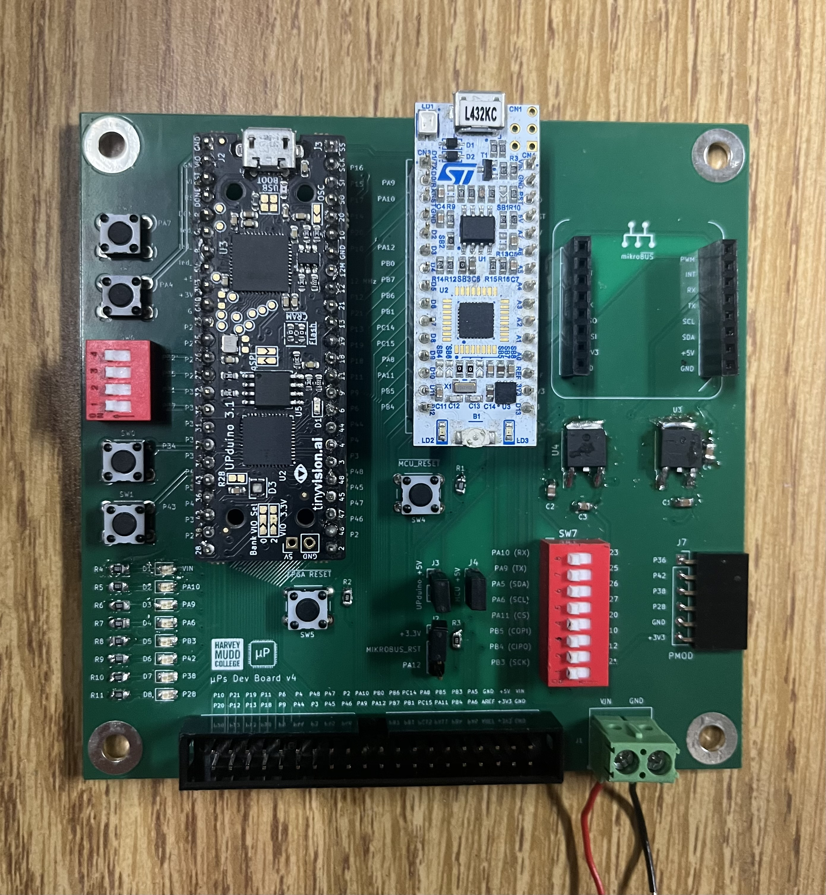
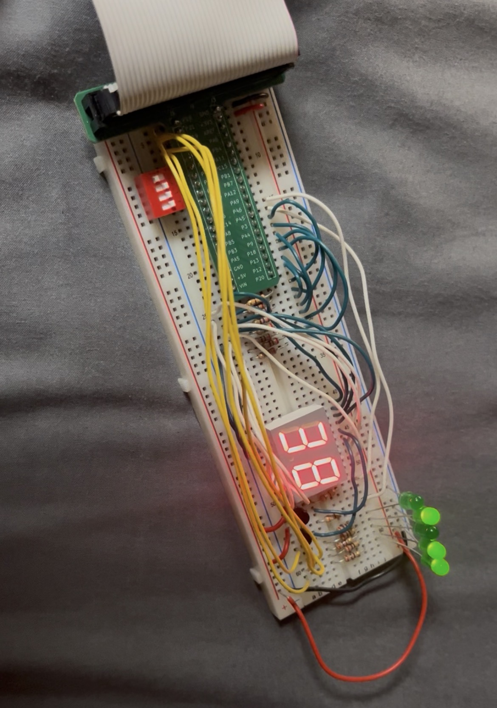
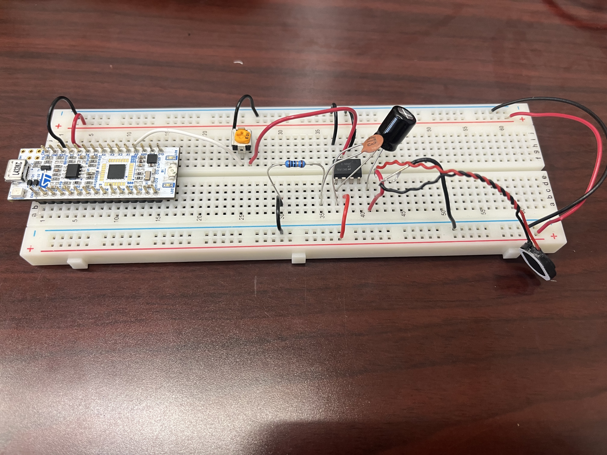
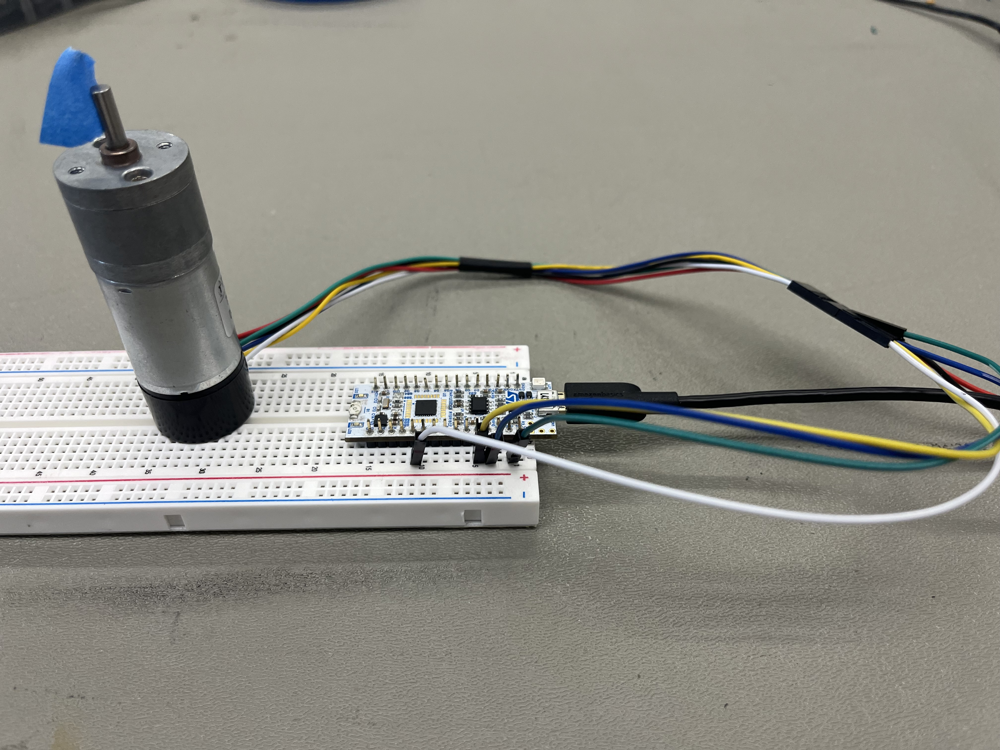
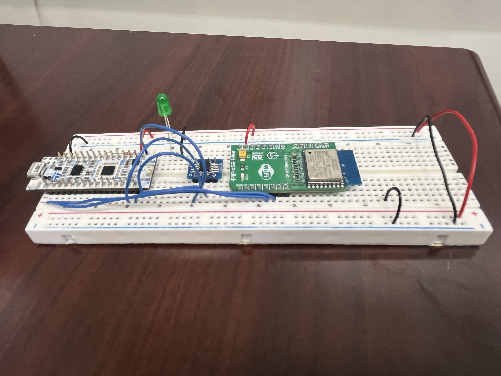

```{=html}
<div style="display: flex; flex-direction: row; flex-wrap: wrap; gap: 20px; margin-bottom: 1em;">
  <div style="flex: 2; min-width: 300px;">
    <p>This Fall 2026, I will be taking an upper division  engineering elective, <a href="https://hmc-e155.github.io/" target="_blank" rel="noopener noreferrer">
  E155: Microprocessor Systems</a> at Harvey Mudd College. In this course I will build a variety of systems with FPGAs, microcontrollers, and custom digital logic. Along the way, I will gain experience with RTL design, simulation and verification in Questa, and FPGA development using Lattice Radiant. Check out my work below!
    </p>
```

## FPGA and MCU Setup and Testing (Lab 1)

```{=html}
<div style="display: flex; flex-direction: row; flex-wrap: wrap; gap: 20px; margin-bottom: 1em;">
  <div style="flex: 2; width: 300px;">
    
  </div>
  <div style="flex: 2; min-width: 300px;">
    <p class="justify-text">
      <strong>Summary:</strong><br>
      Assembled a development board by hand-soldering SMT and THT components, integrating the UPduino v3.1 FPGA and Nucleo-L432KC MCU via female header pins. Implemented a SystemVerilog design leveraging the on-board high-speed oscillator to blink an LED at 2.4 Hz, drive three on-board LEDs using combinational logic from DIP switch inputs, and display all 16 hexadecimal digits on a 7-segment display.
    </p>
    <a href="labs/lab1/lab1.qmd" style="display: inline-block; border-radius: 6px; padding: 8px 14px; background-color: #f5f5f5; border: 1px solid #aaa; cursor: pointer; font-weight: 500; text-decoration: none; color: inherit;">
      See Lab Report
    </a>
  </div>
</div>
```

---

## Multiplexed 7-Segment Display (Lab 2)

```{=html}
<div style="display: flex; flex-direction: row; flex-wrap: wrap; gap: 20px; margin-bottom: 1em;">
  <div style="flex: 2; width: 300px;">
    
  </div>
  <div style="flex: 2; min-width: 300px;">
    <p class="justify-text">
      <strong>Summary:</strong><br>
      A time-multiplexed dual 7-segment display was implemented on the UPduino v3.1 FPGA, simultaneously showing two independent 4-bit hexadecimal values provided via DIP switches. A 2N3906 PNP transistor circuit was constructed to drive the display anodes, and five on-board LEDs display the binary sum of the two inputs.
    </p>
    <a href="labs/lab2/lab2.qmd" style="display: inline-block; border-radius: 6px; padding: 8px 14px; background-color: #f5f5f5; border: 1px solid #aaa; cursor: pointer; font-weight: 500; text-decoration: none; color: inherit;">
      See Lab Report
    </a>
  </div>
</div>
```

---

## Keypad Scanner (Lab 3)

```{=html}
<div style="display: flex; flex-direction: row; flex-wrap: wrap; gap: 20px; margin-bottom: 1em;">
  <div style="flex: 2; min-width: 300px;">
    <p><strong>Summary:</strong><br><em>Coming Soon!</em></p>
    <a href="labs/lab3/lab3.qmd" style="display: inline-block; border-radius: 6px; padding: 8px 14px; background-color: #f5f5f5; border: 1px solid #aaa; cursor: pointer; font-weight: 500; text-decoration: none; color: inherit;">
      See Lab Report
    </a>
  </div>
</div>
```

---

## Digital Audio (Lab 4)

```{=html}
<div style="display: flex; flex-direction: row; flex-wrap: wrap; gap: 20px; margin-bottom: 1em;">
  <div style="flex: 2; width: 300px;">
    
  </div>
  <div style="flex: 2; min-width: 300px;">
    <p class="justify-text">
      <strong>Summary:</strong><br>
      Configured TIM2 on the STM32L432KC to drive an 8-ohm speaker via an LM386 amplifier, generating square waves by toggling a GPIO pin at twice the target frequency. Using a 1 MHz timer clock (4 MHz system clock and PSC=3), computed ARR values achieve 0.10% frequency error across 220–1000 Hz. Successfully played <em>Für Elise</em> and an optional piece <em>Fallen Down</em>, with a potentiometer providing adjustable volume.
    </p>
    <a href="labs/lab4/lab4.qmd" style="display: inline-block; border-radius: 6px; padding: 8px 14px; background-color: #f5f5f5; border: 1px solid #aaa; cursor: pointer; font-weight: 500; text-decoration: none; color: inherit;">
      See Lab Report
    </a>
  </div>
</div>
```

---

## Interrupts (Lab 5)

```{=html}
<div style="display: flex; flex-direction: row; flex-wrap: wrap; gap: 20px; margin-bottom: 1em;">
  <div style="flex: 2; width: 300px;">
    
  </div>
  <div style="flex: 2; min-width: 300px;">
    <p class="justify-text">
      <strong>Summary:</strong><br>
      Designed an interrupt-driven system on the STM32L432KC to measure the angular velocity and direction of a brushed DC motor using a quadrature encoder. Configured GPIO interrupts on 5V-tolerant pins to process encoder pulses at both high and low speeds, computing revolutions per second and displaying velocity with an update rate of at least 1 Hz.
    </p>
    <a href="labs/lab7/lab7.qmd" style="display: inline-block; border-radius: 6px; padding: 8px 14px; background-color: #f5f5f5; border: 1px solid #aaa; cursor: pointer; font-weight: 500; text-decoration: none; color: inherit;">
      See Lab Report
    </a>
  </div>
</div>
```

---

## SPI and IoT (Lab 6)

```{=html}
<div style="display: flex; flex-direction: row; flex-wrap: wrap; gap: 20px; margin-bottom: 1em;">
  <div style="flex: 2; width: 300px;">
    
  </div>
  <div style="flex: 2; min-width: 300px;">
    <p class="justify-text">
      <strong>Summary:</strong><br>
      Built an internet-accessible IoT device using an STM32L432KC MCU, DS1722 SPI temperature sensor, and ESP8266 WiFi module. Developed custom C SPI drivers using CMSIS device templates to read ambient temperature data, and implemented UART communication at 125,000 baud to serve a dynamically generated HTML webpage allowing remote LED control and real-time temperature monitoring.
    </p>
    <a href="labs/lab6/lab6.qmd" style="display: inline-block; border-radius: 6px; padding: 8px 14px; background-color: #f5f5f5; border: 1px solid #aaa; cursor: pointer; font-weight: 500; text-decoration: none; color: inherit;">
      See Lab Report
    </a>
  </div>
</div>
```

---

## Advanced Encryption Standard (Lab 7)

```{=html}
<div style="display: flex; flex-direction: row; flex-wrap: wrap; gap: 20px; margin-bottom: 1em;">
  <div style="flex: 2; min-width: 300px;">
    <p><strong>Summary:</strong><br><em>Coming Soon!</em></p>
    <a href="labs/lab7/lab7.qmd" style="display: inline-block; border-radius: 6px; padding: 8px 14px; background-color: #f5f5f5; border: 1px solid #aaa; cursor: pointer; font-weight: 500; text-decoration: none; color: inherit;">
      See Lab Report
    </a>
  </div>
</div>
```
