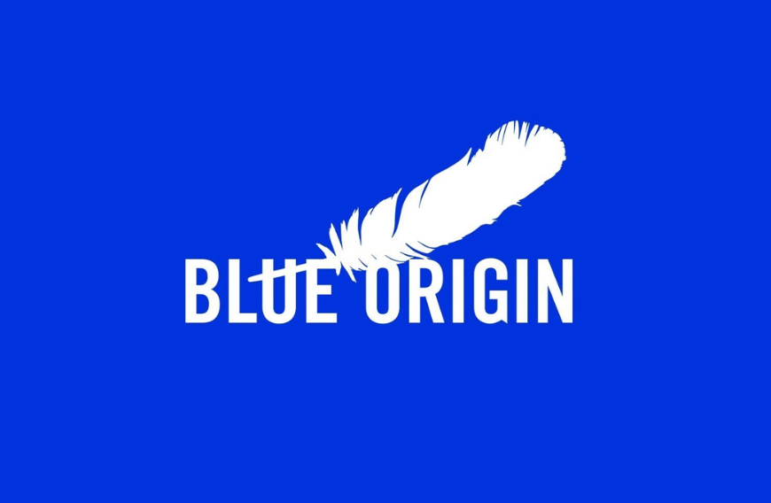
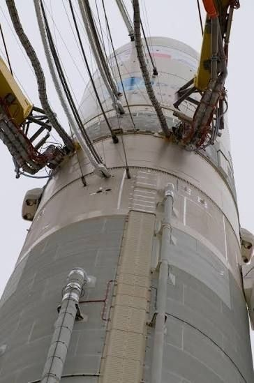
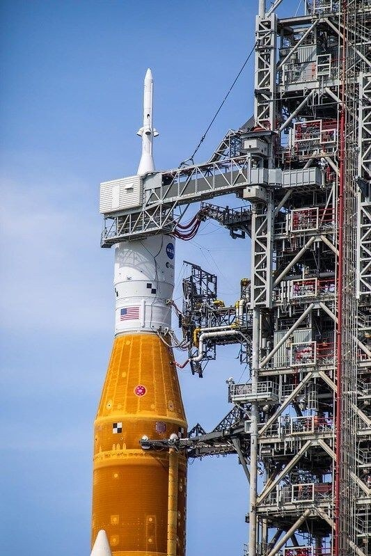
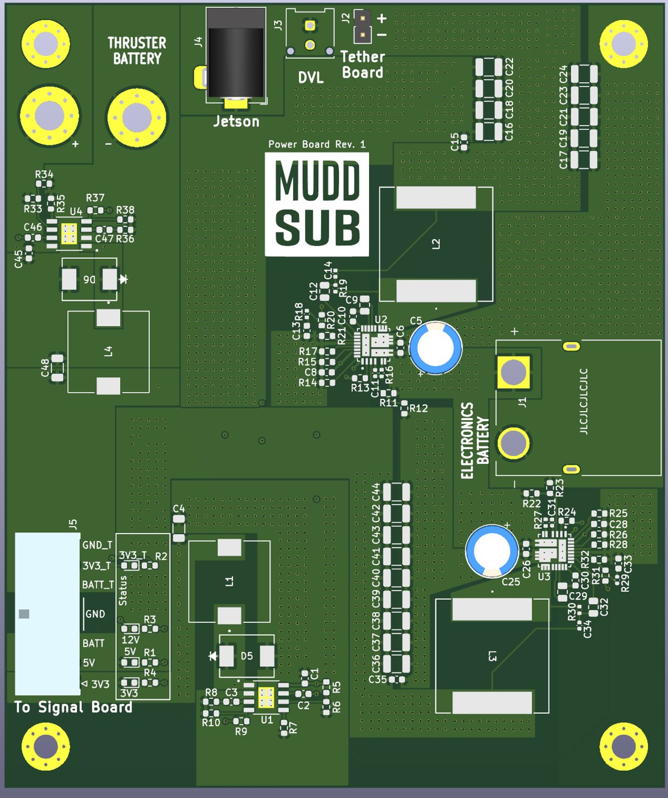
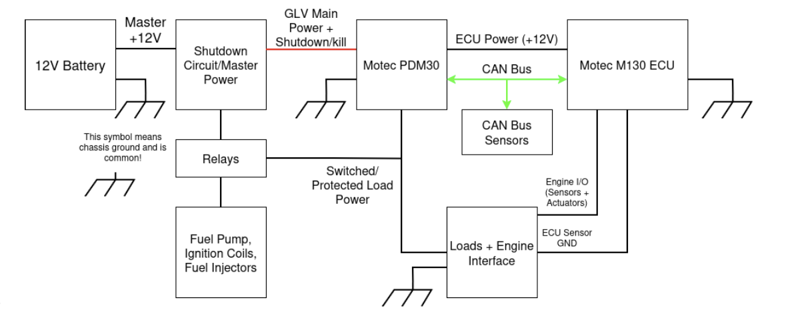

# Industry & Research Experience

## Blue Origin: Sponsored Engineering Project {#blue-origin}

```{=html}
<div style="display: flex; flex-direction: row; flex-wrap: wrap; gap: 20px; margin-bottom: 1em;">
  <div style="flex: 1; min-width: 200px; max-width: 300px;">
    
  </div>
  <div style="flex: 2; min-width: 300px;">
    <p class="justify-text">
      <strong>Automated Umbilical Panel Validation System</strong><br>
      Before launch, ground-side umbilical panels must mate with the vehicle to carry propellant, power, and electrical
      signals, a process that is still largely manual at extreme heights. Our team is selecting and validating a redundant
      multi-sensor suite (radar, LiDAR, proximity sensors, IMU, and computer vision) that feeds control logic with Kalman
      filtering to align the panels in all six degrees of freedom to about 0.1&nbsp;mm, while tolerating rain, fog,
      cryogenic temperatures, purge gas, and EMI. I own component selection, sensor installation and packaging design,
      and hardware procurement, working with Blue Origin engineers on prototype build-up and testing.
    </p>
  </div>
</div>
<div style="display: flex; flex-direction: row; flex-wrap: wrap; gap: 20px; margin-bottom: 1em;">
  <figure style="flex: 1; min-width: 200px; max-width: 320px; margin: 0;">
    
    <figcaption style="font-size: 0.8rem; color: #6c757d;">Umbilical lines connected to a launch vehicle</figcaption>
  </figure>
  <figure style="flex: 1; min-width: 200px; max-width: 320px; margin: 0;">
    
    <figcaption style="font-size: 0.8rem; color: #6c757d;">Launch-tower umbilical arms connecting to the vehicle</figcaption>
  </figure>
</div>
```

---

## USDA: Electropenetography Hardware/Firmware

```{=html}
<div style="display: flex; flex-direction: row; flex-wrap: wrap; gap: 20px; margin-bottom: 1em;">
  <div style="flex: 1; min-width: 200px; max-width: 300px;">
    
  </div>
  <div style="flex: 2; min-width: 300px;">
    <p class="justify-text">
      <strong>Overview:</strong><br>
      Designed and tested low-noise, field-deployable analog amplifiers for electropenetrography (EPG) to monitor feeding
      behavior of disease-vector insects, supporting agricultural and ecological research.
      Developed microcontroller firmware and Python-based software to acquire, process, and visualize high-sensitivity analog
      signals from insect feeding experiments.
      Applied benchtop electronics skills including oscilloscopes, function generators, and power supplies to prototype circuits,
      optimize signal quality, and improve reliability for field deployment.
    </p>
  </div>
</div>
```

---

## MuddSub: PCB Designer, Electrical Team {#muddsub}

```{=html}
<div style="display: flex; flex-direction: row; flex-wrap: wrap; gap: 20px; margin-bottom: 1em;">
  <div style="flex: 1; min-width: 200px; max-width: 300px;">
    
  </div>
  <div style="flex: 2; min-width: 300px;">
    <p class="justify-text">
      <strong>Overview:</strong><br>
      Contribute to the electrical team's KiCad design of the power and signal boards for MuddSub's 8-thruster autonomous
      underwater vehicle, competing in RoboSub. The Rev. 1 boards are now entering fabrication and verification.
      The power board converts separate thruster and electronics batteries into 12V, 5V, and 3.3V rails for the Jetson, DVL,
      tether, and signal boards. The Teensy 4.1 signal board drives thruster PWM and breaks out I&sup2;C, SPI, and UART.
      I am also working on a hydrophone amplification front end using impedance matching and AC coupling for acoustic localization.
    </p>
    <a href="pcb.html#muddsub-boards" class="learn-btn">See the Boards &rarr;</a>
  </div>
</div>
```

---

## Harvey Mudd Racing (Formula SAE): Electrical & Engine Team {#fsae}

```{=html}
<div style="margin-bottom: 1em;">
  
</div>
<p class="justify-text">
  <strong>Overview:</strong><br>
  Designing the low-voltage electrical system for Harvey Mudd Racing's first Formula SAE car. A 12V battery feeds the
  shutdown circuit and master power, which supplies a MoTeC PDM30 power distribution module and a MoTeC M130 ECU linked
  over CAN bus with CAN sensors. Relays switch the fuel pump, ignition coils, and fuel injectors. The custom harness is
  split into six subharnesses (engine sensors, injectors, ignition coils, rear, cockpit, and shutdown circuit) for easier
  maintenance and future upgrades, within a $5.5k electrical budget.
</p>
```

---

## Drone FPGA Radio-Telescope Beam Mapping

```{=html}
<div style="display: flex; flex-direction: row; flex-wrap: wrap; gap: 20px; margin-bottom: 1em;">
  <div style="flex: 1; min-width: 200px; max-width: 300px;">
    
  </div>
  <div style="flex: 2; min-width: 300px;">
    <p class="justify-text">
      <strong>Overview:</strong><br>
      Operated and programmed a large hexacopter drone carrying a custom (Xilinx FPGA) RF transmitter to calibrate and map a clear beam pattern of a ground-based radio telescope, modeling a software defined radio.
      Developed FPGA-based software-defined radio system with Verilog and Python, transmitting and receiving GHz-wideband signals for DSP analysis via Fast Fourier Transforms (FFTs).
      Configured hardware and software systems include drone flight control (PX4/Ardupilot) GPS synchronization, RF amplification, and Python-based data analysis/visualization.
    </p>
  </div>
</div>
```

---

## Head Machine Shop Proctor

```{=html}
<div style="display: flex; flex-direction: row; flex-wrap: wrap; gap: 20px; margin-bottom: 1em;">
  <div style="flex: 1; min-width: 200px; max-width: 300px;">
    
  </div>
  <div style="flex: 2; min-width: 300px;">
    <p class="justify-text">
      <strong>Overview:</strong><br>
      Supervised safe operation of machining equipment (mills, lathes, bandsaw) by student users, ensuring adherence to shop safety protocols and best practices. Trained peers in proper tool usage, machining techniques, as well as fabrication and tolerancing. As a future improvement proctor: Learn how to use the Big Brother CNC Mill, spot welder, and other advanced machinery.
    </p>
    <a href="https://sites.google.com/g.hmc.edu/hmc-machine-shop/home?authuser=0" class="learn-btn">Machine Shop Website →</a>
  </div>
</div>
```

---

## E79 Practicum Proctor

```{=html}
<div style="display: flex; flex-direction: row; flex-wrap: wrap; gap: 20px; margin-bottom: 1em;">
  <div style="flex: 1; min-width: 200px; max-width: 300px;">
    
  </div>
  <div style="flex: 2; min-width: 300px;">
    <p class="justify-text">
      <strong>Overview:</strong><br>
      Will supervise and support students through 13 hands-on lab practicums in Harvey Mudd's E79 Systems Engineering course, 
      where underwater robotics serves as the teaching vehicle for modeling, constructing, and controlling mechanical, thermal, 
      and electrical systems. Will guide student pairs through 2.5-hour sessions spanning circuit work, soldering, and 
      field experiences, providing real-time debugging assistance and ensuring adherence to lab safety protocols. 
      Responsible for fostering a collaborative and inclusive lab environment while helping students develop practical 
      engineering intuition across all five course modules.
    </p>
    <a href="https://sites.google.com/g.hmc.edu/e79-practicum/" class="learn-btn">E79 Practicum Website →</a>
  </div>
</div>
```

---

## Makerspace Repair Steward

```{=html}
<div style="display: flex; flex-direction: row; flex-wrap: wrap; gap: 20px; margin-bottom: 1em;">
  <div style="flex: 1; min-width: 200px; max-width: 300px;">
    
  </div>
  <div style="flex: 2; min-width: 300px;">
    <p class="justify-text">
      <strong>Overview:</strong><br>
      Guided makerspace users in safely operating fabrication tools including laser cutters, 3D printers, and welding equipment, fostering an inclusive and collaborative environment. Oversaw project grants and budget distribution for student projects, supporting student innovation while ensuring responsible and equitable use of resources.
    </p>
    <a href="https://make.hmc.edu/" class="learn-btn">Makerspace Website →</a>
  </div>
</div>
```