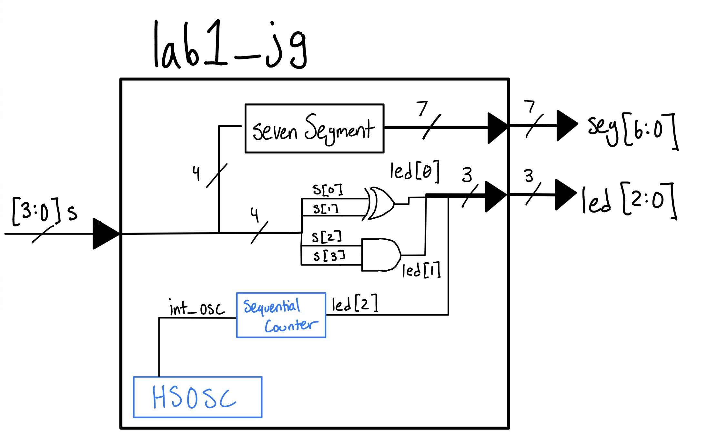
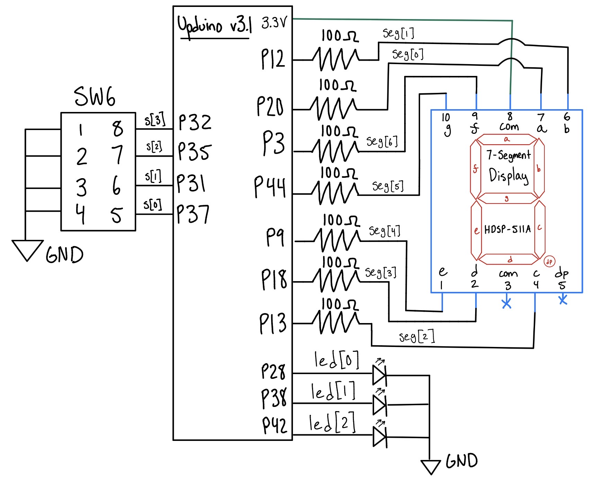
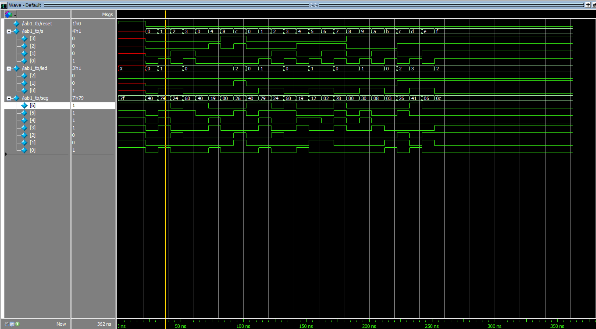

## Introduction
In this lab, a development board was assembled by soldering SMT and THT components, and a SystemVerilog design was implemented on the `UPduino v3.1 FPGA` to demonstrate the functionality of that board. Code was written to utilize the high-speed oscillator to control three on-board LEDS and a 7-Segment Display using 4 DIP switch inputs on the board. 

## Design and Testing Methodology
### Development Board Interface 
To start, the development board system consisted of Surface-Mount (SMT) and Through-Hole (THT) components that were hand-soldered onto the board. Two development boards are integrated into this PCB using female header pins: The `UPduino v3.1 FPGA` and the `Nucleo-L432KC MCU`. The resulting development board is shown in @fig-dev-board:

{#fig-dev-board}

### FPGA Implementation
| Signal Name | Signal Type | Description                                      |   |   |
|-------------|-------------|--------------------------------------------------|---|---|
| clk         | input       | 48 MHz clock on FPGA                             |   |   |
| s[3:0]      | input       | Four DIP switches (SW6)        |   |   |
| led[2:0]    | output      | 3 On-Board LEDS           |   |   |
| seg[6:0]    | output      | Common-Anode 7-segment display segments  |   |   |

: Digital Inputs and Outputs for Lab 1 {#tbl-letters}

The on-board high-speed oscillator (`HSOSC`) from the iCE40 UltraPlus primitive library was used to generate a clock signal at 24 MHz. Then, a counter was used to divide the high frequency clock signal down so that the blinking frequency could be easily visualized using one of the on-board LEDs.

The design was developed using a simple clock divider module which drives the external LED.

## Technical Documentation:

::: {.callout-note}
## Source Code
The source code for the project can be found in the associated [Github Repo](https://github.com/jgonzalezsalgado/e155-Lab1).
:::

### Block Diagram

*Lab 1 Block Diagram // Joaquin Gonzalez-Salgado // September x 2025*

{#fig-block-diagram}

The block diagram in @fig-block-diagram demonstrates the overall architecture of the design. The top-level module `lab1_jg` includes three submodules: a high-speed oscillator block (`HSOSC`), a sequential logic counter which acts as a clock divider, and the combinational logic for the 7-Segment display (`sevenSegment`).

### Schematic

*Lab 1 Wiring Schematic // Joaquin Gonzalez-Salgado // September x 2025*

{#fig-schematic}

@fig-schematic Shows the wiring approach for this lab. Each on-board LED is connected to an SMT 1 k$\Omega$ resistor via the development board. 

As for the 7-Segment display, 5 to 20 mA of current was advised in the lab manual. Since the FPGA GPIO pins output 3.3V, Ohm's law can be used to find an effective resistor for this current. (For this calculation, I chose 13 mA of current). This is shown in @eq-resistor:

$$
V = IR \implies R = \frac{V}{I} = \frac{3.3\,\text{V} - 2.0\,\text{V}}{0.013\,\text{A}} = 100\,\Omega
$$ {#eq-resistor}

## Results and Discussion

::: {.callout-note}
## Results and Discussion
The Design was a Success!
:::

The design successfully met all objectives. The LED truth table was verified both in Questa and the on-board LEDs. `led[0]` correctly implements XOR of S1 and S0, and `led[1]` correctly illuminates only when both S2 and S3 are high (AND). `led[2]` blinks at approximately 2.4 Hz, verified by observing the counter period in simulation. All 16 hexadecimal digits (0–F) were confirmed to display correctly on the 7-segment display, with distinguishable representations for visually similar digits such as b vs 8.

### Testbench Simulation

{#fig-testbench}

@fig-testbench shows a screenshot of the QuestaSim simulation. Asserts were also used to verify all 8 LED truth table cases, and all decoder outputs. 

## Conclusion

::: {.callout-note}
## Hours Spent on Lab
This lab took 20 hours. Soldering on the components to the developoment board required a lot of time, and setting up the Lattice Radiant and Programmer Environments took a bit to get used to. A huge chunk of time was dedicated to debugging USB Serial Driver issues!
:::

## AI Prototype Summary
The purpose of the AI Prototype is to experiment with utilizing AI as a coding assistant, and analyze the quality, speed, and precision that an LLM can generate code. The prompt for this week is shown below:

::: {.callout-tip}
## AI Prototype (ChatGPT)
**Prompt:** Write SystemVerilog HDL to leverage the internal high speed oscillator in the Lattice UP5K FPGA and blink an LED at 2 Hz. Take full advantage of SystemVerilog syntax, for example, using logic instead of wire and reg.
:::

::: {.callout-note}
## Generated Code:
module top (
    output logic LED
);

    logic clk_hf;
    logic clk_enable;

    assign clk_enable = 1'b1;

    HSOSC #(
        .CLKHF_DIV("0b00")
    ) hf_oscillator (
        .CLKHFPU (1'b1),
        .CLKHFEN (clk_enable),
        .CLKHF   (clk_hf)
    );

    localparam int unsigned TOGGLE_COUNT = 12_000_000 - 1;

    logic [$clog2(TOGGLE_COUNT + 1)-1:0] counter = '0;

    always_ff @(posedge clk_hf) begin
        if (counter == TOGGLE_COUNT) begin
            counter <= '0;
            LED     <= ~LED;
        end
        else begin
            counter <= counter + 1'b1;
        end
    end

endmodule
:::

### Reflection:
Every week I will try a different AI model, just to get a scope of the variety of LLMs. This week is `ChatGPT-5.5`. `ChatGPT-5.5` was able to create code that was synthesizable in Lattice Radiant, and produced a succesful verilog file that allowed for an LED to pulse at `2.01 Hz` (verified via Oscilloscope), completely on the first try. The only work I had to do was route the resulting led output to the pin on the FPGA. 

As for the quality of the output, `ChatGPT-5.5` did exactly what I told it to do, with no errors from Radiant at all. The LLM generated some syntax that I was unfamiliar with, as I have never used `$clog2` before. It also used a different method than what I had used (stating an unsigned integer for the count) so that was new. 

The next time I utilize an LLM in my workflow, I would most likely ask it to use terms/methods that I am familiar with, or explain what the different parts of the SystemVerilog file do. `ChatGPT-5.5` did not explain the workflow at all, and just gave me the code with not context.
