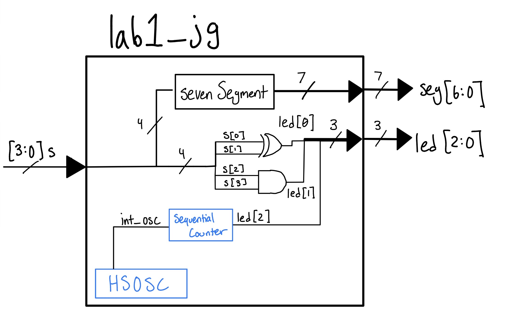
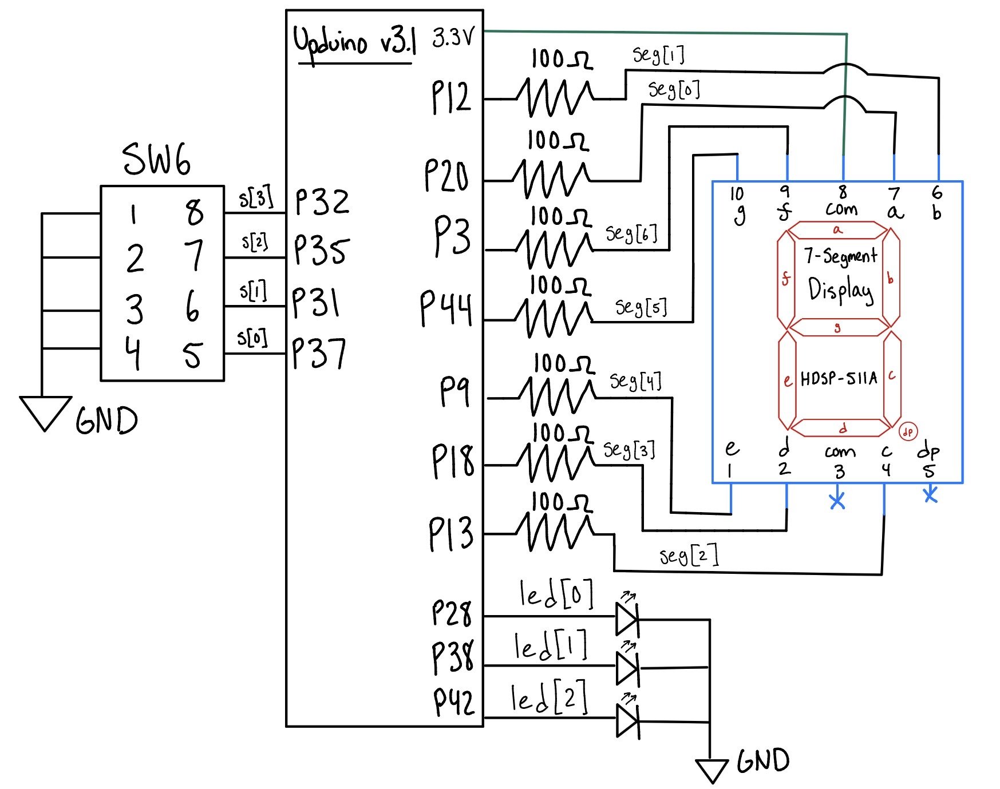

## Introduction
In this lab, a time-multiplexed dual 7-segment display and a keypad scanning circuit were implemented on the [UPduino v3.1 FPGA](https://tinyvision.ai/products/fpga-development-board-upduino-v3-1?srsltid=AfmBOoqXjkh4n-9gW1HjXNOWm0b4ySK_AJRF_WvL9qQCIZqjqcqFcVpX). Two independent 4-bit hexadecimal values are provided via DIP switches: one from the on-board switch bank and one from a breadboard DIP switch. These two values are displayed simultaneously on a dual 7-segment display by rapidly alternating between the two digits, so that a single shared `sevenSegment` decoder module and a single set of cathode pins drive both digits. A `2N3906` PNP transistor circuit sources the large anode current required by each digit. A scanning circuit drives the four rows of a matrix keypad through `2N3904` NPN transistors wired as open-collector outputs, and the four keypad columns are read back into the FPGA and driven out onto LEDs, so that pressing a key blinks an LED.

## Design and Testing Methodology
### FPGA Implementation
| Name | Type | Description                                      |   |   |
|-------------|-------------|--------------------------------------------------|---|---|
| clk         | internal    | 24 MHz internal oscillator (`HSOSC`) |   |   |
| reset       | input       | Active low; holds both counters at zero |   |   |
| s1[3:0]     | input       | Hex value shown on the first digit |   |   |
| s2[3:0]     | input       | Hex value shown on the second digit |   |   |
| cols[3:0]   | input       | Keypad columns, externally pulled up |   |   |
| rows[3:0]   | output      | One-hot scan pattern to the NPN row drivers |   |   |
| led[3:0]    | output      | Column readback; lights when a key in the scanned row is held |   |   |
| active      | output      | PNP base for digit 1; low turns that digit on |   |   |
| inactive    | output      | PNP base for digit 2; low turns that digit on |   |   |
| seg[6:0]    | output      | Shared 7-segment cathode drive (Common Anode) |   |   |

:Digital Inputs and Outputs for Lab 2 {#tbl-letters}

The same 24 MHz high-speed oscillator (`HSOSC`) from Lab 1 was used to clock the design. The top-level module `lab2_jg` contains only module instances and assign statements: the oscillator, one `counter` instance acting as the multiplexing divider, one `scanning` instance for the keypad, and the `sevenSegment` decoder reused unchanged from Lab 1. No counter is written inline, and both counters in the design are parametrized instances of the same `counter` module from Lab 1.

The multiplexing counter is instantiated with a maximum count of 50,000 and a width of 18 bits. The select signal, called `state`, is generated by comparing the count against the half-way point rather than by tapping a single counter bit, so that the divide ratio is set entirely by the parameter. `state` drives the multiplexer that selects between `s1` and `s2`, and at the same time controls the `active` and `inactive` signals to the PNP transistors, which switch the COM ports. Because the `2N3906` is a PNP with its emitter tied to 3.3 V, a low base turns a digit on, so `active` is low while `state` is low and digit 1 is lit, and `inactive` is low while `state` is high and digit 2 is lit. The two signals are always complementary, so exactly one digit is ever illuminated. The selected 4-bit value `s` is fed into the `sevenSegment` decoder, which works as previously in Lab 1, mapping hex numbers 0 to F onto the display.

The `scanning` module follows the structure required by the specifications: a single `counter` instance holds the state, and four assign statements convert that count into the one-hot row outputs. It contains no sequential logic of its own, and it inherits the active-low reset and active-high enable of the underlying counter, so it is both resettable and enable-able. Each asserted row bit turns on its `2N3904`, which pulls that keypad row to ground, while the deasserted rows leave their transistors off and float. A key pressed in the currently scanned row therefore pulls its column low against the pull-up resistor, and the top level inverts the columns before driving the LEDs. Because the deasserted rows float rather than driving high, two keys pressed in the same column connect a grounded row to a floating row instead of shorting two drivers together, so multiple simultaneous presses are tolerated without producing indeterminate voltages.

### Multiplexing and Scanning Frequency Calculations
The multiplexing counter wraps every 50,000 cycles at 24 MHz, and `state` is high for the second half of each wrap, so each digit is refreshed once per wrap:

$$
f_{\text{display}} = \frac{24,000,000}{50,000} = 480 \text{ Hz per digit}
$$

$$
t_{\text{on}} = \frac{25,000}{24,000,000} \approx 1.04 \text{ ms per digit}
$$

480 Hz is well above the flicker threshold of the human eye, and 1.04 ms of on-time is long compared to the switching time of the transistors, so there is neither flicker nor bleeding between the digits. The multiplexing counter requires 18 bits, since

$$
2^{18} = 262,144 > 50,000
$$

The scanning counter uses a maximum count of 12,000,000, so one full rotation of the four rows takes 0.5 s and each row is asserted for one quarter of that:

$$
f_{\text{scan}} = \frac{24,000,000}{12,000,000} = 2 \text{ Hz}
$$

$$
t_{\text{row}} = \frac{12,000,000 / 4}{24,000,000} = 125 \text{ ms}
$$

Each row bit is high for 125 ms once every 500 ms, meeting the 2 Hz toggle requirement. This requires 24 bits, which is

$$
2^{24} = 16,777,216
$$

## Technical Documentation:

::: {.callout-note collapse="true"}
## Source Code
The source code for the project can be found in the associated [Github Repo](https://github.com/jgonzs/Microprocessor-Projects).
:::

### Block Diagram

*Lab 2 Block Diagram // Joaquin Gonzalez-Salgado // September 12 2026*

::: {.callout-note collapse="true"}
## Expand to see Block Diagram
{#fig-block-diagram}
:::

The block diagram in @fig-block-diagram demonstrates the overall architecture of the design. The top-level module `lab2_jg` includes four submodules: a high-speed oscillator block (`HSOSC`), a `counter` instance acting as the multiplexing clock divider, a `scanning` module that drives the keypad rows, and the combinational logic for the 7-segment display (`sevenSegment`). The `scanning` module itself instantiates a second `counter`, so every counter in the design is a parametrized instance of the Lab 1 module. The remaining top-level logic consists of the comparator that produces `state`, the 2:1 multiplexer between `s1` and `s2`, the inverter that produces `inactive`, and the inverters between the keypad columns and the LEDs.

### Schematic

*Lab 2 Wiring Schematic // Joaquin Gonzalez-Salgado // September 12 2026*

::: {.callout-note collapse="true"}
## Expand to see Schematic
{#fig-schematic}
:::

@fig-schematic Shows the wiring approach for this lab. 270 $\Omega$ resistors were used for the LEDs and the display segments, 510 $\Omega$ resistors were used for the bases of the PNP and NPN transistors, and 10 k$\Omega$ pull-ups were used on the keypad columns. All FPGA pin currents are kept below the 8 mA maximum given for LVCMOS33 outputs in Section 4.17 of the iCE40 UltraPlus datasheet.

The 7-segment display and the LEDs have a forward voltage of roughly 2.0 V, and the FPGA GPIO current should not exceed 8 mA. Ohm's law gives the desired series resistor, choosing a current of 5 mA. This is shown in @eq-leds:

$$
V = IR \implies R = \frac{V}{I} = \frac{3.3\,\text{V} - 2.0\,\text{V}}{0.005\,\text{A}} = 260\,\Omega \approx 270\,\Omega
$$ {#eq-leds}

With the 270 $\Omega$ resistor actually used, each segment draws 4.8 mA, which is below the 8 mA limit. Every segment has its own resistor, so segment current does not depend on how many segments are lit and all digits are the same brightness. With all seven segments on, the common anode carries roughly 34 mA, far more than a single FPGA pin can source, which is the reason for the PNP transistor.

The 2N3906 PNP transistor has a forward voltage drop from the base to the emitter of about 0.7 V. With the same 8 mA constraint, and again choosing 5 mA, the base resistor is found in @eq-transistor:

$$
V = IR \implies R = \frac{V}{I} = \frac{3.3\,\text{V} - 0.7\,\text{V}}{0.005\,\text{A}} = 520\,\Omega \approx 510\,\Omega
$$ {#eq-transistor}

With 510 $\Omega$ the base current is 5.1 mA, under the pin limit. The forced beta is roughly 6.6, far below the 2N3906 minimum $h_{FE}$ of 60, so the transistor is fully saturated and passes the entire anode current.

The 2N3904 NPN transistors used as open-collector row drivers have the same 0.7 V base-emitter drop, so the same 510 $\Omega$ base resistor applies and each asserted row sources 5.1 mA from its FPGA pin. Only one row is asserted at a time. The collector load is only the column pull-ups, at worst 1.3 mA with four keys held in the scanned row, so the NPN is deeply saturated and each pressed column reads a solid logic low.

*Note, the two resistor approximations were made as those were the resistor values available.

## Results and Discussion

::: {.callout-note}
## Results and Discussion
The Design was a Success!
:::

The design successfully met all lab requirements. Both display digits independently show the correct hexadecimal representation of `s1` and `s2`, with all 16 digits (0–F) rendering correctly with unique, distinguishable shapes such as b versus 8. The multiplexed display shows no visible flicker at the 480 Hz per-digit refresh rate, and because each digit gets a clean 1.04 ms window with the other anode fully off, there is no bleeding between the two digits. Since each segment has its own resistor, brightness is identical regardless of how many segments are lit.

The scanning outputs rotate through 1000, 0100, 0010, and 0001 with each bit toggling at 2 Hz, and pressing any key blinks the LED corresponding to that key's column. The open-collector row drivers make this tolerant of multiple presses: two keys held in the same row light two LEDs at once, and two keys held in the same column blink their shared LED on both corresponding row phases without producing an indeterminate voltage. All of this was verified both in QuestaSim and on the breadboard.

### Testbench Simulation

::: {.callout-note collapse="true"}
## Expand to see Simulation Results
{#fig-testbench-1}

{#fig-testbench-2}

{#fig-testbench-3}
:::

@fig-testbench-1, @fig-testbench-2, and @fig-testbench-3 show screenshots of the QuestaSim simulations. Per the specifications, the Lab 1 decoder simulation was not repeated, since that module was already verified. Two new automatic testbenches were written instead. The scanning testbench instantiates the module with a short maximum count so that a full cycle takes a handful of clocks, and uses asserts to check every one of the four output values, all four transitions between them, that the output freezes while enable is low, and that the output returns to 1000 when reset is asserted mid-cycle. The top-level testbench supplies a simulation stub for the `HSOSC` primitive, which the simulator cannot elaborate on its own, and uses asserts to check that `active` and `inactive` are always complementary, that the cathode pattern matches the expected encoding of `s1` while digit 1 is on and of `s2` while digit 2 is on, and that the LED outputs always equal the inverted column inputs as the inputs are changed during the run. All asserts passed.

## Conclusion

This lab demonstrated time-multiplexing to share a single 7-segment decoder and a single set of I/O pins between two digits, and showed how transistors can move current-driving work off the FPGA pins: PNPs to source the anode current the FPGA cannot supply, and NPNs to convert ordinary push-pull outputs into open-collector row drivers that tolerate simultaneous key presses. The `sevenSegment` decoder was reused from Lab 1 without any changes, and both counters are parametrized instances of the Lab 1 `counter`, which kept the new HDL down to one small scanning module and a handful of assign statements.

::: {.callout-note}
## Hours Spent on Lab
This lab took 9 hours. Setting up the breadboard was slightly difficult, due to the number of components necessary for the lab.
:::

## AI Prototype Summary
The purpose of the AI Prototype is to experiment with utilizing AI as a coding assistant, and analyze the quality, speed, and precision that an LLM can generate code. The prompts for this week are shown below. The first was entered in a fresh conversation, and the second was entered in a new conversation with my Lab 1 files attached as context:

::: {.callout-tip}
## AI Prototype (Gemini)
**Prompt 1:** Write SystemVerilog HDL to time multiplex a single seven segment decoder (that decodes from four bits to a common anode seven segment display) to decode two sets of input bits and drive two sets of seven output bits.
:::

::: {.callout-tip}
## AI Prototype (Gemini) — With Context
**Prompt 2:** Write SystemVerilog HDL to time multiplex a single seven segment decoder (that decodes from four bits to a common anode seven segment display) to decode two sets of input bits and drive two sets of seven output bits.
:::

::: {.callout-note collapse="true"}
## Expand to see First Round of Generated Code (No Context)
module top_seven_seg_mux (
    input  logic        clk,
    input  logic        rst_n,
    input  logic [3:0]  in_data0,
    input  logic [3:0]  in_data1,
    output logic [6:0]  seg,
    output logic [1:0]  anode
);

    logic [15:0] refresh_counter;
    logic        mux_sel;
    logic [3:0]  current_nibble;

    always_ff @(posedge clk or negedge rst_n) begin
        if (!rst_n) refresh_counter <= '0;
        else        refresh_counter <= refresh_counter + 1'b1;
    end

    assign mux_sel = refresh_counter[15];

    always_comb begin
        if (mux_sel == 1'b0) begin
            current_nibble = in_data0;
            anode          = 2'b10;
        end else begin
            current_nibble = in_data1;
            anode          = 2'b01;
        end
    end

    always_comb begin
        case (current_nibble)
            4'h0: seg = 7'b100_0000;
            4'h1: seg = 7'b111_1001;
            4'h2: seg = 7'b010_0100;
            4'h3: seg = 7'b011_0000;
            4'h4: seg = 7'b001_1001;
            4'h5: seg = 7'b001_0010;
            4'h6: seg = 7'b000_0010;
            4'h7: seg = 7'b111_1000;
            4'h8: seg = 7'b000_0000;
            4'h9: seg = 7'b001_0000;
            4'hA: seg = 7'b000_1000;
            4'hB: seg = 7'b000_0011;
            4'hC: seg = 7'b100_0110;
            4'hD: seg = 7'b010_0001;
            4'hE: seg = 7'b000_0110;
            4'hF: seg = 7'b000_1110;
            default: seg = 7'b111_1111;
        endcase
    end

endmodule
:::

::: {.callout-note collapse="true"}
## Expand to see Second Round of Generated Code (With Lab 1 Files)
module top_multiplex (
    input  logic       reset,
    input  logic [3:0] s1,
    input  logic [3:0] s2,
    output logic [6:0] seg,
    output logic [1:0] anode
);

    logic int_osc;
    logic [31:0] counter = 0;
    logic [3:0] mux_digit;
    logic mux_clk;

    HSOSC #(.CLKHF_DIV(2'b01))
         hf_osc (.CLKHFPU(1'b1), .CLKHFEN(1'b1), .CLKHF(int_osc));

    always_ff @(posedge int_osc) begin
        if (reset == 0) counter <= 0;
        else            counter <= counter + 1;
    end

    assign mux_clk = counter[15];

    always_comb begin
        if (mux_clk) begin
            mux_digit = s1;
            anode     = 2'b10;
        end else begin
            mux_digit = s2;
            anode     = 2'b01;
        end
    end

endmodule
:::

### Reflection:
New week, new AI model! This week is `Gemini-3.5 Flash`. `Gemini-3.5 Flash` was able to create code off the first prompt that was synthesizable in Lattice Radiant, and produced a file that seemed very reasonable. The only concern was that the file had an external `clk` and did not use the oscillator on the FPGA board. It also inlined both the counter and the decoder into a single module, which the lab specs explicitly forbid.

For the second prompt, after uploading my files to give `Gemini-3.5 Flash` context for the problem, it could **not** get the code to synthesize. This shocked me, because I would have assumed the context would have been more helpful, but that was not the case. Although `Gemini-3.5 Flash` incorporated the oscillator in the design, the module it produced never assigns the segment outputs at all, so the decoder it was supposed to be multiplexing is simply missing. Neither version used a separate counter module, and neither attempted the scanning half of the lab.

The next time I utilize an LLM in my workflow, I think I will ask it to produce code on its own first, then provide context in the **same** AI chat, allowing for it to incorporate those aspects into its already written design. I would also state the structural constraints up front, since the model defaults to one flat module and both attempts had to be restructured into submodules anyway.