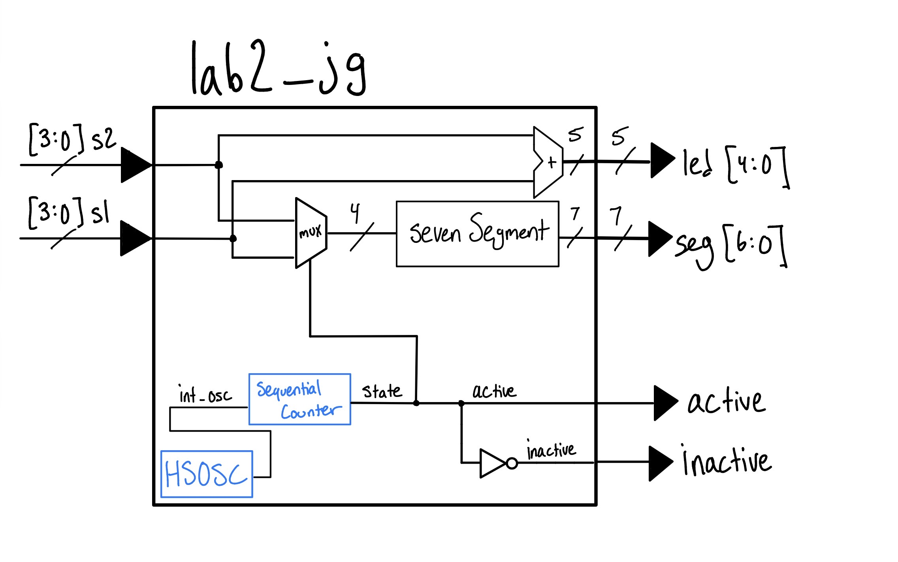
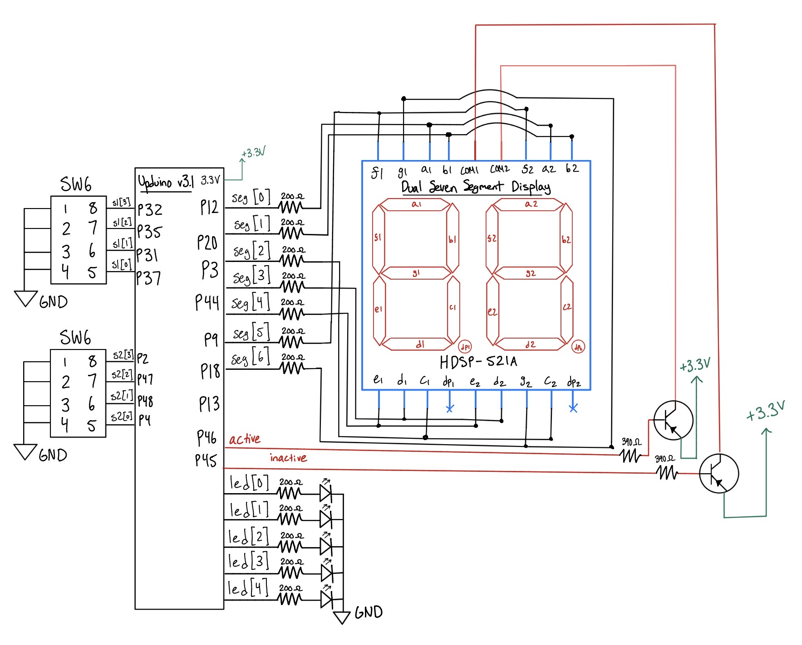

## Introduction
In this lab, a time-multiplexed dual 7-segment display was implemented using the [`UPduino v3.1 FPGA`](https://upduino.readthedocs.io/en/latest/features/specs.html#upduino-pinout). Two independent 4-bit hexadecimal values are provided via DIP switches: one from the on-board switch bank and one from a breadboard DIP switch. These two values are displayed simultaneously on a dual 7-segment display by rapidly alternating between the two digits. A single shared `sevenSegment` decoder module drives the cathodes for both digits. The sum of the two input values is displayed across five on-board LEDs. A `2N3906` PNP transistor circuit was built to source the large anode current required by each display digit.

## Design and Testing Methodology
### FPGA Implementation
| Signal Name | Signal Type |                        Description                       |   |   |
|:-----------:|:-----------:|:--------------------------------------------------------:|---|---|
| int_osc     | internal    | 48 MHz clock      |   |   |
| s1[3:0]     | input       | First 7-segment               |   |   |
| s2[3:0]     | input       | Second 7-segment            |   |   |
| reset     | input       |  Hold to turn off Display                             |   |   |
| active      | output      | Currently Active Anode     |   |   |
| inactive    | output      | Currently Inactive Anode |   |   |
| led[4:0]    | output      | 5-bit sum of s1 and s2        |   |   |
| seg[6:0]    | output      | Resulting displayed output (switches between s1 and s2)   |   |   |

: Digital Inputs and Outputs for Lab 2 {#tbl-letters}


The top-level module `lab2_jg` uses the same 24 MHz internal high-speed oscillator (`HSOSC`) divider from Lab 1. A 20-bit counter is incremented by 10 on every rising clock edge, producing an approximately `229 Hz` toggle. This toggle signal called `state`, is the input to the multiplexer that selects between `s1` and `s2`, the two numbers to be displayed. At the same time, it controls the `active` and `inactive` signals to the PNP transistors, which control the COM ports. Each digit is therefore illuminated at roughly `114 Hz`, which is above the flicker threshold of the human eye.

The selected 4-bit value (between `s1` and `s2`) `s` is fed into the `sevenSegment` decoder, which works as previously in Lab 1 mapping hex numbers 0 to F on the display. Five LEDs on a breadboard directly implement the 5-bit sum `s1 + s2`.

### Multiplexing Frequency Calculation
The counter increments by 10 each cycle at 24 MHz, and `state` = `counter[19]`:

$$
\begin{aligned}
f_{\text{switching}} &= \frac{24{,}000{,}000 \times 10}{2^{20}} \approx 228.9 \text{ Hz} \\
f_{\text{display}} &= \frac{f_{\text{switching}}}{2} \approx 114.4 \text{ Hz per display}
\end{aligned}
$$


## Technical Documentation:

::: {.callout-note}
## Source Code
The source code for the project can be found in the associated [Github Repo](https://github.com/jgonzalezsalgado/e155-Lab2).
:::

### Block Diagram
*Lab 2 Block Diagram // Joaquin Gonzalez-Salgado // May 29th 2026*

{#fig-block-diagram}

The top-level module `lab2_jg` contains four submodules: the `HSOSC` clock, a sequential 20-bit counter acting as a clock divider and display controller, a mux selecting between `s1` and `s2`, and the `sevenSegment` decoder from previous labs. The active and inactive anode control signals are connected to the bases of two `2N3906` PNP transistors.

### Schematic

*Lab 2 Wiring Schematic // Joaquin Gonzalez-Salgado // May 29th 2026*

{#fig-schematic}

@fig-schematic Shows the wiring schematic for this lab. 270 Ohm resistors were used for the LEDS and Display, and 510 Ohm resistors were used for the Base of the PNPs. The calculations for these resistors are described below:


The 7-segment display and Green LEDS have a forward voltage of roughly 2.0 V, and we do not want to exceed the FPGA GPIO current of 8 mA. So, we can use Ohm's law to find the desired resistor (using a current of 5 mA) This is shown in @eq-leds:


$$
V = IR \implies R = \frac{V}{I} = \frac{3.3\,\text{V} - 2\,\text{V}}{0.005\,\text{A}} = 260\,\Omega \approx 270\,\Omega
$$ {#eq-leds}


The 2N3906 PNP transistor has a forward voltage drop from the Base to the Emitter of about 0.7 V. With the same current constraint of 8 mA, we can find a desired resistor for the circuit. (Once again choosing a current of 5 mA.)
This is shown in @eq-transistor:

$$
V = IR \implies R = \frac{V}{I} = \frac{3.3\,\text{V} - 0.7\,\text{V}}{0.005\,\text{A}} = 520\,\Omega \approx 510\,\Omega
$$ {#eq-transistor}

*Note, the two resistor approximations were made as those were the resistor values available.

## Results and Discussion

::: {.callout-note}
## Results and Discussion
The Design was a Success!
:::

The design successfully met all lab requirements. Both display digits independently show the correct hexadecimal representation of `s1` and `s2`, with all 16 digits (`0`–`F`) rendering correctly with unique, distinguishable shapes. The multiplexed display shows no visible flicker at the `~114 Hz` per digit switching rate. The five LEDs correctly display the binary sum `s1 + s2`, including the carry bit on `led[4]`. The QuestaSim testbench verified correct decoder outputs for all 16 input combinations, and asserts in the tesetbenched all passed.

### Testbench Simulation

{#fig-testbench}

The simulation confirmed the correct behavior for toggling between `s1` and `s2`. Asserts showed that the 7-segment decoder remained accurate, and the summing logic for the 5 leds was proved accurate with this as well. (These were also verified visually on the breadboard)

## Conclusion
This lab successfully demonstrated time-multiplexing to share a single 7-segment decoder and a single set of I/O pins to display two separate digits. The design reused the `sevenSegment` decoder from Lab 1 without any changes.

::: {.callout-note}
## Hours Spent on Lab
This lab took 9 hours. Setting up the breadboard was slightly difficult, due to the number of components necessary for the lab.
:::


## AI Prototype

::: {.callout-tip}
## AI Prototype (Gemini)
**Prompt 1:** Write SystemVerilog HDL to time multiplex a single seven segment decoder (that decodes from four bits to a common anode seven segment display) to decode two sets of input bits and drive two sets of seven output bits.
:::

Then, starting a new AI conversation and attaching my lab 1 files as context, I entered this prompt:

::: {.callout-tip}
## AI Prototype (Gemini) — With Context
**Prompt 2:** Write SystemVerilog HDL to time multiplex a single seven segment decoder (that decodes from four bits to a common anode seven segment display) to decode two sets of input bits and drive two sets of seven output bits.
:::

::: {.callout-note}
## First Round of Generated Code (No Context):
```systemverilog
module top_seven_seg_mux (
    input  logic        clk,
    input  logic        rst_n,
    input  logic [3:0]  in_data0,
    input  logic [3:0]  in_data1,
    output logic [6:0]  seg,
    output logic [1:0]  anode
);

    logic [15:0] refresh_counter;
    logic        mux_sel;
    logic [3:0]  current_nibble;

    always_ff @(posedge clk or negedge rst_n) begin
        if (!rst_n) refresh_counter <= '0;
        else        refresh_counter <= refresh_counter + 1'b1;
    end

    assign mux_sel = refresh_counter[15];

    always_comb begin
        if (mux_sel == 1'b0) begin
            current_nibble = in_data0;
            anode          = 2'b10;
        end else begin
            current_nibble = in_data1;
            anode          = 2'b01;
        end
    end

    always_comb begin
        case (current_nibble)
            4'h0: seg = 7'b100_0000;
            4'h1: seg = 7'b111_1001;
            4'h2: seg = 7'b010_0100;
            4'h3: seg = 7'b011_0000;
            4'h4: seg = 7'b001_1001;
            4'h5: seg = 7'b001_0010;
            4'h6: seg = 7'b000_0010;
            4'h7: seg = 7'b111_1000;
            4'h8: seg = 7'b000_0000;
            4'h9: seg = 7'b001_0000;
            4'hA: seg = 7'b000_1000;
            4'hB: seg = 7'b000_0011;
            4'hC: seg = 7'b100_0110;
            4'hD: seg = 7'b010_0001;
            4'hE: seg = 7'b000_0110;
            4'hF: seg = 7'b000_1110;
            default: seg = 7'b111_1111;
        endcase
    end

endmodule
```
:::

::: {.callout-note}
## Second Round of Generated Code (With Lab 1 Files):
```systemverilog
module top_multiplex (
    input  logic       reset,
    input  logic [3:0] s1,
    input  logic [3:0] s2,
    output logic [6:0] seg,
    output logic [1:0] anode
);

    logic int_osc;
    logic [31:0] counter = 0;
    logic [3:0] mux_digit;
    logic mux_clk;

    HSOSC #(.CLKHF_DIV(2'b01)) 
         hf_osc (.CLKHFPU(1'b1), .CLKHFEN(1'b1), .CLKHF(int_osc)); 

    always_ff @(posedge int_osc) begin
        if (reset == 0) counter <= 0;
        else            counter <= counter + 1;
    end

    assign mux_clk = counter[15];

    always_comb begin
        if (mux_clk) begin
            mux_digit = s1;
            anode     = 2'b10;
        end else begin
            mux_digit = s2;
            anode     = 2'b01;
        end
    end

endmodule
```
:::

### Reflection:
New week new AI model! This week is `Gemini-3.5 Flash`. `Gemini-3.5 Flash` was able to create code off the first prompt that was synthesizable in Lattice Radiant, and produced a file that seemed very reasonable. The only concern was that the file had an external `clk`, and did not use the oscillator on the FPGA board. 

For the second prompt, after uploading the files to show `Gemini-3.5 Flash` context for the problem, `Gemini-3.5 Flash` could **not** get the code to synthesize. This shocked me, because I would have assumed the context would have been more helpful, but that was not the case. Although `Gemini-3.5 Flash` incorporated the oscillator in the design, it ultimately failed in writing code that could be synthesized.

The next time I utilize an LLM in my workflow, I think I will ask it to produce code on its own first, then provide context in the **same** AI chat, allowing for it to incorporate those aspects into its already written design.