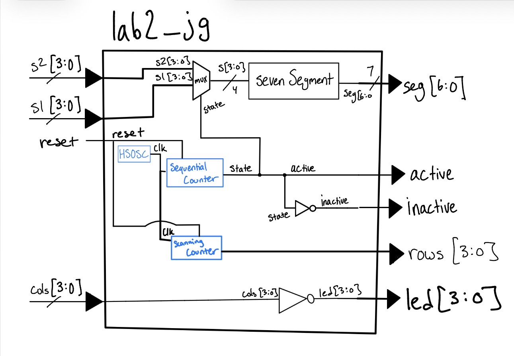
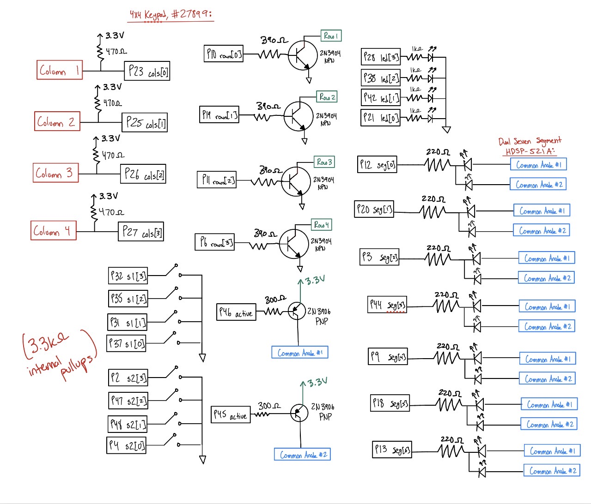
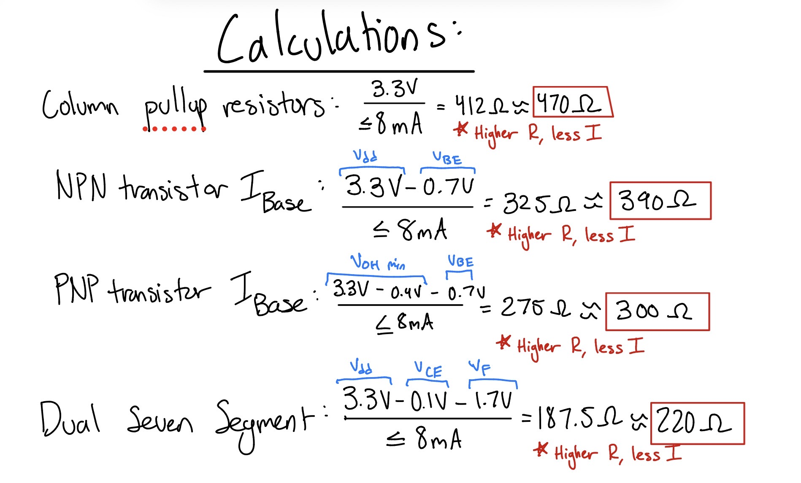
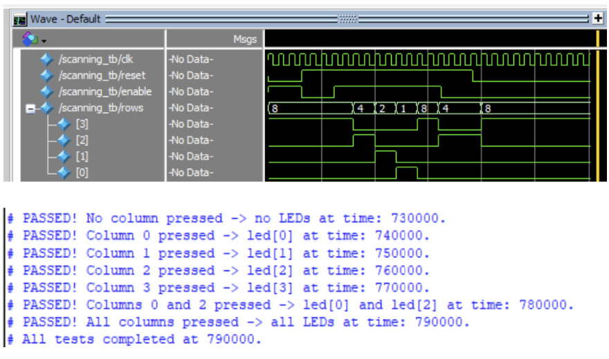

## Introduction
In this lab, a time-multiplexed dual 7-segment display and a keypad scanning circuit were implemented using the [`UPduino v3.1 FPGA`](https://upduino.readthedocs.io/en/latest/features/specs.html#upduino-pinout). Two independent 4-bit hexadecimal values are provided via DIP switches: one from the on-board switch and one from a breadboard DIP switch. These two values are displayed simultaneously on a dual 7-segment display by rapidly alternating between the two digits, so that a single shared `sevenSegment` decoder module and a single set of cathode pins drive both digits. A `2N3906` PNP transistor circuit sources the large anode current required by each digit. A scanning circuit drives the four rows of a matrix keypad through `2N3904` NPN transistors wired as open-collector outputs, and the four keypad columns are read back into the FPGA and driven out onto LEDs, so that pressing a key lights the LED for its column.

## Design and Testing Methodology
### FPGA Implementation
| Signal Name | Signal Type |                        Description                       |   |   |
|:-----------:|:-----------:|:--------------------------------------------------------:|---|---|
| int_osc     | internal    | 24 MHz internal oscillator (`HSOSC`)      |   |   |
| s1[3:0]     | input       | Hex value for the first digit (on-board DIP switches)               |   |   |
| s2[3:0]     | input       | Hex value for the second digit (breadboard DIP switches)            |   |   |
| reset     | input       |  Holds the multiplexing and scanning counters at reset                             |   |   |
| cols[3:0]   | input       | Keypad columns, externally pulled up |   |   |
| rows[3:0]   | output      | Scan pattern to rows |   |   |
| led[3:0]    | output      | Column readback |   |   |
| active      | output      | Digit 1     |   |   |
| inactive    | output      | Digit 2 |   |   |
| seg[6:0]    | output      | Shared 7-segment decoder   |   |   |

: Digital Inputs and Outputs for Lab 2 {#tbl-letters}

## Technical Documentation:

::: {.callout-note collapse="true"}
## Source Code
The source code for the project can be found in the associated [Github Repo](https://github.com/jgonzs/Microprocessor-Projects).
:::

### Block Diagram
*Lab 2 Block Diagram // Joaquin Gonzalez-Salgado // September 14th 2026*

::: {.callout-note collapse="true"}
## Expand to see Block Diagram
{#fig-block-diagram}
:::

The block diagram in @fig-block-diagram shows the top-level architecture of `lab2_jg`. Internally, `HSOSC` provides the clock to two counter instances: a sequential counter that produces `state`, and a separate scanning counter that produces the one-hot `rows[3:0]` pattern for the keypad. `state` selects between `s1` and `s2` at the 2:1 multiplexer feeding the `sevenSegment` decoder, and also drives `active` directly and `inactive` through an inverter, so the two PNP anode controls are always complementary. The four keypad columns, `cols[3:0]`, are inverted and driven straight out onto `led[3:0]`.

### Schematic

*Lab 2 Wiring Schematic // Joaquin Gonzalez-Salgado // September 14th 2026*

::: {.callout-note collapse="true"}
## Expand to see Schematic
{#fig-schematic}
:::

@fig-schematic shows the wiring for the FPGA, the DIP switches, the 4x4 matrix keypad, the `2N3906` PNP anode drivers, the `2N3904` NPN row drivers, and the dual seven-segment display. A resistor is placed in series with every FPGA pin that sources or sinks current: 470 $\Omega$ pull-up resistors on the four keypad columns, 390 $\Omega$ and 300 $\Omega$ resistors on the NPN and PNP transistor bases respectively, and 220 $\Omega$ resistors on the seven-segment display segments. Every one of these values keeps the corresponding pin below the 8 mA maximum LVCMOS33 output current given in Section 4.17 of the iCE40 UltraPlus datasheet. The derivations for these resistors are shown in @fig-calculations.

### Calculations

::: {.callout-note collapse="true"}
## Expand to see Calculations
{#fig-calculations}
:::

## Results and Discussion

::: {.callout-note}
## Results and Discussion
The Design was a Success!
:::

The design meets all of the lab's requirements, with no known shortcomings. Both digits correctly display `s1` and `s2`, with consistent brightness regardless of how many segments are lit. The display shows no visible flicker or bleeding between digits. The keypad scanning signal is correctly displayed under all keypress conditions, including multiple simultaneous presses.

### Testbench Simulation

As specified, the Lab 1 `sevenSegment` decoder simulation was not repeated, since that module was already verified there. Two new automatic testbenches were written instead, one for the `scanning` module and one for the top-level `lab2_jg` module.

::: {.callout-note collapse="true"}
## Expand to see Simulation Results
{#fig-testbench}

{#fig-testbench-scanning}
:::

## Conclusion
This lab successfully demonstrated time-multiplexing to share a single 7-segment decoder and a single set of I/O pins between two digits, and showed how transistors can move current-driving work off the FPGA pins: PNPs to source the anode current the FPGA cannot supply, and NPNs to convert ordinary push-pull outputs into open-collector row drivers for the keypad. The design reused the `sevenSegment` decoder from Lab 1 without any changes.

::: {.callout-note}
## Hours Spent on Lab
This lab took 13 hours. Setting up the breadboard was slightly difficult, due to the number of components necessary for the lab.
:::


## AI Prototype

::: {.callout-tip}
## AI Prototype (Gemini)
**Prompt 1:** Write SystemVerilog HDL to time multiplex a single seven segment decoder (that decodes from four bits to a common anode seven segment display) to decode two sets of input bits and drive two sets of seven output bits.
:::

Then, starting a new AI conversation and attaching my lab 1 files as context, I entered this prompt:

::: {.callout-tip}
## AI Prototype (Gemini) — With Context
**Prompt 2:** Write SystemVerilog HDL to time multiplex a single seven segment decoder (that decodes from four bits to a common anode seven segment display) to decode two sets of input bits and drive two sets of seven output bits.
:::

::: {.callout-note collapse="true"}
## Expand to see First Round of Generated Code (No Context)
```systemverilog
module top_seven_seg_mux (
    input  logic        clk,
    input  logic        rst_n,
    input  logic [3:0]  in_data0,
    input  logic [3:0]  in_data1,
    output logic [6:0]  seg,
    output logic [1:0]  anode
);

    logic [15:0] refresh_counter;
    logic        mux_sel;
    logic [3:0]  current_nibble;

    always_ff @(posedge clk or negedge rst_n) begin
        if (!rst_n) refresh_counter <= '0;
        else        refresh_counter <= refresh_counter + 1'b1;
    end

    assign mux_sel = refresh_counter[15];

    always_comb begin
        if (mux_sel == 1'b0) begin
            current_nibble = in_data0;
            anode          = 2'b10;
        end else begin
            current_nibble = in_data1;
            anode          = 2'b01;
        end
    end

    always_comb begin
        case (current_nibble)
            4'h0: seg = 7'b100_0000;
            4'h1: seg = 7'b111_1001;
            4'h2: seg = 7'b010_0100;
            4'h3: seg = 7'b011_0000;
            4'h4: seg = 7'b001_1001;
            4'h5: seg = 7'b001_0010;
            4'h6: seg = 7'b000_0010;
            4'h7: seg = 7'b111_1000;
            4'h8: seg = 7'b000_0000;
            4'h9: seg = 7'b001_0000;
            4'hA: seg = 7'b000_1000;
            4'hB: seg = 7'b000_0011;
            4'hC: seg = 7'b100_0110;
            4'hD: seg = 7'b010_0001;
            4'hE: seg = 7'b000_0110;
            4'hF: seg = 7'b000_1110;
            default: seg = 7'b111_1111;
        endcase
    end

endmodule
```
:::

::: {.callout-note collapse="true"}
## Expand to see Second Round of Generated Code (With Lab 1 Files)
```systemverilog
module top_multiplex (
    input  logic       reset,
    input  logic [3:0] s1,
    input  logic [3:0] s2,
    output logic [6:0] seg,
    output logic [1:0] anode
);

    logic int_osc;
    logic [31:0] counter = 0;
    logic [3:0] mux_digit;
    logic mux_clk;

    HSOSC #(.CLKHF_DIV(2'b01))
         hf_osc (.CLKHFPU(1'b1), .CLKHFEN(1'b1), .CLKHF(int_osc));

    always_ff @(posedge int_osc) begin
        if (reset == 0) counter <= 0;
        else            counter <= counter + 1;
    end

    assign mux_clk = counter[15];

    always_comb begin
        if (mux_clk) begin
            mux_digit = s1;
            anode     = 2'b10;
        end else begin
            mux_digit = s2;
            anode     = 2'b01;
        end
    end

endmodule
```
:::

### Reflection:
New week new AI model! This week is `Gemini-3.5 Flash`. `Gemini-3.5 Flash` was able to create code off the first prompt that was synthesizable in Lattice Radiant, and produced a file that seemed very reasonable. The only concern was that the file had an external `clk`, and did not use the oscillator on the FPGA board.

For the second prompt, after uploading the files to show `Gemini-3.5 Flash` context for the problem, `Gemini-3.5 Flash` could **not** get the code to synthesize. This shocked me, because I would have assumed the context would have been more helpful, but that was not the case. Although `Gemini-3.5 Flash` incorporated the oscillator in the design, it ultimately failed in writing code that could be synthesized.

The next time I utilize an LLM in my workflow, I think I will ask it to produce code on its own first, then provide context in the **same** AI chat, allowing for it to incorporate those aspects into its already written design.
