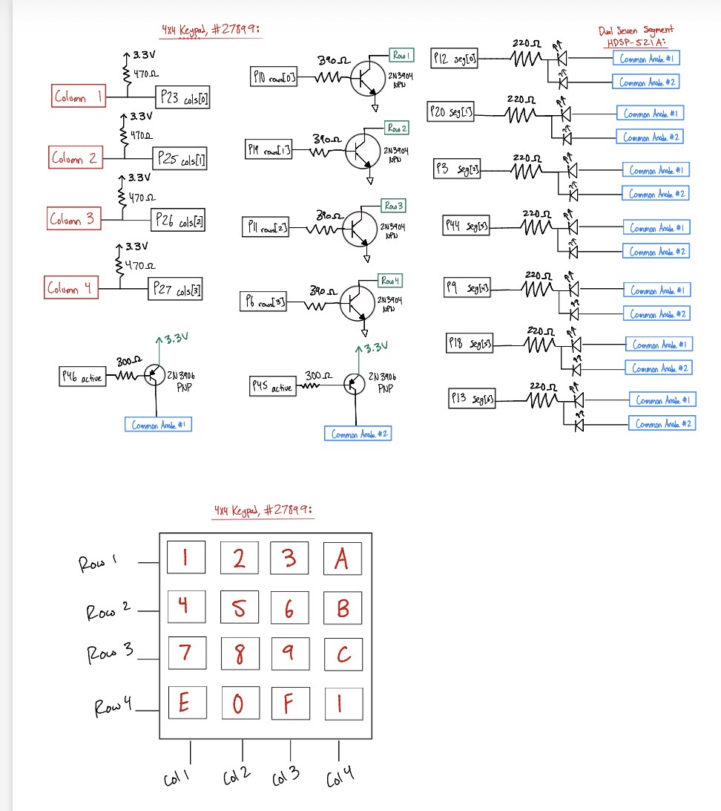
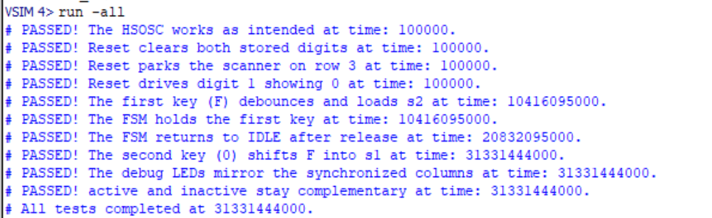
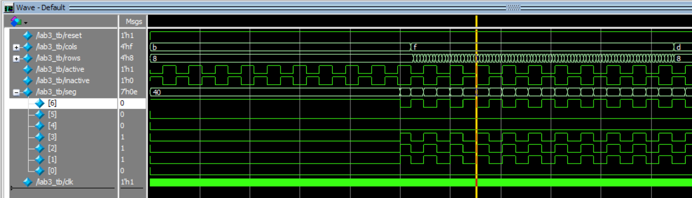
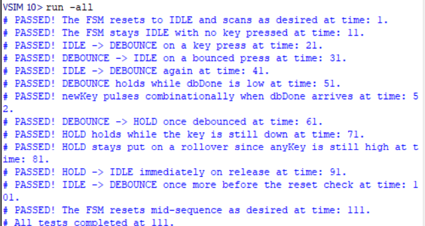
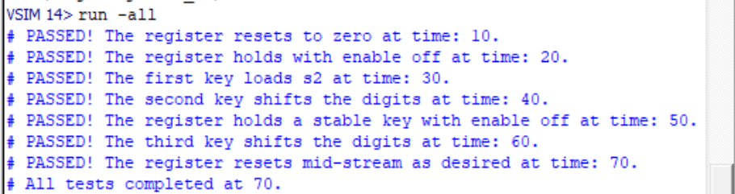
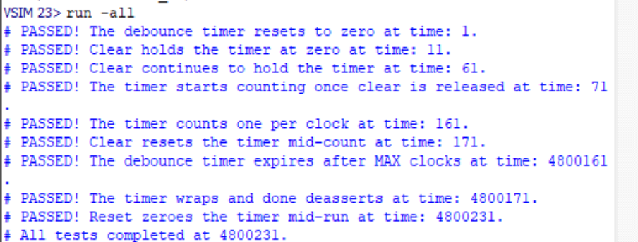
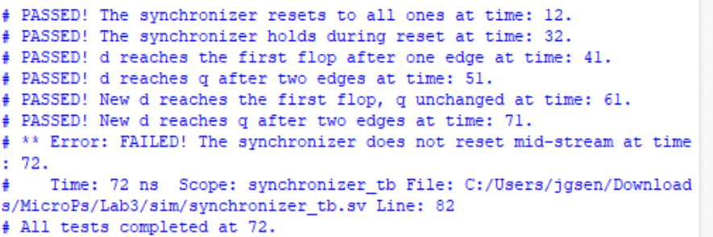

## Introduction
In this lab, a debounced, single-registration keypad reader was implemented on the [UPduino v3.1 FPGA](https://tinyvision.ai/products/fpga-development-board-upduino-v3-1?srsltid=AfmBOoqXjkh4n-9gW1HjXNOWm0b4ySK_AJRF_WvL9qQCIZqjqcqFcVpX), reusing the 4x4 matrix keypad, `2N3904`/`2N3906` transistor drivers, and dual seven-segment display wired for [Lab 2](../lab2/lab2.qmd). Rather than continuously reading the scanned keypad columns onto LEDs, this lab synchronizes the asynchronous keypad inputs, debounces the mechanical switch bounce inherent to the keypad, and uses a finite state machine to register each keypress exactly once regardless of how long the key is held. The dual seven-segment display, reused unchanged from Lab 2, shows the last two hexadecimal digits pressed.

## Design and Testing Methodology
### FPGA Implementation
| Name | Type | Description |   |   |
|-------------|-------------|--------------------------------------------------|---|---|
| clk         | internal    | 24 MHz internal oscillator (`HSOSC`) |   |   |
| reset       | input       | Active low |   |   |
| cols[3:0]   | input       | Keypad columns, externally pulled up |   |   |
| rows[3:0]   | output      | Scan pattern to rows |   |   |
| active      | output      | Digit 1 |   |   |
| inactive    | output      | Digit 2 |   |   |
| seg[6:0]    | output      | Common Anode |   |   |

: Digital Inputs and Outputs for Lab 3 {#tbl-letters}

### FSM Communication
The design is made up of five communicating FSMs:

- **Keypad FSM (`keypadFSM`):** the main controller, which decides when to scan, debounce, and register a key.
- **Scanning sequence (`scanning`):** cycles through the keypad rows. The keypad FSM stops it on the active row with `scanEn` when a key is pressed.
- **Debounce timer (`debounceTimer`):** counts while the keypad FSM is in DEBOUNCE, and sends `dbDone` when the time is up.
- **Digit register (`digitRegister`):** stores the last two keys pressed, and shifts in a new digit when the keypad FSM pulses `newKey`.
- **Display multiplexing:** alternates between the two digits stored in the digit register on the dual seven-segment display.

### Switch Debouncing Strategy
When a key is pressed, the keypad FSM waits for the duration of a typical button bounce (20 ms, or 480,000 clock cycles at 24 MHz). Once that time has passed, the debounce timer sends `dbDone` to tell the FSM to continue and register the key.

## Technical Documentation:

::: {.callout-note collapse="true"}
## Source Code
The source code for the project can be found in the associated [Github Repo](https://github.com/jgonzs/Microprocessor-Projects).
:::

### Block Diagram

*Lab 3 Block Diagram // Joaquin Gonzalez-Salgado // September 21 2026*

::: {.callout-note collapse="true"}
## Expand to see Block Diagram
{#fig-block-diagram}
:::

### State Transition Diagram

::: {.callout-note collapse="true"}
## Expand to see State Transition Diagram
{#fig-fsm}
:::

### State Transition Table

| Current State | Inputs | Next State | `scanEn` | `dbClear` | `newKey` |
|----------|--------------------------------------------|----------|---|---|---|
| IDLE     | `!anyKey`                                  | IDLE     | 1 | 1 | 0 |
| IDLE     | `anyKey & !oneKey` (multiple keys)         | IDLE     | 0 | 1 | 0 |
| IDLE     | `oneKey`                                   | DEBOUNCE | 0 | 1 | 0 |
| DEBOUNCE | `!oneKey`                                  | IDLE     | 0 | 0 | 0 |
| DEBOUNCE | `oneKey & !dbDone`                         | DEBOUNCE | 0 | 0 | 0 |
| DEBOUNCE | `oneKey & dbDone`                          | HOLD     | 0 | 0 | 1 |
| HOLD     | `!anyKey`                                  | IDLE     | 0 | 1 | 0 |
| HOLD     | `oneKey & !sameKey`                        | DEBOUNCE | 0 | 1 | 0 |
| HOLD     | `anyKey & !(oneKey & !sameKey)`            | HOLD     | 0 | 1 | 0 |

: Keypad FSM next-state and output table {#tbl-state-transition}

### Synthesis Results
::: {.callout-note collapse="true"}
## Expand to see Synthesized Netlist
{#fig-netlist}
:::

The synthesized netlist in @fig-netlist contains only flip-flops, multiplexers, comparators, and logic gates. No latches or tristate buffers were inferred: every `always_comb` block assigns its outputs on all paths, and no signal is ever driven to `z`.


### Schematic

*Lab 3 Wiring Schematic // Joaquin Gonzalez-Salgado // September 21 2026*

::: {.callout-note collapse="true"}
## Expand to see Schematic
{#fig-schematic}
:::

The wiring shown in @fig-schematic is reused from [Lab 2](../lab2/lab2.qmd).

## Results and Discussion

::: {.callout-note}
## Results and Discussion
The Design was a Success!
:::

Everything works as intended! The keypad is correctly debounced and synchronized, each keypress is registered exactly once regardless of how long the key is held, and the dual seven-segment display correctly shows the last two hexadecimal digits pressed.

### Testbench Simulation

::: {.callout-note collapse="true"}
## Expand to see Simulation Results
#### Top Level (`lab3`)
{#fig-sim-top-transcript}

{#fig-sim-top-wave-1}

{#fig-sim-top-wave-2}

#### Keypad FSM (`keypadFSM`)
{#fig-sim-fsm-wave}

{#fig-sim-fsm-transcript}

#### Digit Register (`digitRegister`)
{#fig-sim-digitRegister-wave}

{#fig-sim-digitRegister-transcript}

#### Key Decoder (`keyDecoder`)
{#fig-sim-keyDecoder-wave}

{#fig-sim-keyDecoder-transcript}

#### Debounce Timer (`debounceTimer`)
{#fig-sim-debounceTimer-wave}

{#fig-sim-debounceTimer-transcript}

#### Synchronizer (`synchronizer`)
{#fig-sim-synchronizer-wave}

{#fig-sim-synchronizer-transcript}
:::

Testbenches were written for the top-level module and each submodule. All asserts passed.

## Conclusion

This lab built on the display and keypad hardware from Lab 2 by adding synchronization, debouncing, and a finite state machine to turn raw, bouncy switch contacts into a single clean event per keypress. Reusing the Lab 2 scanning, decoder, and multiplexing logic kept the new HDL focused on the FSM and debounce logic, and demonstrated how a fully synchronous design with strobed enables avoids the metastability and glitching problems that come with asynchronous keypad inputs.

::: {.callout-note}
## Hours Spent on Lab
This lab took 23 hours.
:::


## AI Prototype Summary

::: {.callout-tip}
## AI Prototype A: Monolithic Prompt
**Prompt:** Target device: Lattice iCE40 UP5K FPGA with internal high-speed oscillator (~20 MHz).

Write synthesizable SystemVerilog to scan a 4x4 matrix keypad and display the last two hex keys pressed on a dual 7‑segment display. Implement:

A clock divider that derives a scan clock on the order of 100–200 Hz from the internal oscillator.
A keypad scanning controller that iterates one active‑low column at a time and samples active‑low rows, registering at most one key per press (debounce‑by‑design), ignoring additional presses while any key is held, and allowing a new registration only after release.
A top level that updates two hex digits (older and most recent) when a new key is registered and drives a time‑multiplexed two‑digit 7‑segment display without visible flicker and with balanced brightness.
Use idiomatic SystemVerilog (e.g., logic, always_ff, enumerated states for FSMs). Provide clean module boundaries and keep all state synchronous. Include brief comments explaining the design choices.

Create a new Radiant project, type the code generated by the LLM in and analyze the results. If the synthesis fails, type the error message back into the LLM to see what suggestions it generates.
:::

::: {.callout-note collapse="true"}
## Expand to see Generated Code (Prototype A)
```systemverilog
// ============================================================================
// 4x4 Matrix Keypad -> Last Two Hex Keys -> Dual 7-Segment Display
//
// Target: Lattice iCE40 UP5K
// Clock : ~20 MHz
//
// Keypad:
//   row[3:0]    : active-low row drive
//   col[3:0]    : active-low column inputs
//
// Display:
//   seg[6:0]    : {g,f,e,d,c,b,a}, active-low
//   digit[1:0]  : active-low digit enables
//
// Key mapping:
//   1 2 3 A
//   4 5 6 B
//   7 8 9 C
//   E 0 F D
//
// ============================================================================

module keypad_hex_top #(
    parameter int CLK_HZ = 20_000_000,

    // Keypad scan frequency. 100 Hz means each row is visited at 100 Hz.
    // A complete 4-row scan therefore takes 40 ms.
    parameter int SCAN_HZ = 100,

    // Number of identical complete scans required before accepting a
    // changed key state. 3 scans ~= 120 ms with SCAN_HZ=100.
    parameter int DEBOUNCE_SCANS = 3,

    // Display multiplexing frequency per digit.
    parameter int DISP_HZ = 1000
) (
    input  logic       clk,

    input  logic [3:0] key_col,
    output logic [3:0] key_row,

    output logic [6:0] seg,
    output logic [1:0] digit
);

    // ------------------------------------------------------------------------
    // Clock enables
    // ------------------------------------------------------------------------

    logic scan_ce;
    logic disp_ce;

    clock_divider #(
        .CLK_HZ  (CLK_HZ),
        .OUT_HZ  (SCAN_HZ * 4)
    ) u_scan_clock (
        .clk     (clk),
        .ce      (scan_ce)
    );

    clock_divider #(
        .CLK_HZ  (CLK_HZ),
        .OUT_HZ  (DISP_HZ * 2)
    ) u_display_clock (
        .clk     (clk),
        .ce      (disp_ce)
    );

    // ------------------------------------------------------------------------
    // Keypad scanner
    // ------------------------------------------------------------------------

    logic [3:0] key_event;
    logic       key_valid;

    keypad_scanner #(
        .DEBOUNCE_SCANS (DEBOUNCE_SCANS)
    ) u_keypad (
        .clk            (clk),
        .scan_ce        (scan_ce),

        .key_col        (key_col),
        .key_row        (key_row),

        .key_event      (key_event),
        .key_valid      (key_valid)
    );

    // ------------------------------------------------------------------------
    // Remember last two keys
    // ------------------------------------------------------------------------

    logic [3:0] key_previous;
    logic [3:0] key_latest;

    always_ff @(posedge clk) begin
        if (key_valid) begin
            key_previous <= key_latest;
            key_latest   <= key_event;
        end
    end

    // ------------------------------------------------------------------------
    // Multiplexed seven-segment display
    // ------------------------------------------------------------------------

    seven_seg_mux u_display (
        .clk          (clk),
        .disp_ce      (disp_ce),

        .left_nibble  (key_previous),
        .right_nibble (key_latest),

        .seg          (seg),
        .digit        (digit)
    );

endmodule


// ============================================================================
// Clock divider producing a one-clock-cycle clock-enable pulse.
//
// OUT_HZ is the requested enable frequency, not a generated clock.
// ============================================================================

module clock_divider #(
    parameter int CLK_HZ = 20_000_000,
    parameter int OUT_HZ = 400
) (
    input  logic clk,
    output logic ce
);

    localparam int DIVISOR = CLK_HZ / OUT_HZ;
    localparam int CNT_W   = (DIVISOR <= 2) ? 1 : $clog2(DIVISOR);

    logic [CNT_W-1:0] count;

    initial begin
        if (OUT_HZ <= 0)
            $error("OUT_HZ must be greater than zero");

        if (DIVISOR < 1)
            $error("OUT_HZ must not exceed CLK_HZ");
    end

    always_ff @(posedge clk) begin
        ce <= 1'b0;

        if (count == DIVISOR-1) begin
            count <= '0;
            ce    <= 1'b1;
        end
        else begin
            count <= count + 1'b1;
        end
    end

endmodule


// ============================================================================
// 4x4 keypad scanner
//
// The scanner drives exactly one row low at a time.
//
// scan_ce occurs at SCAN_HZ * 4, so:
//
//   row 0 -> row 1 -> row 2 -> row 3 -> row 0 ...
//
// At the end of row 3, a complete scan has been collected.
//
// Debounce strategy:
//   1. Scan all four rows.
//   2. Decode the complete 4x4 state.
//   3. Require that state to be identical for DEBOUNCE_SCANS scans.
//   4. Generate one key_valid pulse when a new stable key appears.
//
// This deliberately reports a key once per press, rather than repeatedly
// while the key is held.
//
// ============================================================================

module keypad_scanner #(
    parameter int DEBOUNCE_SCANS = 3
) (
    input  logic       clk,
    input  logic       scan_ce,

    input  logic [3:0] key_col,
    output logic [3:0] key_row,

    output logic [3:0] key_event,
    output logic       key_valid
);

    // Synchronize asynchronous keypad inputs to the FPGA clock.
    logic [3:0] col_meta;
    logic [3:0] col_sync;

    always_ff @(posedge clk) begin
        col_meta <= key_col;
        col_sync <= col_meta;
    end

    // Row index.
    logic [1:0] row_index;

    // Store the result from each row until the entire scan is complete.
    logic [3:0] row_sample [0:3];

    // Candidate and stable states.
    //
    // A 17-bit representation is used:
    //   bit 16       = "some key pressed"
    //   bits 15:12   = row
    //   bits 11:8    = column
    //   remaining bits unused
    //
    // For simplicity, internally we instead use a 5-bit key code:
    //
    //   0..15 = actual key
    //   16    = no key
    //
    localparam logic [4:0] NO_KEY = 5'd16;

    logic [4:0] candidate_key;
    logic [4:0] stable_key;

    localparam int DB_W =
        (DEBOUNCE_SCANS <= 1) ? 1 : $clog2(DEBOUNCE_SCANS + 1);

    logic [DB_W-1:0] debounce_count;

    // Drive one row low at a time.
    always_comb begin
        key_row = 4'b1111;

        case (row_index)
            2'd0: key_row[0] = 1'b0;
            2'd1: key_row[1] = 1'b0;
            2'd2: key_row[2] = 1'b0;
            2'd3: key_row[3] = 1'b0;
        endcase
    end

    // Decode a complete keypad state.
    //
    // row_sample[r][c] == 1 means that column was low while row r
    // was selected.
    function automatic logic [4:0] decode_key(
        input logic [3:0] r0,
        input logic [3:0] r1,
        input logic [3:0] r2,
        input logic [3:0] r3
    );

        begin
            decode_key = NO_KEY;

            // Row 0: 1 2 3 A
            if      (r0[0]) decode_key = 5'd1;
            else if (r0[1]) decode_key = 5'd2;
            else if (r0[2]) decode_key = 5'd3;
            else if (r0[3]) decode_key = 5'd10;

            // Row 1: 4 5 6 B
            else if (r1[0]) decode_key = 5'd4;
            else if (r1[1]) decode_key = 5'd5;
            else if (r1[2]) decode_key = 5'd6;
            else if (r1[3]) decode_key = 5'd11;

            // Row 2: 7 8 9 C
            else if (r2[0]) decode_key = 5'd7;
            else if (r2[1]) decode_key = 5'd8;
            else if (r2[2]) decode_key = 5'd9;
            else if (r2[3]) decode_key = 5'd12;

            // Row 3: E 0 F D
            else if (r3[0]) decode_key = 5'd14;
            else if (r3[1]) decode_key = 5'd0;
            else if (r3[2]) decode_key = 5'd15;
            else if (r3[3]) decode_key = 5'd13;
        end

    endfunction

    logic [4:0] scanned_key;

    always_comb begin
        // A column is active-low, so invert the synchronized inputs.
        scanned_key = decode_key(
            ~row_sample[0],
            ~row_sample[1],
            ~row_sample[2],
            ~row_sample[3]
        );
    end

    // Scan and debounce state machine.
    always_ff @(posedge clk) begin
        key_valid <= 1'b0;

        if (scan_ce) begin

            // Capture the columns belonging to the currently active row.
            row_sample[row_index] <= col_sync;

            if (row_index == 2'd3) begin
                // This completes a four-row scan.
                //
                // Because row_sample[3] is being written on this same
                // clock edge, construct the decoded state explicitly
                // using col_sync for row 3.

                scanned_key = decode_key(
                    ~row_sample[0],
                    ~row_sample[1],
                    ~row_sample[2],
                    ~col_sync
                );

                if (scanned_key == candidate_key) begin

                    if (debounce_count < DEBOUNCE_SCANS) begin
                        debounce_count <= debounce_count + 1'b1;
                    end

                    // Candidate has remained unchanged for the requested
                    // number of complete scans.
                    if ((debounce_count >= DEBOUNCE_SCANS-1) &&
                        (stable_key != candidate_key)) begin

                        stable_key <= candidate_key;

                        // Only generate a key event for an actual key,
                        // not for the transition to NO_KEY.
                        if (candidate_key != NO_KEY) begin
                            key_event <= candidate_key[3:0];
                            key_valid <= 1'b1;
                        end
                    end
                end
                else begin
                    // New candidate state.
                    candidate_key <= scanned_key;
                    debounce_count <= '0;
                end

                // Begin another complete scan.
                row_index <= 2'd0;
            end
            else begin
                row_index <= row_index + 1'b1;
            end
        end
    end

    initial begin
        if (DEBOUNCE_SCANS < 1)
            $error("DEBOUNCE_SCANS must be >= 1");
    end

endmodule


// ============================================================================
// Dual 7-segment multiplexing driver
//
// seg[6:0] = {g,f,e,d,c,b,a}
//
// Active-low segments and active-low digit enables are assumed.
//
// left_nibble  -> left display digit
// right_nibble -> right display digit
// ============================================================================

module seven_seg_mux (
    input  logic       clk,
    input  logic       disp_ce,

    input  logic [3:0] left_nibble,
    input  logic [3:0] right_nibble,

    output logic [6:0] seg,
    output logic [1:0] digit
);

    logic display_select;

    function automatic logic [6:0] hex_to_7seg(
        input logic [3:0] value
    );

        begin
            case (value)

                4'h0: hex_to_7seg = 7'b1000000;
                4'h1: hex_to_7seg = 7'b1111001;
                4'h2: hex_to_7seg = 7'b0100100;
                4'h3: hex_to_7seg = 7'b0110000;

                4'h4: hex_to_7seg = 7'b0011001;
                4'h5: hex_to_7seg = 7'b0010010;
                4'h6: hex_to_7seg = 7'b0000010;
                4'h7: hex_to_7seg = 7'b1111000;

                4'h8: hex_to_7seg = 7'b0000000;
                4'h9: hex_to_7seg = 7'b0010000;
                4'hA: hex_to_7seg = 7'b0001000;
                4'hB: hex_to_7seg = 7'b0000011;

                4'hC: hex_to_7seg = 7'b1000110;
                4'hD: hex_to_7seg = 7'b0100001;
                4'hE: hex_to_7seg = 7'b0000110;
                4'hF: hex_to_7seg = 7'b0001110;

                default: hex_to_7seg = 7'b1111111;

            endcase
        end

    endfunction

    always_ff @(posedge clk) begin
        if (disp_ce)
            display_select <= ~display_select;
    end

    always_comb begin
        // Disable both digits while changing the segment data.
        // This also minimizes visible ghosting.
        digit = 2'b11;
        seg   = 7'b1111111;

        if (display_select == 1'b0) begin
            seg   = hex_to_7seg(left_nibble);
            digit = 2'b10;       // left digit ON
        end
        else begin
            seg   = hex_to_7seg(right_nibble);
            digit = 2'b01;       // right digit ON
        end
    end

endmodule
```
:::

::: {.callout-tip}
## AI Prototype B: Modular Prompts
In this variant, the LLM was prompted for the two main FSMs separately: (1) the one‑shot registration (debounce‑by‑design) behavior and (2) the keypad scanning controller. After generating those, a top‑level integration and display logic was requested.

**Prompt 1 (One‑shot Registration, Debounce‑by‑design):** Target device: Lattice iCE40 UP5K FPGA.

Overall Goal: Write SystemVerilog to scan a 4x4 matrix keypad and display the last two hex keys pressed on a dual 7 segment display.

Current Goal: Write a synthesizable SystemVerilog module that produces a one‑shot registration signal for the keypad system. Behavior:

When a key press is first detected, capture the current key code and assert a single‑cycle "new key" pulse.
While any key remains pressed, do not accept additional keys.
Only after keys are released should a subsequent press be recognized.
This should handle debouncing of the keys.
Implement as a small synchronous FSM with enumerated states and glitch‑free outputs. Keep names and interfaces reasonable; do not assume any hidden modules beyond what you define here.

Run this prompt within the same session to maintain the context of the above FSM.

**Prompt 2 (Keypad Scanner Controller):** Target device: Lattice iCE40 UP5K FPGA.

Write a synthesizable SystemVerilog module that cycles through keypad columns (active‑low, one at a time) and samples rows (active‑low) to detect a single key at a time. Behavior:

Iterate columns at a suitable scan rate derived from the divided clock and sample rows.
When a key is detected, report a stable key code consistent with a standard 4x4 keypad layout and maintain it while the key remains pressed.
Provide a boolean signal indicating whether any key is currently pressed.
Use clean state encoding and synchronous logic; avoid combinational feedback and latches.

**Prompt 3 (Integrate and Display):** Target device: Lattice iCE40 UP5K FPGA with internal oscillator as the root clock source.

Write a top‑level SystemVerilog module that instantiates the scanner and one‑shot modules, shifts the last two keys (older ← most recent; most recent ← new), and drives a multiplexed two‑digit seven‑segment display. Requirements:

Update the displayed digits only when a new key is registered.
Ensure equal apparent brightness and no visible flicker.
Keep all logic synthesizable and synchronous; use idiomatic SystemVerilog constructs.
Provide any small clock‑enable or divider logic you need. You can also assume that a sevenSegment module exists that takes a 4 bit input and outputs the 7 segments.
:::

::: {.callout-note collapse="true"}
## Expand to see Generated Code (Prototype B)
```systemverilog
module key_one_shot #(
    parameter int unsigned DEBOUNCE_CYCLES = 50_000
) (
    input  logic clk,
    input  logic rst_n,
    input  logic key_in,

    output logic new_key
);

    localparam int unsigned CNT_W =
        (DEBOUNCE_CYCLES <= 1) ? 1 : $clog2(DEBOUNCE_CYCLES);

    typedef enum logic [1:0] {
        IDLE,       // Waiting for a press
        DEBOUNCE,   // Verify that the press is stable
        HELD,       // Key is down; block further presses
        RELEASE    // Verify that the key has been released
    } state_t;

    state_t state;
    logic [CNT_W-1:0] counter;

    always_ff @(posedge clk or negedge rst_n) begin
        if (!rst_n) begin
            state   <= IDLE;
            counter <= '0;
            new_key <= 1'b0;
        end else begin
            // Default: pulse is asserted for only one clock cycle.
            new_key <= 1'b0;

            case (state)

                IDLE: begin
                    counter <= '0;

                    if (key_in) begin
                        state   <= DEBOUNCE;
                        counter <= '0;
                    end
                end

                DEBOUNCE: begin
                    if (!key_in) begin
                        // Press was just switch bounce.
                        state   <= IDLE;
                        counter <= '0;
                    end else if (DEBOUNCE_CYCLES <= 1 ||
                                 counter == DEBOUNCE_CYCLES-1) begin
                        // Stable press confirmed.
                        new_key <= 1'b1;
                        state   <= HELD;
                        counter <= '0;
                    end else begin
                        counter <= counter + 1'b1;
                    end
                end

                HELD: begin
                    // Ignore all input activity while the key is held.
                    counter <= '0;

                    if (!key_in) begin
                        state   <= RELEASE;
                        counter <= '0;
                    end
                end

                RELEASE: begin
                    if (key_in) begin
                        // Release was bounce; remain locked out.
                        state   <= HELD;
                        counter <= '0;
                    end else if (DEBOUNCE_CYCLES <= 1 ||
                                 counter == DEBOUNCE_CYCLES-1) begin
                        // Stable release confirmed.
                        state   <= IDLE;
                        counter <= '0;
                    end else begin
                        counter <= counter + 1'b1;
                    end
                end

                default: begin
                    state   <= IDLE;
                    counter <= '0;
                end

            endcase
        end
    end

endmodule
```

```systemverilog
module keypad_scanner #(
    parameter int CLK_FREQ_HZ   = 50_000_000,
    parameter int SCAN_RATE_HZ  = 1000,
    parameter int DEBOUNCE_SCANS = 5
) (
    input  logic       clk,
    input  logic       rst_n,

    // Matrix keypad: columns are driven, rows are read.
    output logic [3:0] col_n,    // Active-low column outputs
    input  logic [3:0] row_n,    // Active-low row inputs

    // Key event output
    output logic       key_valid,
    output logic [4:0] key_code,
    output logic       key_pressed
);

    localparam int SCAN_DIV =
        (CLK_FREQ_HZ / (SCAN_RATE_HZ * 4)) - 1;

    localparam int DIV_W =
        (SCAN_DIV < 1) ? 1 : $clog2(SCAN_DIV + 1);

    localparam int DB_W =
        (DEBOUNCE_SCANS < 2) ? 1 : $clog2(DEBOUNCE_SCANS + 1);

    logic [DIV_W-1:0] scan_cnt;
    logic [1:0]       col_idx;

    logic [15:0]      stable_keys;
    logic [15:0]      sampled_keys;

    logic [DB_W-1:0]  debounce_cnt;

    integer r;
    integer k;

    // One column is driven low; all other columns remain high.
    always_comb begin
        col_n = 4'b1111;
        col_n[col_idx] = 1'b0;
    end

    // Convert the active row/column into a key code.
    function automatic logic [4:0] make_key_code(
        input logic [1:0] c,
        input logic [1:0] r_idx
    );
        make_key_code = (c * 4) + r_idx;
    endfunction

    always_ff @(posedge clk or negedge rst_n) begin
        if (!rst_n) begin
            scan_cnt     <= '0;
            col_idx      <= 2'd0;
            stable_keys  <= 16'b0;
            sampled_keys <= 16'b0;
            debounce_cnt <= '0;

            key_valid    <= 1'b0;
            key_code     <= 5'd0;
            key_pressed  <= 1'b0;
        end
        else begin
            key_valid <= 1'b0;

            if (scan_cnt == SCAN_DIV) begin
                scan_cnt <= '0;

                /*
                 * row_n is active-low, so invert it.
                 * Each scan samples the currently selected column.
                 */
                for (r = 0; r < 4; r = r + 1) begin
                    sampled_keys[(col_idx * 4) + r] <= ~row_n[r];
                end

                if (col_idx == 2'd3) begin
                    /*
                     * A complete 4-column scan has finished.
                     * Compare the newly sampled matrix with the
                     * previous stable state.
                     */
                    if (sampled_keys == stable_keys) begin
                        debounce_cnt <= '0;
                    end
                    else if (debounce_cnt < DEBOUNCE_SCANS) begin
                        debounce_cnt <= debounce_cnt + 1'b1;
                    end
                    else begin
                        // Accept the new state after debounce.
                        for (k = 0; k < 16; k = k + 1) begin
                            if (sampled_keys[k] != stable_keys[k]) begin
                                key_valid   <= 1'b1;
                                key_code    <= k[4:0];
                                key_pressed <= sampled_keys[k];
                            end
                        end

                        stable_keys  <= sampled_keys;
                        debounce_cnt <= '0;
                    end
                end

                col_idx <= col_idx + 1'b1;
            end
            else begin
                scan_cnt <= scan_cnt + 1'b1;
            end
        end
    end

endmodule
```

```systemverilog
module top (
    input  logic       clk,
    input  logic       rst_n,

    // Key/input interface
    input  logic [3:0] key,

    // 7-segment outputs
    output logic [6:0] seg,
    output logic [1:0] an
);

    // ------------------------------------------------------------
    // FSM signals
    // ------------------------------------------------------------
    logic [3:0] fsm1_key;
    logic [3:0] fsm2_key;

    logic       fsm1_valid;
    logic       fsm2_valid;

    // ------------------------------------------------------------
    // Instantiate FSM #1
    // Replace ports with those used by your FSM.
    // ------------------------------------------------------------
    fsm1 u_fsm1 (
        .clk       (clk),
        .rst_n     (rst_n),
        .key       (key),
        .key_out   (fsm1_key),
        .valid     (fsm1_valid)
    );

    // ------------------------------------------------------------
    // Instantiate FSM #2
    // Replace ports with those used by your FSM.
    // ------------------------------------------------------------
    fsm2 u_fsm2 (
        .clk       (clk),
        .rst_n     (rst_n),
        .key       (key),
        .key_out   (fsm2_key),
        .valid     (fsm2_valid)
    );

    // ------------------------------------------------------------
    // Two-key shift register
    //
    // key_old = previously accepted key
    // key_new = most recently accepted key
    //
    // A key is shifted whenever either FSM indicates a valid
    // accepted key.
    // ------------------------------------------------------------
    logic [3:0] key_old;
    logic [3:0] key_new;

    logic [3:0] accepted_key;
    logic       accepted_valid;

    always_comb begin
        if (fsm2_valid) begin
            accepted_key   = fsm2_key;
            accepted_valid = 1'b1;
        end
        else if (fsm1_valid) begin
            accepted_key   = fsm1_key;
            accepted_valid = 1'b1;
        end
        else begin
            accepted_key   = 4'h0;
            accepted_valid = 1'b0;
        end
    end

    always_ff @(posedge clk or negedge rst_n) begin
        if (!rst_n) begin
            key_old <= 4'h0;
            key_new <= 4'h0;
        end
        else if (accepted_valid) begin
            key_old <= key_new;
            key_new <= accepted_key;
        end
    end

    // ------------------------------------------------------------
    // Display refresh
    //
    // A relatively high refresh rate prevents visible flicker.
    // For a 100 MHz clock, REFRESH_DIV=50000 gives:
    //
    //   digit switching = 100 MHz / 50000 = 2 kHz
    //   each digit      = 1 kHz
    //
    // Each digit therefore receives exactly 50% of the display
    // enable time, giving equal brightness.
    // ------------------------------------------------------------
    localparam int REFRESH_DIV = 50_000;

    localparam int DIV_W =
        (REFRESH_DIV <= 2) ? 1 : $clog2(REFRESH_DIV);

    logic [DIV_W-1:0] refresh_cnt;
    logic             digit_sel;

    always_ff @(posedge clk or negedge rst_n) begin
        if (!rst_n) begin
            refresh_cnt <= '0;
            digit_sel   <= 1'b0;
        end
        else if (refresh_cnt == REFRESH_DIV-1) begin
            refresh_cnt <= '0;
            digit_sel   <= ~digit_sel;
        end
        else begin
            refresh_cnt <= refresh_cnt + 1'b1;
        end
    end

    // ------------------------------------------------------------
    // 7-segment decoder
    //
    // This example assumes:
    //   seg[6:0] = {a,b,c,d,e,f,g}
    //   active-low segments
    //
    // Change the patterns if your hardware is active-high.
    // ------------------------------------------------------------
    function automatic logic [6:0] hex_to_7seg(
        input logic [3:0] value
    );
        case (value)
            4'h0: hex_to_7seg = 7'b1000000;
            4'h1: hex_to_7seg = 7'b1111001;
            4'h2: hex_to_7seg = 7'b0100100;
            4'h3: hex_to_7seg = 7'b0110000;
            4'h4: hex_to_7seg = 7'b0011001;
            4'h5: hex_to_7seg = 7'b0010010;
            4'h6: hex_to_7seg = 7'b0000010;
            4'h7: hex_to_7seg = 7'b1111000;
            4'h8: hex_to_7seg = 7'b0000000;
            4'h9: hex_to_7seg = 7'b0010000;
            4'hA: hex_to_7seg = 7'b0001000;
            4'hB: hex_to_7seg = 7'b0000011;
            4'hC: hex_to_7seg = 7'b1000110;
            4'hD: hex_to_7seg = 7'b0100001;
            4'hE: hex_to_7seg = 7'b0000110;
            4'hF: hex_to_7seg = 7'b0001110;
            default: hex_to_7seg = 7'b1111111;
        endcase
    endfunction

    // ------------------------------------------------------------
    // Multiplexed display
    //
    // Only one digit is enabled at a time. Since digit_sel
    // toggles symmetrically, both digits have equal duty cycle.
    // ------------------------------------------------------------
    always_comb begin
        if (digit_sel == 1'b0) begin
            // Most recent key
            an  = 2'b10;
            seg = hex_to_7seg(key_new);
        end
        else begin
            // Previous key
            an  = 2'b01;
            seg = hex_to_7seg(key_old);
        end
    end

endmodule
```
:::

### Reflection:

