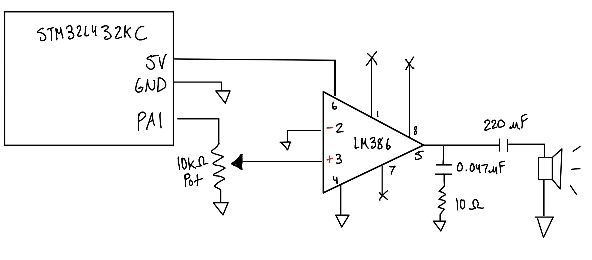

Joaquin Gonzalez-Salgado | jgonzalezsalgado@hmc.edu | May 31, 2026

## Introduction

In this lab, an hardware timer of the `STM32L432KC MCU` was used to drive an 8-ohm speaker to play music. The timer was configured to toggle a GPIO pin at a specified frequency, generating a square wave corresponding to each musical note, and also to produce millisecond delays for note durations. The system was tested by playing *Für Elise*, and as an optional piece, *Fallen Down* was also implemented.

## Design and Testing Methodology
### Lab Overview

A single timer, TIM2, was used for both frequency generation and duration control. The `ARR` register is reloaded each note to set the correct half-period, and the GPIO pin is flipped on every update event, producing a square wave. For rests, the GPIO pin is held low and `ARR` is set for a 1 ms tick, looping for the required number of milliseconds.

All peripheral registers of `RCC`, `GPIO`, and `TIM2` were manually defined via `#define` using base addresses and offsets from the `STM32L432KC` Reference Manual. No CMSIS headers were used!

### Clock and Timer Configuration
The MCU runs on the default 4 MHz clock. TIM2 is clocked from `APB1ENR1` and is configured with a prescaler (`PSC`) of 3, dividing the 4 MHz clock by 4 to produce a **1 MHz timer clock**!:

$$
f_{\text{timer}} = \frac{4\,\text{MHz}}{PSC + 1} = \frac{4\,\text{MHz}}{4} = 1\,\text{MHz}
$$

### Frequency Generation

For a note at frequency `f`, the GPIO pin must be toggled twice per period (once high, once low), the timer update event must occur at `2f`, so the GPIO toggles at `2f` and the resulting square wave has frequency `f`. Then, we can write an expression for the Auto-Reload Register `ARR`:

$$
f_{\text{out}} = \frac{f_{\text{clock}}}{\text{ARR}+1}
= \frac{1{,}000{,}000}{\text{ARR}+1}
$$

Solving for `ARR`, we get:

$$
\text{ARR} = \frac{f_{\text{timer}}}{2f} - 1 = \frac{1{,}000{,}000}{2f} - 1
$$

### Duration Control (Rests)

For rests (`freq == 0`), the delay function sets `ARR` to produce a 1 ms tick:

$$
\text{ARR}_{\text{delay}} = \frac{1{,}000{,}000}{1{,}000} - 1 = 999
$$

It then loops, polling the update flag once per millisecond for the desired duration. The GPIO pin stays low throughout.

---

## Calculations
First, we need to calculate the possible range of frequencies given the TIM2 and PSC setup. Plugging in the maximum and minimum ARR can help us find the frequency range. Note that because TIM2 is a 32-bit timer, ARR_max = $2^{32} - 1$ = 4,294,967,295. ARR_min is simply 0.
**Frequency range (TIM2, PSC = 3, timer clock = 1 MHz):**

$$
f_{\text{min}} = \frac{f_{\text{timer}}}{2 \times (\text{ARR}_{\text{max}} + 1)} = \frac{1{,}000{,}000}{2 \times 2^{32}} \approx 0.000116\,\text{Hz}
$$

$$
f_{\text{max}} = \frac{f_{\text{timer}}}{2 \times (\text{ARR}_{\text{min}} + 1)} = \frac{1{,}000{,}000}{2 \times 1} = 500{,}000\,\text{Hz}
$$

Both values comfortably cover the required 220–1000 Hz range.

**Duration range (1 ms tick loop):**

The minimum supported duration is **1 ms** (one loop iteration). The maximum is bounded by the `uint32_t` loop counter in the delay function:

$$
t_{\text{max}} = (2^{32} - 1)\,\text{ms} \approx 4.3 \times 10^6\,\text{s} \approx 49.7\,\text{days}
$$

This is far more than sufficient for any musical duration.

**Frequency accuracy (220–1000 Hz):**

Because `ARR` is an integer, rounding introduces a small quantization error. Checking boundary and mid-range cases:

At 220 Hz:
$$
\text{ARR} = \left\lfloor\frac{1{,}000{,}000}{2 \times 220}\right\rfloor - 1 = 2271$$
$$f_{\text{actual}} = \frac{1{,}000{,}000}{2 \times 2272} \approx 220.07\,\text{Hz} \qquad (0.03\%\,\text{error})
$$

At 440 Hz:
$$
\text{ARR} = \left\lfloor\frac{1{,}000{,}000}{2 \times 440}\right\rfloor - 1 = 1135$$
$$f_{\text{actual}} = \frac{1{,}000{,}000}{2 \times 1136} \approx 440.14\,\text{Hz} \qquad (0.03\%\,\text{error})
$$

At 659 Hz:
$$
\text{ARR} = \left\lfloor\frac{1{,}000{,}000}{2 \times 659}\right\rfloor - 1 = 757$$
$$f_{\text{actual}} = \frac{1{,}000{,}000}{2 \times 758} \approx 659.63\,\text{Hz} \qquad (0.10\%\,\text{error})
$$

At 1000 Hz:
$$
\text{ARR} = \frac{1{,}000{,}000}{2 \times 1000} - 1 = 499$$
$$f_{\text{actual}} = \frac{1{,}000{,}000}{2 \times 500} = 1000.00\,\text{Hz} \qquad (0.00\%\,\text{error})
$$

All frequencies in the 220–1000 Hz range are within **0.10% of their target**, well within the 1% requirement.

## Technical Documentation

PA1 was configured as a general-purpose output (`MODER = 0b01`) by enabling GPIOA via `RCC->AHB2ENR` and setting the appropriate mode bits. TIM2 was enabled via `RCC->APB1ENR1`. All register access were manually defined struct typedefs, meaning no CMSIS headers!

*Lab 4 Wiring Schematic // Joaquin Gonzalez-Salgado // June 3rd 2026*

{#fig-schematic}

The PA1 output was connected to the non-inverting input of the `LM386 amplifier`. The `LM386` was powered from the `3.3 V` MCU supply, and its output drove the 8-ohm speaker directly. A `10 kΩ` potentiometer between PA1 and the LM386 input provided adjustable volume!

The code for this project can be accessed on [GitHub](https://github.com/jgonzalezsalgado/e155-Lab4). 

## Conclusion

The design successfully met all lab requirements. *Für Elise* played at the correct tempo with all pitches accurate to well within `1%` across the full `220–1000` Hz range, as verified by the `ARR` calculations above. All rests were rendered as silence for the correct durations. The optional composition *Fallen Down* also played correctly! And the Potentiometer did vary the volume as intended.

This lab successfully demonstrated C programming on the `STM32L432KC` to synthesize digital audio using a single hardware timer. By configuring TIM2 entirely from scratch with manually defined register structs and polling its update flag to toggle a GPIO pin, the MCU generated accurate square waves for musical playback!

The lab took approximately 15 hours to complete. The most time-consuming parts were navigating the reference manual to find the correct register offsets, and understanding C code in a more thorough way.

## AI Prototype Summary
The purpose of the AI Prototype is to experiment with utilizing AI as a coding assistant, and analyze the quality, speed, and precision that an LLM can generate code. The prompt for this week is shown below:

::: {.callout-tip}
## AI Prototype (Claude Sonnet)
**Prompt:** What timers should I use on the STM32L432KC to generate frequencies ranging from 220Hz to 1kHz? What’s the best choice of timer if I want to easily connect it to a GPIO pin? What formulae are relevant, and what registers need to be set to configure them properly?
:::

### Reflection:
This week is `Claude Sonnet`. `Claude Sonnet` claimed that the following timers would work for generating 220 Hz to 1kHz frequencies: TIM1, TIM2, TIM15, and TIM16. This makes sense, as I had used TIM2. It chose TIM2 as the best option due to its resolution, # of channels, and ease of accessibility. 

It also gave the following formula:

$$
f_{output} = \frac{f_{TIMx\_CLK}}{(PSC + 1) \times (ARR + 1)}
$$

with an example for 440 Hz (A4) with PWM. It also provided the maximum and minimum ARR, which it stated were 4544 and 999 for a given PSC of 79. Not sure how accurate that is, as I did not use that PSC value.

`Claude Sonnet` also provided the correct register configuration, and how to enable the clocks with RCC, and even configure the GPIO pin! Overall the LLM returned mostly the correct information, however it was too much information than I asked for.