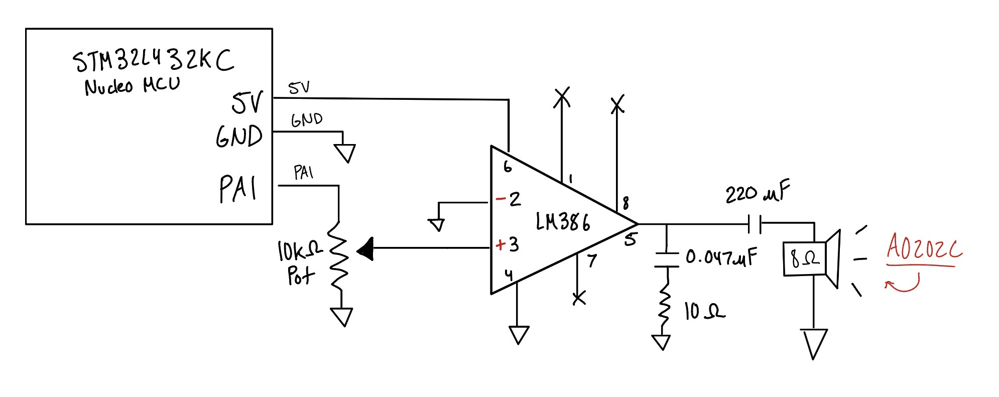

Joaquin Gonzalez-Salgado | jgonzalezsalgado@hmc.edu | September 28, 2026

## Introduction

In this lab, a hardware timer of the [`STM32L432KC MCU`](https://os.mbed.com/platforms/ST-Nucleo-L432KC/) was used to drive an 8-ohm speaker to play music. The timer was used to toggle a GPIO pin at a specified frequency, generating a square wave for each musical note, and also to produce millisecond delays for rests. The system was tested by playing *Für Elise*, and as an optional piece, *Fallen Down* was also implemented.

## Design and Testing Methodology
### Lab Overview

A single timer, `TIM2`, was used for both frequency generation and duration control. For each note, `ARR` is reloaded to set the correct half-period, and the GPIO pin is flipped on every update event, producing a square wave. The note's duration is set by how many times the pin is toggled. For rests, the GPIO pin is held low and `ARR` is set for a 1 ms tick, looping for the required number of milliseconds. After every note the pin is forced low so the speaker never sits at a DC level during a rest.

All peripheral registers of `RCC`, `GPIO`, and `TIM2` were defined by hand as structs mapped to base addresses and offsets from the `STM32L432KC` Reference Manual. No CMSIS headers were used!

### Clock and Timer Configuration
The MCU runs on its default 4 MHz MSI clock. The AHB and APB1 prescalers are both left at 1, so `TIM2`, which sits on the APB1 bus, receives a 4 MHz clock. Its clock is turned on with the `TIM2EN` bit in `RCC->APB1ENR1`. The prescaler (`PSC`) is set to 3, dividing the 4 MHz clock by 4 to produce a **1 MHz timer clock** (1 µs per tick):

$$
f_{\text{timer}} = \frac{4\,\text{MHz}}{PSC + 1} = \frac{4\,\text{MHz}}{4} = 1\,\text{MHz}
$$

### Frequency Generation

The counter counts from 0 to `ARR`, so an update event occurs every `ARR + 1` ticks. The GPIO pin toggles on each update event, so one update period is **half** of the square wave's period. The output frequency is therefore:

$$
f_{\text{out}} = \frac{f_{\text{timer}}}{2\,(\text{ARR}+1)}
= \frac{1{,}000{,}000}{2\,(\text{ARR}+1)}
$$

Solving for `ARR`, and noting that the C code uses integer division (which rounds down):

$$
\text{ARR} = \left\lfloor\frac{f_{\text{timer}}}{2f}\right\rfloor - 1 = \left\lfloor\frac{1{,}000{,}000}{2f}\right\rfloor - 1
$$

### Duration Control (Notes)

A note of duration $d$ milliseconds needs $2f$ toggles per second, so the code toggles the pin

$$
N = \left\lfloor \frac{2 f d}{1000} \right\rfloor
$$

times. Each toggle takes one half-period, so the actual duration is

$$
d_{\text{actual}} = N \cdot (\text{ARR}+1)\ \mu\text{s}
$$

Because $N$ is rounded down, a note can end up to one half-period short. For example, a 125 ms E5 (659 Hz) gives $N = 164$ and $d_{\text{actual}} = 164 \times 758\ \mu\text{s} = 124.3$ ms.

### Duration Control (Rests)

For rests (`freq == 0`), the delay function sets `ARR` to produce a 1 ms tick:

$$
\text{ARR}_{\text{delay}} = \frac{1{,}000{,}000}{1{,}000} - 1 = 999
$$

The loop then counts $d$ update events, so a rest of $d$ ms is exact.

---

## Calculations

### Frequency Range

The possible frequency range follows from the smallest and largest usable `ARR`. Because `TIM2` is a 32-bit timer, `ARR_max` = $2^{32} - 1$ = 4,294,967,295. `ARR_min` is **1**: the Reference Manual states that the counter is blocked while `ARR` is 0.

$$
f_{\text{min}} = \frac{f_{\text{timer}}}{2 \times (\text{ARR}_{\text{max}} + 1)} = \frac{1{,}000{,}000}{2 \times 2^{32}} \approx 0.000116\,\text{Hz}
$$

$$
f_{\text{max}} = \frac{f_{\text{timer}}}{2 \times (\text{ARR}_{\text{min}} + 1)} = \frac{1{,}000{,}000}{2 \times 2} = 250{,}000\,\text{Hz}
$$

These are the hardware limits. In practice the range is narrower:

- **Firmware minimum:** frequencies are stored as integers and `0` means a rest, so the lowest note that can be requested is **1 Hz**.
- **CPU ceiling:** the polling loop (check `UIF`, clear it, toggle `ODR`) takes several instructions at 4 MHz. If the half-period is shorter than one loop pass, update events are missed and the pitch comes out low, so the usable maximum is well below 250 kHz.
- **Accuracy limit:** rounding `ARR` down shortens the half-period by less than one tick, so the relative error is below $1/\lfloor 10^6/2f \rfloor$. Keeping this under 1% requires $\lfloor 10^6/2f \rfloor \ge 101$, i.e. $f \le 10^6/202 \approx$ **4950 Hz**. This is the supported maximum.

All of these comfortably cover the required 220–1000 Hz range.

### Duration Range

**Minimum:** durations are integer milliseconds, so the minimum is **1 ms**. A 1 ms rest is exact. A 1 ms note only produces a toggle if $N = \lfloor 2f/1000 \rfloor \ge 1$, which requires $f \ge 500$ Hz. In general, the shortest sound a note can make is one half-period, $10^6/2f$ µs.

**Maximum (rests):** `delayf` takes a `uint32_t`, but the duration is passed in from an `int`, so the limit is

$$
t_{\text{max,rest}} = (2^{31} - 1)\,\text{ms} \approx 2.1 \times 10^6\,\text{s} \approx 24.8\,\text{days}
$$

**Maximum (notes):** the product `2 * freq * delay` is computed as a signed 32-bit `int`, which overflows past $2^{31}-1$. So

$$
d_{\text{max}}(f) = \left\lfloor \frac{2^{31}-1}{2f} \right\rfloor \text{ms}
$$

For the highest note in *Für Elise* (1319 Hz), $d_{\text{max}} = 814{,}057$ ms ≈ 13.6 minutes. At the 4950 Hz accuracy limit it is 216,917 ms ≈ 3.6 minutes. Both are far more than any musical note needs.

### Frequency Accuracy (220 Hz and 1000 Hz)

Because `ARR` is an integer, rounding introduces a small error. Here are the calculations checking the error between desired and actual frequencies.

At 220 Hz:
$$
\text{ARR} = \left\lfloor\frac{1{,}000{,}000}{2 \times 220}\right\rfloor - 1 = \lfloor 2272.73 \rfloor - 1 = 2271$$
$$f_{\text{actual}} = \frac{1{,}000{,}000}{2 \times 2272} \approx 220.07\,\text{Hz} \qquad (0.03\%\,\text{error})
$$

At 1000 Hz:
$$
\text{ARR} = \frac{1{,}000{,}000}{2 \times 1000} - 1 = 499$$
$$f_{\text{actual}} = \frac{1{,}000{,}000}{2 \times 500} = 1000.00\,\text{Hz} \qquad (0.00\%\,\text{error})
$$

Every frequency in the 220–1000 Hz range is within 1% error.

### Für Elise Accuracy

The table below applies the formulas above to every distinct note in *Für Elise*. Error is measured against the frequency stored in the `notes` array.

| Note | Frequency (Hz) | Actual Frequency (Hz) | Error |
|---|---|---|---|
| C4 | 262 | 262.055 | 0.021% |
| E4 | 330 | 330.033 | 0.010% |
| F4 | 349 | 349.162 | 0.046% |
| G4 | 392 | 392.157 | 0.040% |
| G♯4 | 416 | 416.320 | 0.077% |
| A4 | 440 | 440.141 | 0.032% |
| B4 | 494 | 494.071 | 0.014% |
| C5 | 523 | 523.013 | 0.002% |
| D5 | 587 | 587.544 | 0.093% |
| D♯5 | 623 | 623.441 | 0.071% |
| E5 | 659 | 659.631 | 0.096% |
| F5 | 699 | 699.301 | 0.043% |
| E6 | 1319 | 1319.261 | 0.020% |

Every note in *Für Elise* is within 1% error.

**Is checking 220 Hz and 1000 Hz sufficient?** No, for two reasons. First, the error is not monotonic: it depends on the fractional part of $10^6/2f$, so it rises and falls between neighboring frequencies. 1000 Hz happens to divide evenly and has 0% error, but 969 Hz has 0.19%, so two spot checks say nothing about the frequencies between them. Second, *Für Elise* contains E6 at 1319 Hz, which is outside the tested range entirely. What does prove every note is within 1% is the error bound: it grows with frequency, so checking it at the highest note, $1/379 = 0.26\% < 1\%$, covers every lower note as well.

## Technical Documentation

::: {.callout-note}
## Source Code
The source code for the project can be found in the associated [GitHub Repo](https://github.com/jgonzalezsalgado/e155-Lab4).
:::

`PA1` was configured as a general-purpose output by enabling the GPIOA clock via `RCC->AHB2ENR` and setting its `MODER` field to `01`. `TIM2` was enabled via `RCC->APB1ENR1`. All registers were accessed through hand-written struct typedefs, meaning no CMSIS headers! Very bare-metal C code.

*Lab 4 Wiring Schematic // Joaquin Gonzalez-Salgado // September 28, 2026*

{#fig-schematic}

The `PA1` output was connected through a `10 kΩ` potentiometer, wired as a voltage divider with its wiper feeding the non-inverting input of the `LM386 amplifier`, which provided adjustable volume. The `LM386` was powered from the `3.3 V` MCU supply, and its output drove the 8-ohm speaker.

## Conclusion

The design successfully met all lab requirements. *Für Elise* played at the correct tempo, with every pitch, including the 1319 Hz E6, within `1%` error, as verified by the `ARR` calculations above. The error bound also shows that any frequency up to about 4950 Hz can be produced within `1%`. All rests were rendered as silence for the correct durations. The optional composition *Fallen Down* also played correctly! And the potentiometer varied the volume as intended.

::: {.callout-note}
## Hours Spent on Lab
This lab took approximately 15 hours to complete. The most time-consuming parts were navigating the reference manual to find the correct register offsets, and understanding C code in a more thorough way.
:::

## AI Prototype Summary
The purpose of the AI Prototype is to experiment with utilizing AI as a coding assistant, and analyze the quality, speed, and precision with which an LLM can generate code. The prompt for this week is shown below:

::: {.callout-tip}
## AI Prototype (Claude Sonnet)
**Prompt:** What timers should I use on the STM32L432KC to generate frequencies ranging from 220Hz to 1kHz? What’s the best choice of timer if I want to easily connect it to a GPIO pin? What formulae are relevant, and what registers need to be set to configure them properly?
:::

### Reflection:
This week is `Claude Sonnet`. `Claude Sonnet` claimed that the following timers would work for generating 220 Hz to 1 kHz frequencies: `TIM1`, `TIM2`, `TIM15`, and `TIM16`. This makes sense, as I had used TIM2. It chose TIM2 as the best option due to its resolution, number of channels, and ease of access.

It also gave the following formula:

$$
f_{output} = \frac{f_{TIMx\_CLK}}{(PSC + 1) \times (ARR + 1)}
$$

with an example for 440 Hz (A4) with PWM. This formula has no factor of 2 because in PWM mode the timer hardware produces one full output period per update, whereas my code toggles the pin in software on each update, so it needs two updates per period.

It also gave the maximum and minimum `ARR` as 4544 and 999 for a `PSC` of 79. These check out if the MCU is run at 80 MHz: $80\,\text{MHz}/(79+1) = 1\,\text{MHz}$, so 220 Hz needs $\text{ARR} = 10^6/220 - 1 \approx 4544$ and 1000 Hz needs $\text{ARR} = 10^6/1000 - 1 = 999$. My design runs at the default 4 MHz, so I used `PSC` = 3 to get the same 1 MHz timer clock.

`Claude Sonnet` also provided the correct register configuration, and how to enable the clocks with RCC, and even configure the GPIO pin! Overall the LLM returned mostly correct information, but it gave more information than I asked for.