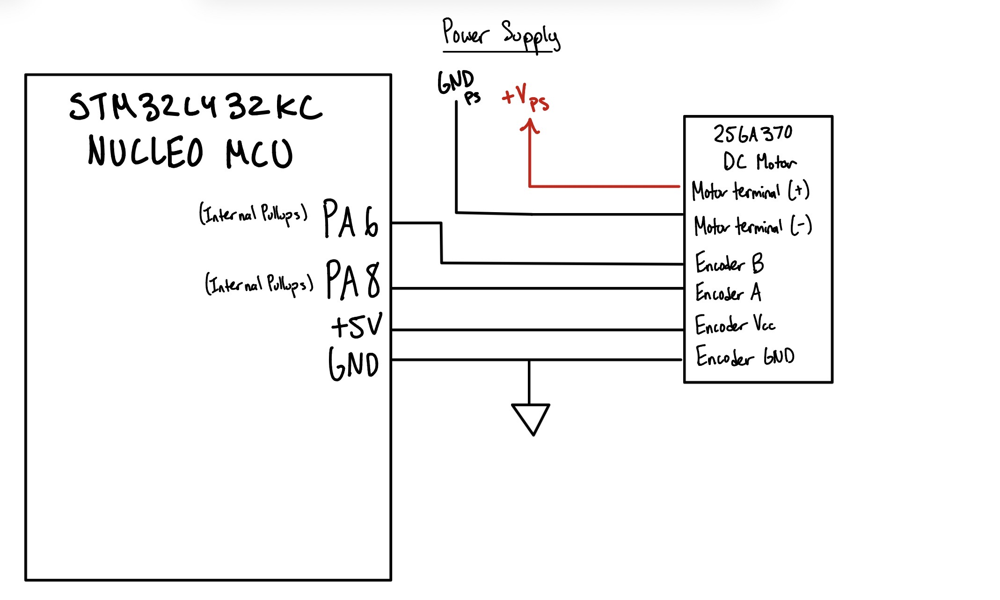
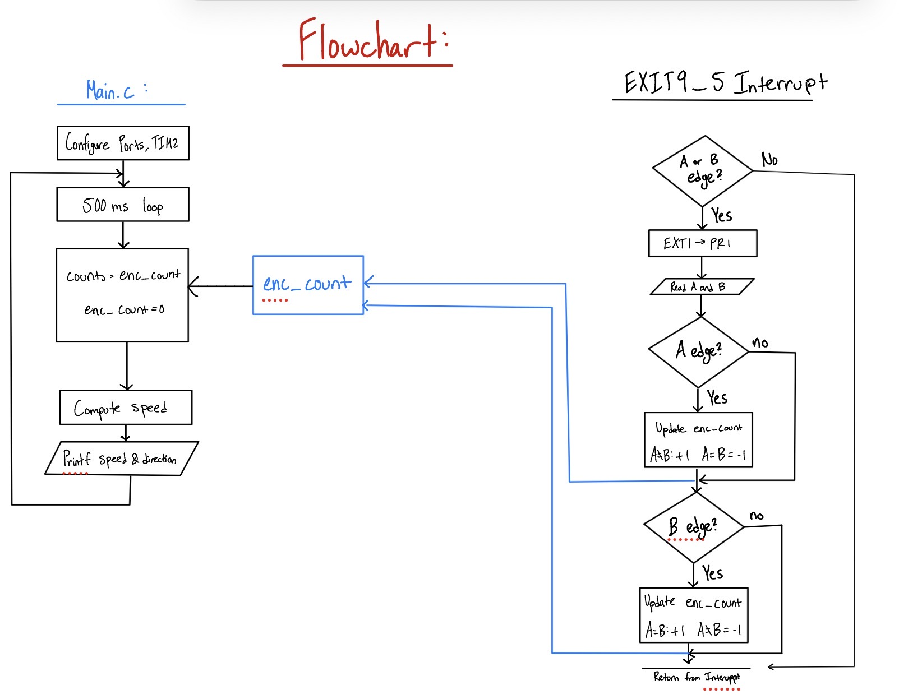

Joaquin Gonzalez-Salgado | jgonzalezsalgado@hmc.edu | October 4, 2026

## Introduction
In this lab, a quadrature encoder on a 25GA-370 brushed DC motor was used to measure motor speed and direction with the [STM32L432KC MCU](https://os.mbed.com/platforms/ST-Nucleo-L432KC/). GPIO external interrupts (EXTI) on both edges of both encoder channels detect every encoder pulse, and the speed in rev/s and direction are printed at a 2 Hz update rate.

## Design and Testing Methodology
### MCU
The two encoder channels are connected to PA6 and PA8, which are 5V-tolerant pins on the STM32L432KC per the datasheet's pin table. Both pins are configured as inputs with the internal pull-ups enabled.

PA6 and PA8 share the EXTI9_5_IRQHandler interrupt, and both are set to trigger on the rising **and** falling edge. Every edge of both channels therefore generates an interrupt, giving the best resolution from the encoder. 

The main loop uses TIM2 to wait out a 500 ms sampling window. It then copies and reset enc_count, and converts the count rev/s, and prints the speed and direction (negative for CCW) based on the sign of the count. If the motor is not spinning, no interrupts occur and the speed is reported as zero.

### Calculations
TIM2 runs from the default 4 MHz clock, and the timer counts to 500ms for each sampling window, meeting the 1Hz spec, as the updating frequency would be 2 Hz.

The encoder outputs 408 pulses per output shaft revolution on each channel. Since both edges of both channels are counted, the counts per revolution is:

$$
\text{CPR} = 408 \times 4 = 1632\,\text{counts/rev}
$$

The speed is the number of counts in the window divided by the counts per revolution and the window length:

$$
\text{rev/s} = \frac{\text{counts}}{\text{CPR} \times T} = \frac{\text{counts}}{1632 \times 0.5\,\text{s}}
$$

A single count corresponds to $1/1632$ of a shaft rotation, so the smallest non-zero speed the system can measure (one count per window) is:

$$
\text{Resolution} = \frac{1}{1632 \times 0.5\,\text{s}} \approx 0.0012\,\text{rev/s}
$$

## Technical Documentation:

::: {.callout-note collapse="true"}
## Source Code
The source code for the project can be found in the associated [Github Repo](https://github.com/jgonzs/Microprocessor-Projects/tree/main/Lab5).
:::

### Schematic

*Lab 5 Wiring Schematic // Joaquin Gonzalez-Salgado // October 4, 2026*

::: {.callout-note collapse="true"}
## Expand to see Schematic
{#fig-schematic}
:::

@fig-schematic shows the off-board wiring for this lab. The encoder's A and B channels connect directly to the 5V-tolerant pins PA8 and PA6 (respectively) on the Nucleo-L432KC, with the internal pull-ups enabled, and share a common ground with the MCU. The motor is powered from a power supply.

### Flowchart

*Lab 5 Program Flowchart // Joaquin Gonzalez-Salgado // October 4, 2026*

::: {.callout-note collapse="true"}
## Expand to see Flowchart
{#fig-flowchart}
:::

@fig-flowchart shows the main loop and the EXTI9_5_IRQHandler interrupt handler, which communicate through the shared enc_count variable.

## Results and Discussion

::: {.callout-note}
## Results and Discussion
The Design was a Success!
:::

The design meets all requirements. Speed and direction are displayed in rev/s at 2 Hz and match the true motor speed and direction, and the speed is reported as zero when the motor is not spinning. Because every edge is caught by an interrupt, no pulses were missed at high speeds.

### Interrupts vs. Polling
To compare the two approaches, a polling version of the code called encoder_polling.c was written that reads both encoder channels in the main loop and checks for changes, instead of using interrupts. With the motor running at 12V, the interrupt-based version measured 2.9 rev/s, while the polling version reported only 0.2 rev/s. 

Speed wise, at 2.9 rev/s the time between encoder edges is:

$$
T_\text{edge} = \frac{1}{2.9\,\text{rev/s} \times 1632\,\text{counts/rev}} \approx 211\,\mu\text{s}
$$

So the encoder produces about one edge every 211 µs. This is way too fast for the polling, which happens only once every 1 ms because of the delay_millis(DELAY_TIM, 1) call in the main loop. Most edges are missed, so the polling version reports a much lower speed.

The tradeoff between the two approaches:

- **Polling** is simple and needs no interrupt setup. However, it requires a lot of time, and means that the system must be polling faster than the motor is running. This has a lot of power considerations for the MCU, and for power optimization, this would be wasting battery power for instance.

- **Interrupts** Doesn't miss edges, as the ISR finishes before the next edge arrives, and only calls the MCU when it receives an edge. As a result, if the motor isn't turnning at all, the MCU isn't using as much power as it would polling and continually updating the same result. However, the setup is a bit more difficult.

## Conclusion
The interrupt-driven design correctly measured motor speed and direction with no missed pulses at high speeds. Compared to polling, the interrupt-based design was far more accurate at high speeds, since the polling version missed most encoder edges and reported only 0.2 rev/s at 12V compared to 2.9 rev/s with interrupts.

::: {.callout-note}
## Hours Spent on Lab
This lab took 9 hours.
:::


## AI Prototype Summary
The purpose of the AI Prototype is to experiment with utilizing AI as a coding assistant, and analyze the quality, speed, and precision that an LLM can generate code. The prompt for this week is shown below:

::: {.callout-tip}
## AI Prototype (Claude)
**Prompt:** Write me interrupt handlers to interface with a quadrature encoder. I’m using the STM32L432KC, what pins should I connect the encoder to in order to allow it to easily trigger the interrupts?
:::

::: {.callout-note collapse="true"}
## Generated Code:
```c
#include "stm32l4xx_hal.h"

volatile int32_t encoder_count = 0;

void Encoder_GPIO_Init(void) {
    __HAL_RCC_GPIOA_CLK_ENABLE();

    GPIO_InitTypeDef gpio = {0};
    gpio.Pin  = GPIO_PIN_0 | GPIO_PIN_1;
    gpio.Mode = GPIO_MODE_IT_RISING_FALLING; // Trigger on both edges
    gpio.Pull = GPIO_PULLUP;
    HAL_GPIO_Init(GPIOA, &gpio);

    HAL_NVIC_SetPriority(EXTI0_IRQn, 0, 0);
    HAL_NVIC_EnableIRQ(EXTI0_IRQn);
    HAL_NVIC_SetPriority(EXTI1_IRQn, 0, 0);
    HAL_NVIC_EnableIRQ(EXTI1_IRQn);
}

// Read current state of both channels
static inline uint8_t read_A(void) { return HAL_GPIO_ReadPin(GPIOA, GPIO_PIN_0); }
static inline uint8_t read_B(void) { return HAL_GPIO_ReadPin(GPIOA, GPIO_PIN_1); }

// Standard quadrature decode table
// Index: [prev_A][prev_B][curr_A][curr_B]
static const int8_t QEM[16] = {
     0, -1,  1,  0,
     1,  0,  0, -1,
    -1,  0,  0,  1,
     0,  1, -1,  0
};

static uint8_t last_state = 0;

static void update_encoder(void) {
    uint8_t curr_state = (read_A() << 1) | read_B();
    encoder_count += QEM[(last_state << 2) | curr_state];
    last_state = curr_state;
}

void EXTI0_IRQHandler(void) {
    update_encoder();
    HAL_GPIO_EXTI_IRQHandler(GPIO_PIN_0);
}

void EXTI1_IRQHandler(void) {
    update_encoder();
    HAL_GPIO_EXTI_IRQHandler(GPIO_PIN_1);
}
```
:::

### Reflection:
This week is Claude Sonnet again! Rather than helping me with the specific question I asked, it gave me two options: Using the Interrupt approach I asked for, or using the "Hardware Timer Encoder Mode". It provided me with code for both options, and stated that for Encoder A I should use PA0 with EXTI Line 0 and for Encoder B I should use PA1 with EXTI Line 1.
