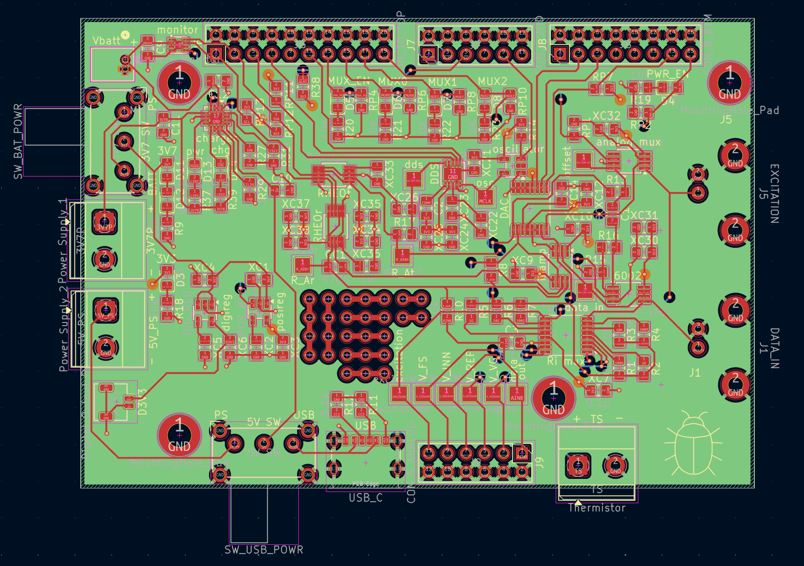
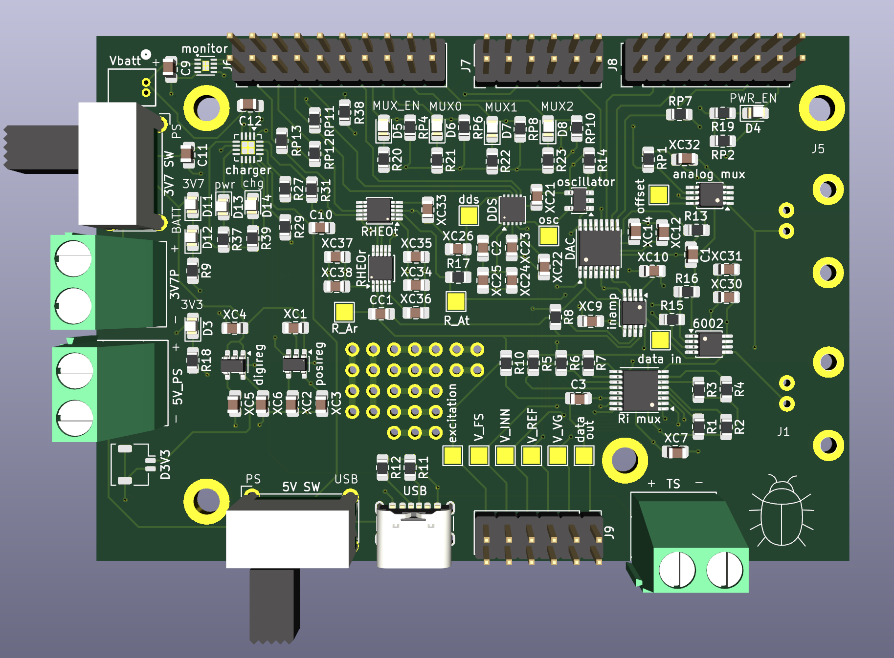

## Single Rail 2 (SR2) — AC/DC Electropenetrograph

```{=html}
<div style="display: flex; flex-direction: row; flex-wrap: wrap; gap: 20px; margin-bottom: 1em;">
  <div style="flex: 1; min-width: 200px;">
    
  </div>
  <div style="flex: 1; min-width: 200px;">
    
  </div>
</div>

<p>
  <strong>Overview:</strong><br>
  A single-rail mixed-signal board designed in collaboration with SJ Caldwell, built to interface with the
  <a href="https://www.nordicsemi.com/Products/Development-hardware/nRF5340-DK" target="_blank">Nordic nRF5340 DK</a>.
  As an AC/DC <a href="https://en.wikipedia.org/wiki/Electrical_penetration_graph" target="_blank">Electropenetrograph</a>,
  its purpose is to inject a small electrical stimulus through a live insect via the TX chain, then capture the
  biologically-altered signal on the RX chain for analysis by entomologists at the USDA.
</p>
<p>
  <strong>Key Features:</strong><br>
  Single-rail power supply, onboard battery charger &amp; monitor, DDS module, analog &amp; digital Mux,
  DAC output stage, rheostats, I²C &amp; SPI interfaces, nRF5340 DK integration.
</p>
<p style="font-size: 0.9rem; color: #666;">
  <em>Coming soon:</em> IB1 (Integrated Board 1) — a fully integrated successor that will physically
  incorporate the Nordic nRF5340 SoC directly on-board.
</p>
```

---

## LiPo Battery Charger & Monitor

```{=html}
<div style="display: flex; flex-direction: row; flex-wrap: wrap; gap: 20px; margin-bottom: 1em;">
  <div style="flex: 1; min-width: 200px;">
    
  </div>
  <div style="flex: 1; min-width: 200px;">
    
  </div>
</div>

<p>
  <strong>Overview:</strong><br>
  (My first PCB!) A single-cell LiPo battery charger and power management board featuring USB-C input, a dedicated charge IC, 5V and 3.7V regulated outputs, fuel gauge IC with I²C interface, and status indicator LEDs. Designed for use as a standalone supply module in embedded systems projects.
</p>
<p>
  <strong>Key Features:</strong><br>
  USB-C charging input, dual regulated outputs (5V / 3.7V), I²C fuel gauge, charge/power-good status LEDs, onboard enable/alert header.
</p>
```

---
