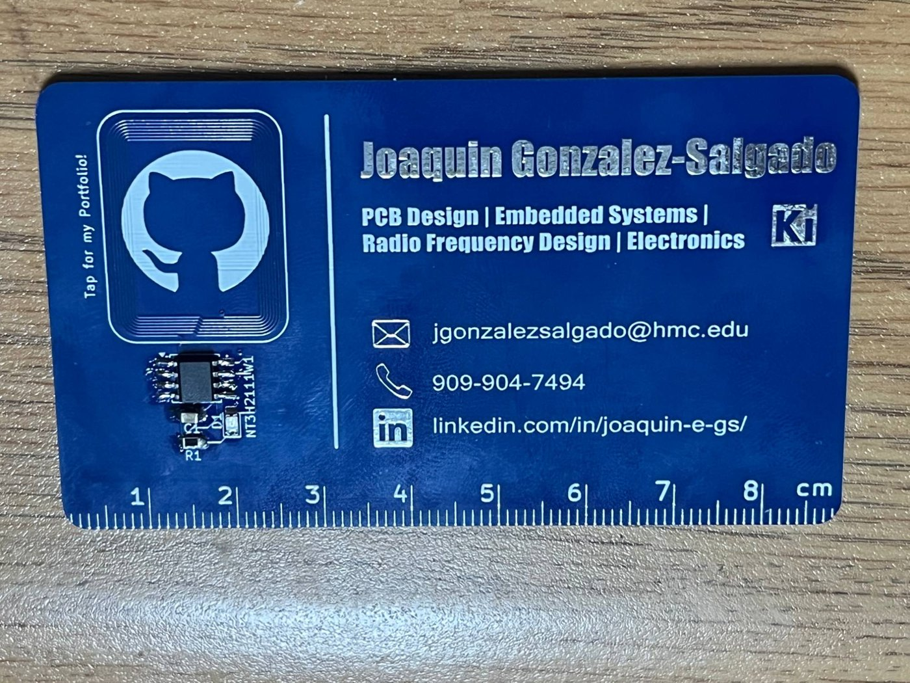
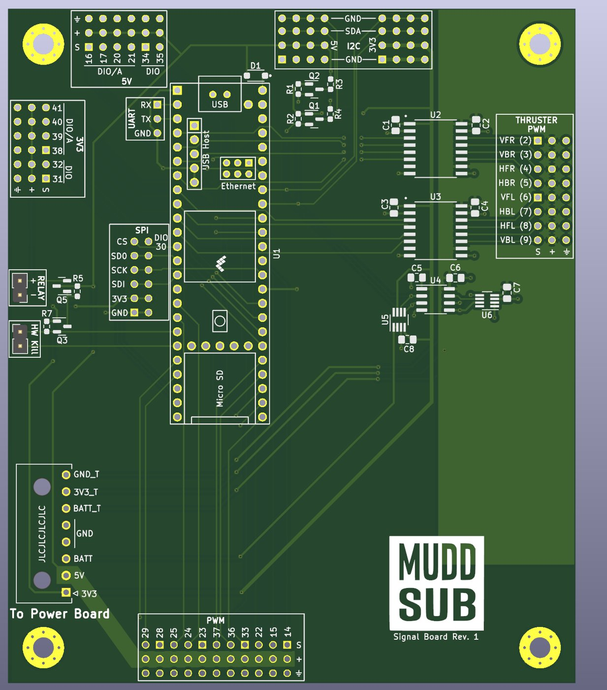
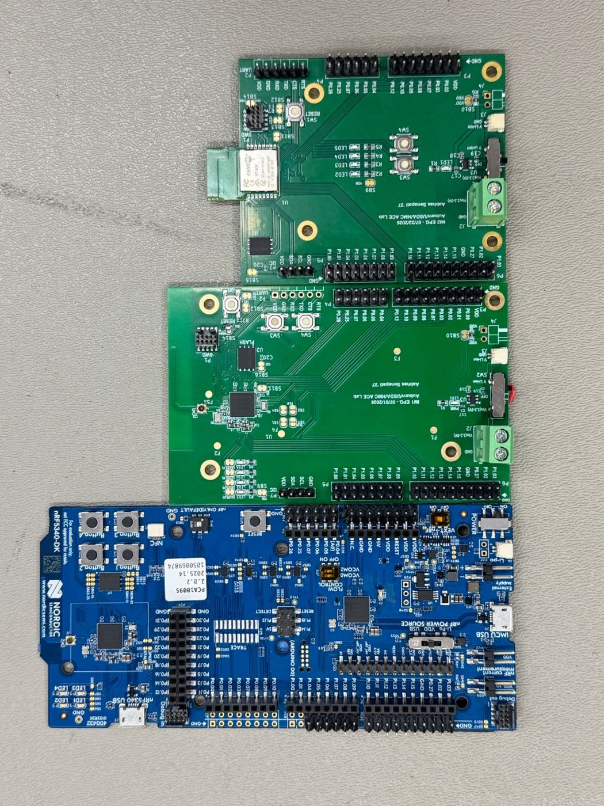
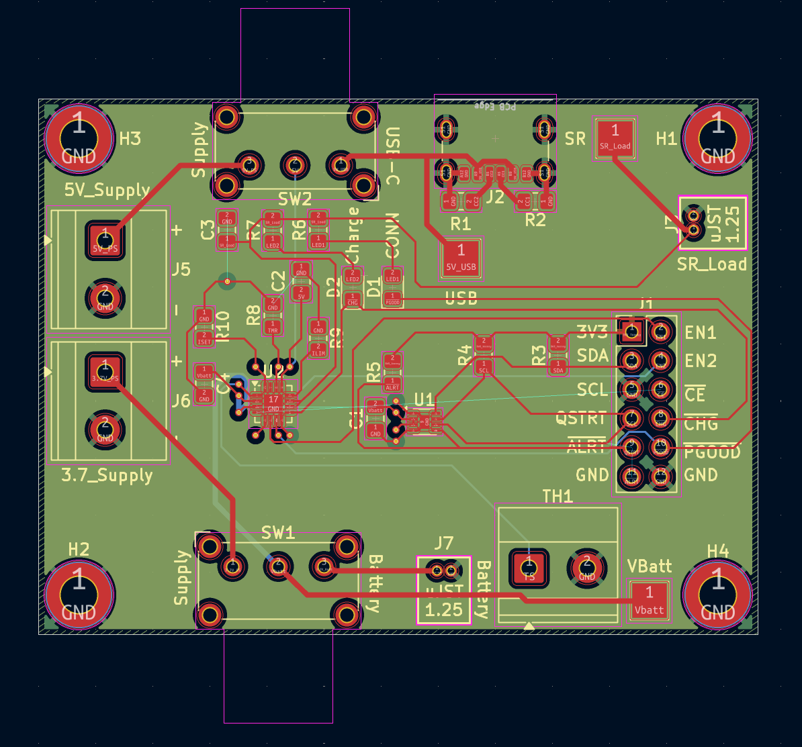
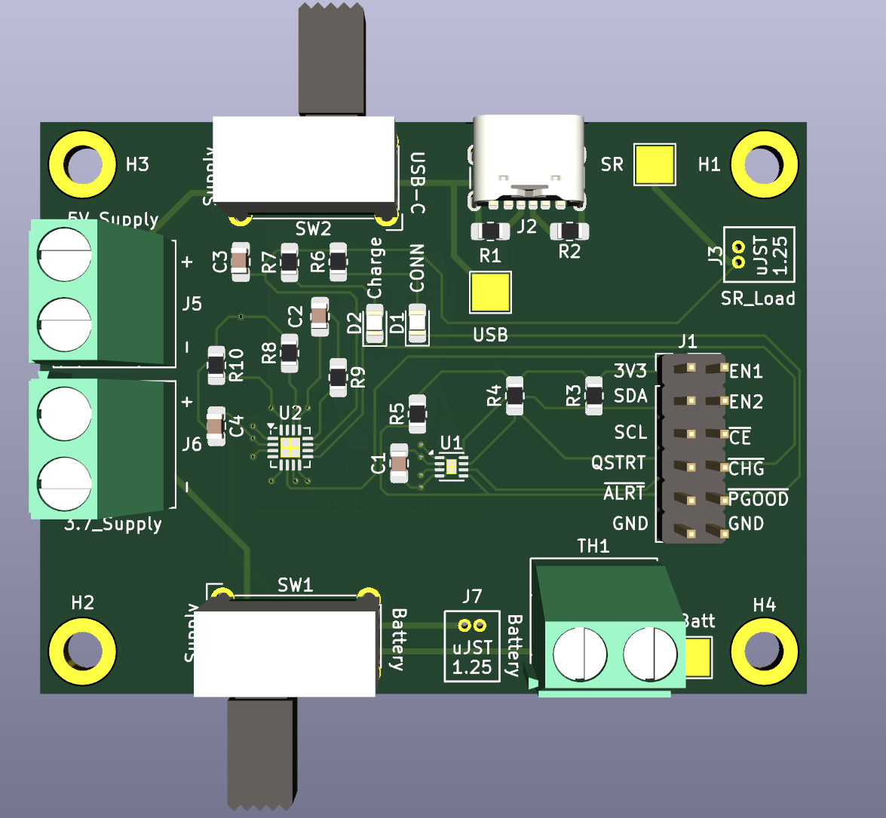

## NFC Business Card {#nfc-business-card}

```{=html}
<div style="display: flex; flex-direction: row; flex-wrap: wrap; gap: 20px; margin-bottom: 1em;">
  <div style="flex: 1; min-width: 250px; max-width: 520px;">
    
  </div>
</div>

<p>
  <strong>Overview:</strong><br>
  A business-card PCB that opens my portfolio when tapped with a phone. Built around the NXP NT3H2111 NFC tag IC
  with a custom loop antenna drawn as a PCB trace, impedance-matched to the 13.56&nbsp;MHz NFC carrier using a
  vector network analyzer (VNA).
</p>
<p>
  <strong>Key Features:</strong><br>
  2-layer KiCad design, PCB-trace NFC loop antenna, NT3H2111 tag IC, indicator LED, test points, silkscreen
  ruler and contact info, fab-ready Gerbers, BOM, and pick-and-place files.
  <a href="https://github.com/jgonzs/NFCBusinessCard" target="_blank">GitHub Repo &rarr;</a>
</p>
```

---

## MuddSub Power & Signal Boards {#muddsub-boards}

```{=html}
<div style="display: flex; flex-direction: row; flex-wrap: wrap; gap: 20px; margin-bottom: 1em;">
  <div style="flex: 1; min-width: 200px;">
    
  </div>
  <div style="flex: 1; min-width: 200px;">
    
  </div>
</div>

<p>
  <strong>Overview:</strong><br>
  Power and signal boards for <a href="https://muddsub.org/" target="_blank">MuddSub</a>'s autonomous underwater
  vehicle, designed in KiCad. The power board takes separate thruster and electronics batteries and uses switching
  regulators to supply 12V, 5V, and 3.3V rails to the Jetson computer, DVL, tether board, and signal board. The signal
  board centers on a Teensy 4.1 and drives PWM for all 8 thrusters.
</p>
<p>
  <strong>Key Features:</strong><br>
  Dual battery inputs, switching regulators, 12V/5V/3.3V rails with status LEDs, Teensy 4.1, 8-channel thruster PWM,
  I&sup2;C, SPI, and UART breakouts, relay and hardware-kill switching, board-to-board power/signal connector.
</p>
```

---

## FI1 (Fully Integrated 1)

```{=html}
<div style="display: flex; flex-direction: row; flex-wrap: wrap; gap: 20px; margin-bottom: 1em;">
  <div style="flex: 1; min-width: 200px;">
    
  </div>
  <div style="flex: 1; min-width: 200px;">
    
  </div>
</div>

<p>
  <strong>Overview:</strong><br>
  A fully integrated revision of the electropenetrograph platform, bringing the previously
  external nRF5340 DK onboard. Currently in manufacturing and assembly.
</p>
<p>
  <strong>Key Features:</strong><br>
  Onboard nRF5340 module with integrated antenna, SWD programming header, onboard flash memory,
  I&sup2;C &amp; SPI control interfaces.
</p>
```

---

## Integrated-Micro Boards (IM1 & IM2), ACE Lab Team {#im-boards}

```{=html}
<div style="display: flex; flex-direction: row; flex-wrap: wrap; gap: 20px; margin-bottom: 1em;">
  <div style="flex: 1; min-width: 250px; max-width: 420px;">
    
  </div>
  <div style="flex: 1; min-width: 250px;">
    <p>
      <strong>Overview:</strong><br>
      From top to bottom: IM2, IM1, and the off-the-shelf Nordic nRF5340 DK they replace. IM1 recreates the DK with only
      the components the project needs. IM2 shrinks it further around an nRF5340 module, making it cheaper and faster to
      manufacture. I helped bring up and verify both boards during a 10-week summer sprint with the ACE Lab team.
    </p>
  </div>
</div>
```

---

## Electropenetrograph

```{=html}
<div style="display: flex; flex-direction: row; flex-wrap: wrap; gap: 20px; margin-bottom: 1em;">
  <div style="flex: 1; min-width: 200px;">
    
  </div>
  <div style="flex: 1; min-width: 200px;">
    
  </div>
</div>

<p>
  <strong>Overview:</strong><br>
  A mixed-signal <a href="https://en.wikipedia.org/wiki/Electrical_penetration_graph" target="_blank">electropenetrograph</a>
  board designed to interface with the
  <a href="https://www.nordicsemi.com/Products/Development-hardware/nRF5340-DK" target="_blank">Nordic nRF5340 DK</a>.
  The board combines a signal generation chain with a synchronized acquisition chain, using onboard control logic to
  configure gain, switching, and calibration on the fly.
</p>
<p>
  <strong>Key Features:</strong><br>
  Onboard battery charger &amp; monitor ICs, DDS-based signal generation, analog &amp; digital multiplexing,
  DAC output stage, digitally controlled rheostats, I&sup2;C &amp; SPI control interfaces, nRF5340 DK integration.
</p>
```

---

## LiPo Battery Charger & Monitor

```{=html}
<div style="display: flex; flex-direction: row; flex-wrap: wrap; gap: 20px; margin-bottom: 1em;">
  <div style="flex: 1; min-width: 200px;">
    
  </div>
  <div style="flex: 1; min-width: 200px;">
    
  </div>
</div>

<p>
  <strong>Overview:</strong><br>
  (My first PCB!) A single-cell LiPo battery charger and power management board featuring USB-C input, a dedicated charge IC, 5V and 3.7V regulated outputs, fuel gauge IC with I²C interface, and status indicator LEDs. Designed for use as a standalone supply module in embedded systems projects.
</p>
<p>
  <strong>Key Features:</strong><br>
  USB-C charging input, dual regulated outputs (5V / 3.7V), I²C fuel gauge, charge/power-good status LEDs, onboard enable/alert header.
</p>
```

---
