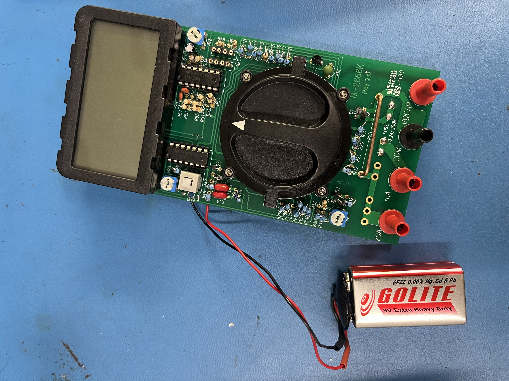
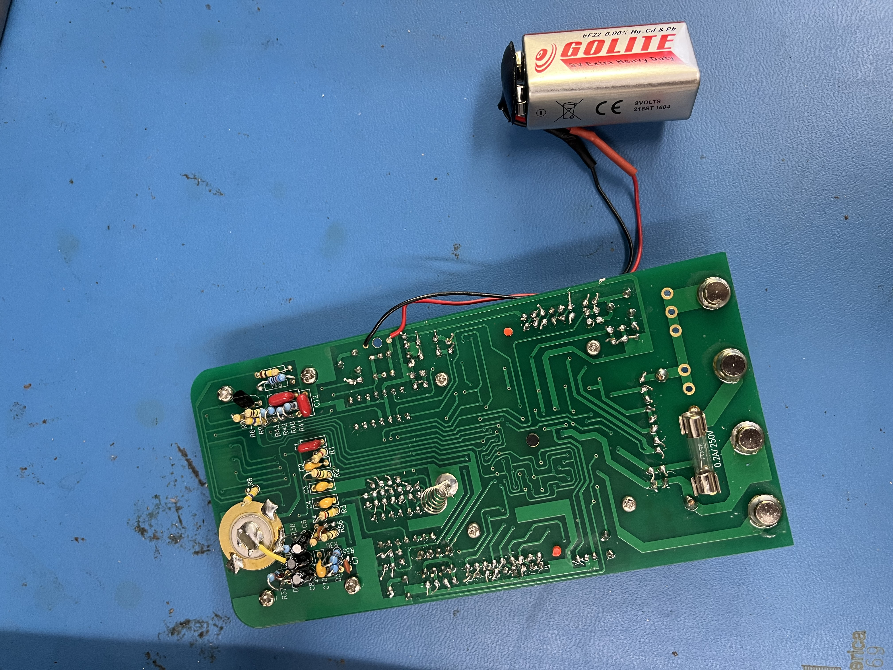
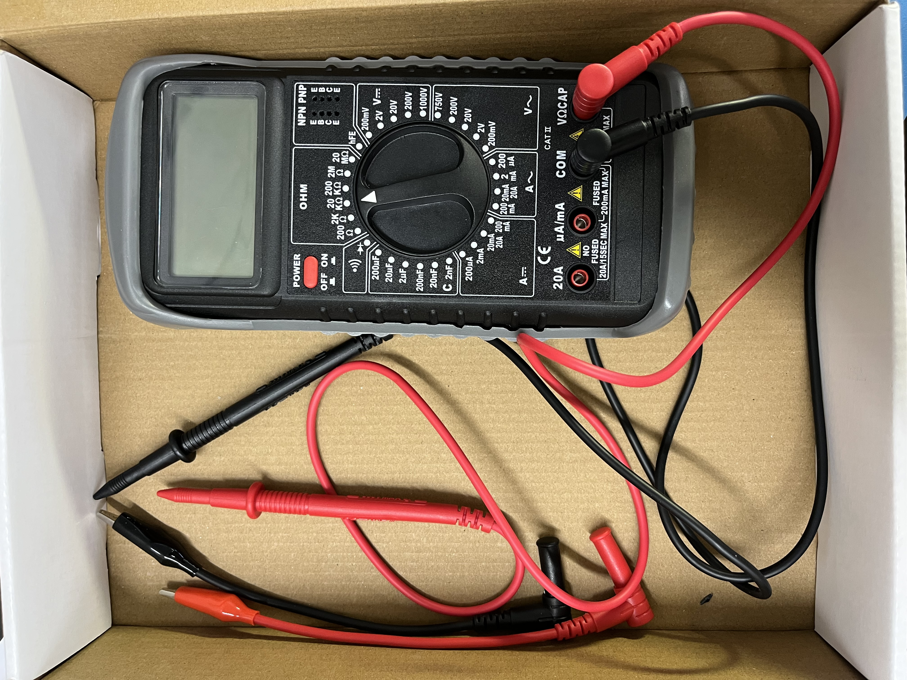
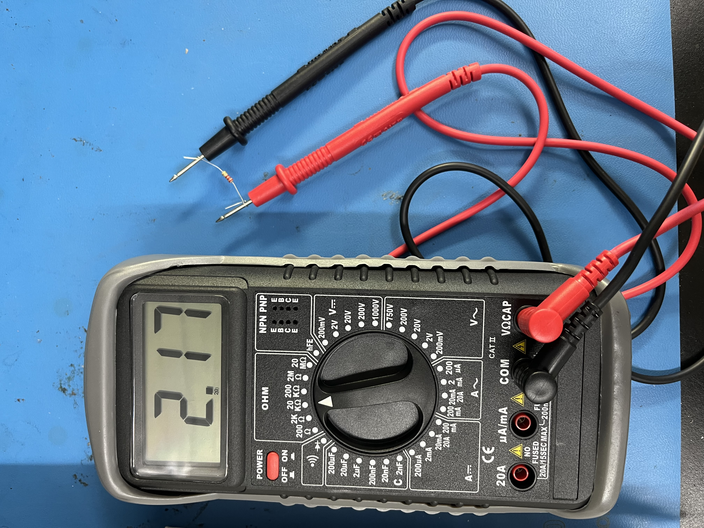

### DIY Multimeter

```{=html}
<script>
  function toggleMultimeter() {
    var content = document.getElementById("moreContentMultimeter");
    var button = document.getElementById("toggleButtonMultimeter");
    if (content.style.display === "none") {
      content.style.display = "block";
      button.innerHTML = "Show Less";
    } else {
      content.style.display = "none";
      button.innerHTML = "Show More";
    }
  }
</script>

<div style="display: flex; flex-direction: row; flex-wrap: wrap; gap: 20px; margin-bottom: 1em;">
  <div style="flex: 2; width: 300px;">
    
  </div>
  <div style="flex: 2; min-width: 300px;">
    <p class="justify-text">
      <strong>Overview:</strong><br>
      Built a fully functional 34-range digital multimeter from scratch that measures AC/DC voltage and current, resistance, capacitance, transistor h<sub>FE</sub>, diode junctions, and has a continuity buzzer. 
    </p>
    <p><strong>Skills:</strong><br>Soldering, Circuit Calibration, Analog/Digital Electronics, Component Identification</p>
    <div style="display: flex; gap: 10px; flex-wrap: wrap;">
      <button id="toggleButtonMultimeter" onclick="toggleMultimeter()" style="border-radius: 6px; padding: 8px 14px; background-color: #f5f5f5; border: 1px solid #aaa; cursor: pointer;">
        Show More
      </button>
    </div>
  </div>
</div>

<div id="moreContentMultimeter" style="display:none;">
  <div class="row">
    <div class="column">
      <strong>Calibration</strong>
      
      <div style="padding: 5px; font-size: 0.8rem;">
        - Calibrated DC/AC voltage and current circuits against a reference meter across all ranges (200μA – 20A).<br><br>
        - Separately calibrated the capacitance circuit using known capacitor values from 2nF to 200μF.
      </div>
    </div>
    <div class="column">
      <strong>Cool Features</strong>
      
      <div style="padding: 5px; font-size: 0.8rem;">
        - Has a real continuity buzzer — short the leads and it beeps!<br><br>
        - Built-in h<sub>FE</sub> socket can test NPN and PNP transistors and read their DC current gain.<br><br>
        - Runs on a custom ICL7106 A/D converter chip for a 3Hz reading frequency.
      </div>
    </div>
    <div class="column">
      <strong>It Works!</strong>
      
      <div style="padding: 5px; font-size: 0.8rem;">
        - Verified measurement voltage, current, resistance, capacitance, and many other features of the multimeter using a power supply and another multimeter as reference.<br><br>
        - An LCD display includes a zebra connector and housing which was all assembled by hand, and a Fuse and other safety measures were incoporated as well.
      </div>
    </div>
  </div>
</div>
```

## Wood Shop French Cleat Wall

```{=html}
<div style="display: flex; flex-direction: row; flex-wrap: wrap; gap: 20px; margin-bottom: 1em;">
  <div style="flex: 2; width: 300px;">
    
  </div>
  <div style="flex: 2; min-width: 300px;">
    <p class="justify-text">
      <strong>Overview:</strong><br>
      Designed and built a modular french cleat wall system for the HMC Wood Shop to organize tools and keep the workspace clean and efficient.
      French cleats use interlocking 45° angled cuts to create a flexible, reconfigurable mounting system — any holder or shelf can be moved or swapped without any hardware.
      Cut and assembled custom holders for screwdrivers, wrenches, pliers, drill bits, sandpaper belts, and more.
    </p>
    <p>
      <strong>Skills:</strong><br>
      Table Saw, Woodworking, Shop Organization, Fabrication
    </p>
  </div>
</div>
```
---

## Rockler Wooden Speaker

```{=html}
<div style="display: flex; flex-direction: row; flex-wrap: wrap; gap: 20px; margin-bottom: 1em;">
  <div style="flex: 2; width: 300px;">
    
  </div>
  <div style="flex: 2; min-width: 300px;">
    <p class="justify-text">
      <strong>Overview:</strong><br>
      Created a bluetooth speaker by cutting 8 triangular pieces of plywood, and wood glueing them together in a box orientation!
      Utilized the Rockler's Speaker Set to design and assemble the speaker kit, which connects via AUX and Bluetooth! It's also portable, as it runs on a lithium ion charged battery.
      This project involved a lot of wood shop tools, including a Table Saw, Miter Saw, Planar, and much more!
      This little project has now become a speaker I use day to day!
    </p>
    <p>
      <strong>Skills:</strong><br>
      Table Saw, Miter Saw, Planar, Wood Glue, Soldering, Bluetooth Electronics
    </p>
  </div>
</div>
```

---

## Red-ish Skateboard

```{=html}
<div style="display: flex; flex-direction: row; flex-wrap: wrap; gap: 20px; margin-bottom: 1em;">
  <div style="flex: 2; width: 300px;">
    
  </div>
  <div style="flex: 2; min-width: 300px;">
    <p class="justify-text">
      <strong>Overview:</strong><br>
      Created a skateboard completely from scratch under the HMC Makerspace Grant!
      The materials for this assembly were a sheet of plywood, bearings and tires, grip tape, and red paint, assembled over the course of 3 weeks.
      Used the ShopBot (CNC Router Table) to cut out the skateboard frame. This board is now used to travel around the Harvey Mudd campus!
    </p>
    <p>
      <strong>Skills:</strong><br>
      ShopBot CNC, CAD, Woodworking, Finishing
    </p>
  </div>
</div>
```

