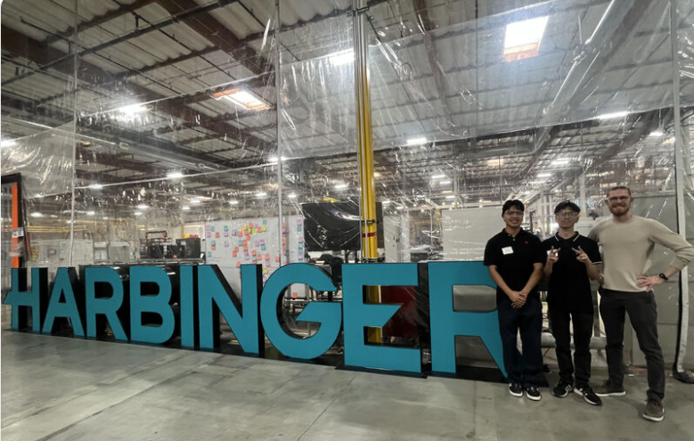

Yesterday, I had the incredible opportunity to visit and job shadow at [Harbinger Motors Inc.](https://harbingermotors.com/?utm_term=harbinger%20motors&utm_campaign=brand&utm_source=google&utm_medium=ppc&utm_content=evergreen&hsa_acc=1898373411&hsa_cam=22991708877&hsa_grp=191928592224&hsa_ad=773048739999&hsa_src=g&hsa_tgt=kwd-2204503973713&hsa_kw=harbinger%20motors&hsa_mt=p&hsa_net=adwords&hsa_ver=3&gad_source=1&gad_campaignid=22991708877&gbraid=0AAAABBLJ9TaVs5GIeypBdKezbWIyZ8njS&gclid=Cj0KCQjw_IXQBhCkARIsADqELbJem7Xmqotll7V1eoC0o9mZiw0q7It_NL_51huGLSY6CS9_H6h3k-UaAjc9EALw_wcB)! Harbinger is a company leading the way in EV commercial vehicle innovation for trucks, RVs, and much more. It was super exciting to see the intricacies of trucks that we see everyday, and how we as engineers can continue to innovate and improve them for the future. 

I would also like to give a HUGE thank you to Zane Bodenbender (Harvey Mudd alum!) for hosting us and generously sharing insights about his work and journey — your passion and expertise made this experience especially impactful, and have truly shown me what it means to be an Engineer! 