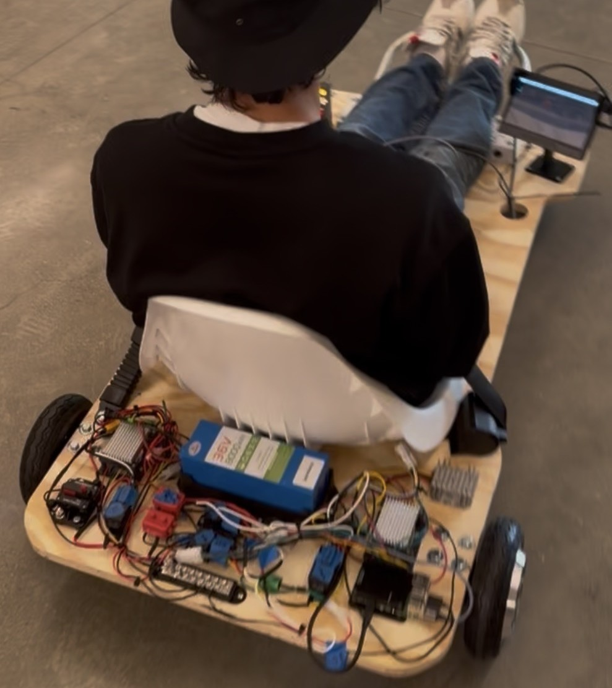
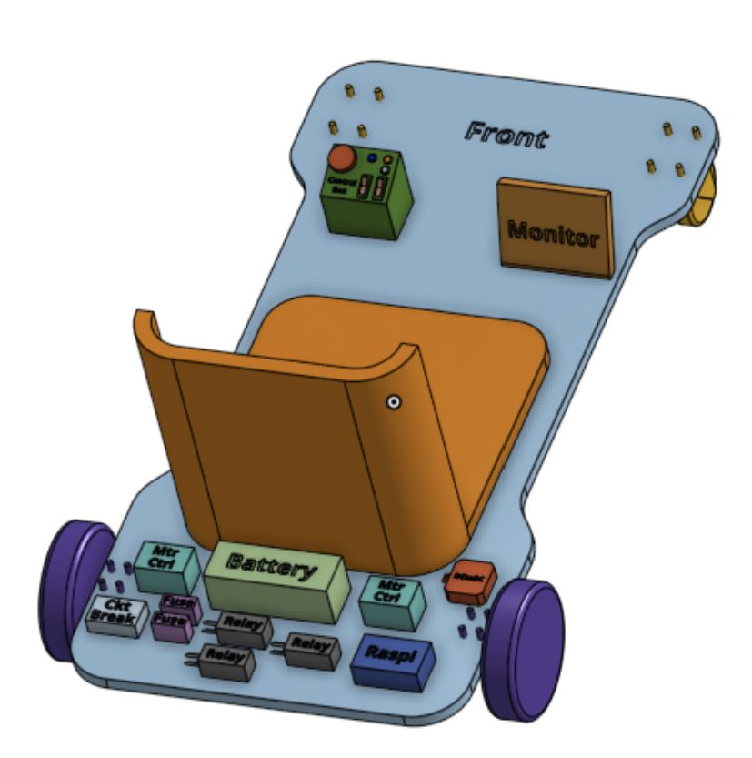
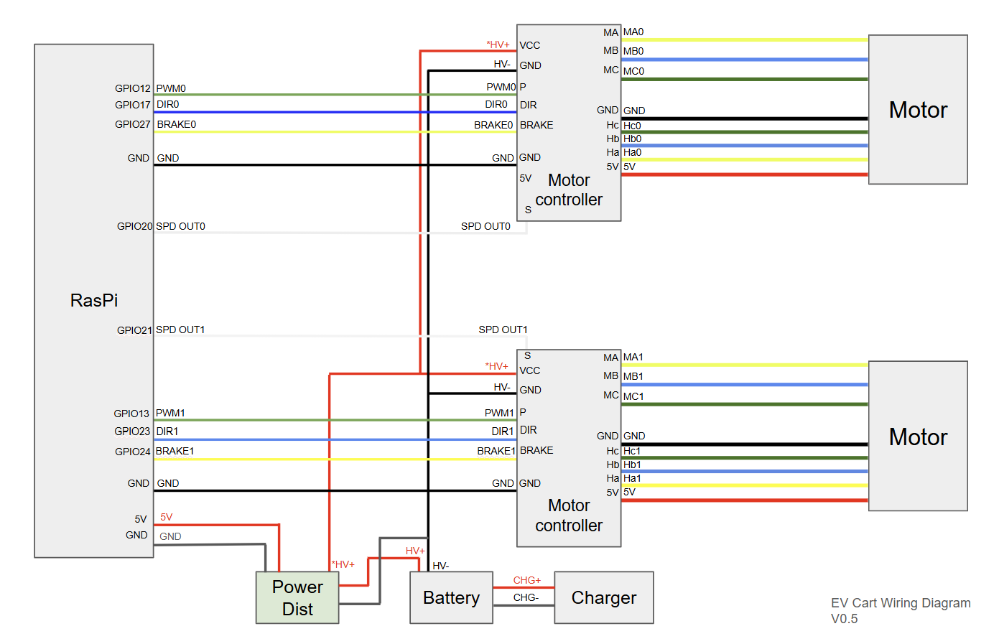
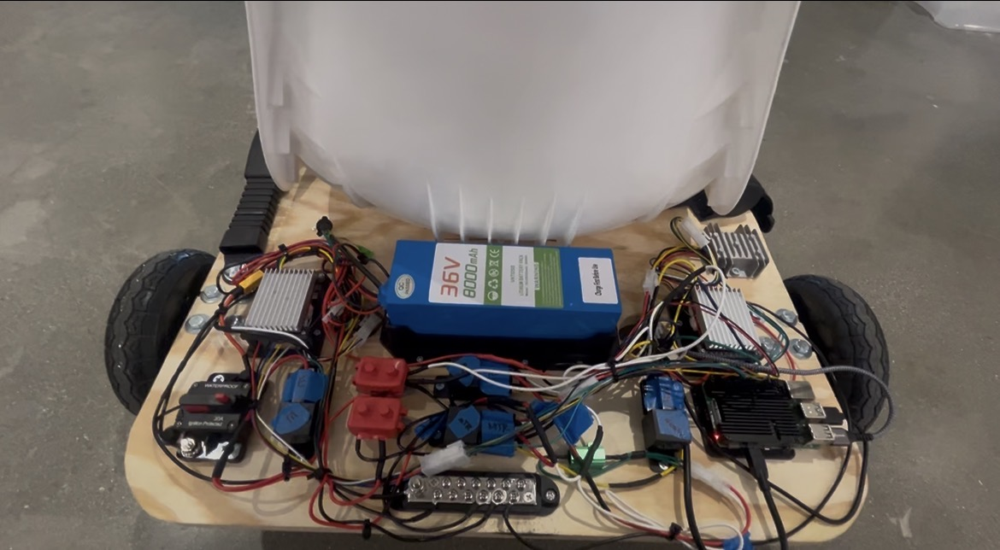
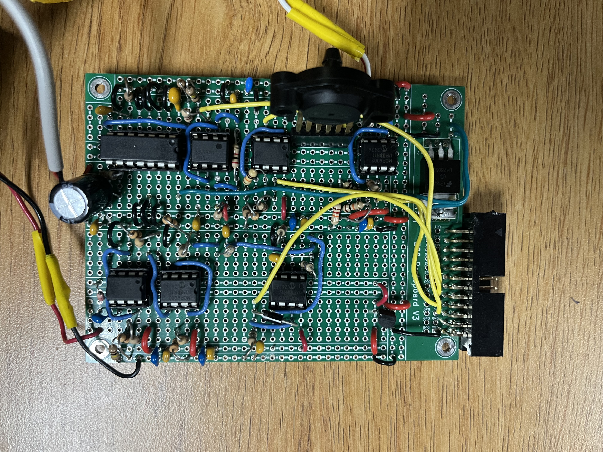
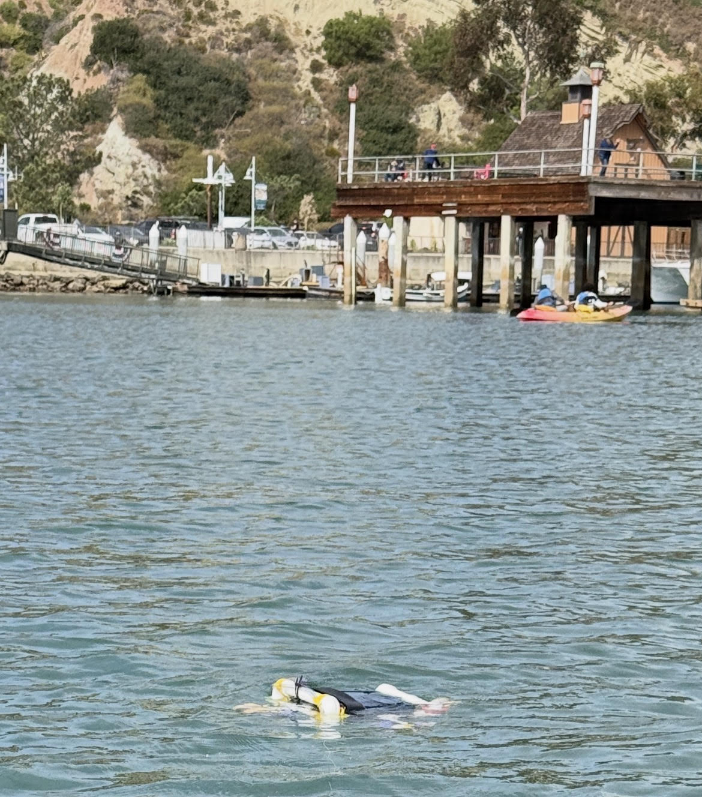
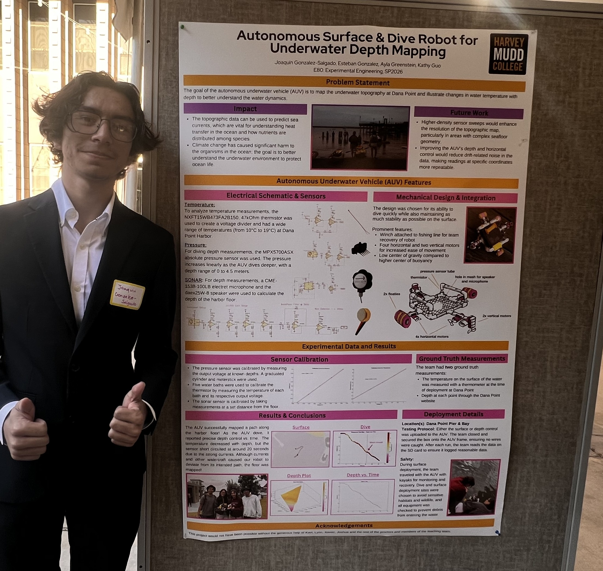

## Electric Vehicle Design Lab (E49C)

### EV Design Team Project

```{=html}
<script>
  function toggleEV() {
    var content = document.getElementById("moreContentEV");
    var button = document.getElementById("toggleButtonEV");
    if (content.style.display === "none") {
      content.style.display = "block";
      button.innerHTML = "Show Less";
    } else {
      content.style.display = "none";
      button.innerHTML = "Show More";
    }
  }
</script>

<div style="display: flex; flex-direction: row; flex-wrap: wrap; gap: 20px; margin-bottom: 1em;">
  <div style="flex: 2; width: 300px;">
    
  </div>
  <div style="flex: 2; min-width: 300px;">
    <p class="justify-text">
      <strong>Overview:</strong><br>
      Team project to build an electric vehicle. Principles of EV design, battery technology, vehicle dynamics, fabrication, wiring, and embedded software development.
    </p>
    <p>
      <strong>Skills:</strong><br>
      EV Design, Battery Technology, Vehicle Dynamics, Fabrication, Embedded Software
    </p>
    <div style="display: flex; gap: 10px; flex-wrap: wrap;">
      <button id="toggleButtonEV" onclick="toggleEV()" style="border-radius: 6px; padding: 8px 14px; background-color: #f5f5f5; border: 1px solid #aaa; cursor: pointer;">
        Show More
      </button>
      <a href="https://youtu.be/whm7blKAmQs" target="_blank" style="display: inline-block; border-radius: 6px; padding: 8px 14px; background-color: #FF0000; border: none; color: white; cursor: pointer; font-weight: 500; text-decoration: none;">
        ▶ Video
      </a>
    </div>
  </div>
</div>

<div id="moreContentEV" style="display:none;">
  <div class="row">
    <div class="column">
      <strong>CAD & Design</strong>
      
      <div style="padding: 5px; font-size: 0.8rem;"> - Developed a CAD assembly of the EV components, from the battery to the display. Implemented high-voltage motor controllers and safety circuitry (relays, fuses, and breakers) with low-voltage Raspberry Pi logic. Integrated software to connect motors to a PS4 controller, and for a Raspberry Pi Display. </div>
    </div>
    <div class="column">
      <strong>Assembly</strong>
      
      <div style="padding: 5px; font-size: 0.8rem;"> 
        - Utilized crimped ring connectors for secure battery-to-controller links and automotive male/female connectors for quick-disconnect capability across the control interface. 
      <br><br>
        - Joined wire extensions with butt splices and applied heat shrink to all terminals to ensure vibration-resistant, short-proof connections.</div>
    </div>
    <div class="column">
      <strong>Result</strong>
      
      <div style="padding: 5px; font-size: 0.8rem;">
        - The cart is fully operational, steady at a safe speed of 15 mph. A custom UI displays real-time speed and direction data, while the PS4 controller integration provides smooth, intuitive steering and throttle control. The result is a fast, stable build that handles reliably at peak performance.</div>
    </div>
  </div>
</div>
```

## Experimental Engineering (E80)

### AUV Ocean Floor SONAR Mapping

```{=html}
<script>
  function toggleAUV() {
    var content = document.getElementById("moreContentAUV");
    var button = document.getElementById("toggleButtonAUV");
    if (content.style.display === "none") {
      content.style.display = "block";
      button.innerHTML = "Show Less";
    } else {
      content.style.display = "none";
      button.innerHTML = "Show More";
    }
  }
</script>

<div style="display: flex; flex-direction: row; flex-wrap: wrap; gap: 20px; margin-bottom: 1em;">
  <div style="flex: 2; width: 300px;">
    
  </div>
  <div style="flex: 2; min-width: 300px;">
    <p class="justify-text">
      <strong>Overview:</strong><br>
      Designed and built an AUV to topographically map the floor of Dana Point Harbor using SONAR time-of-flight measurements. Personally designed analog circuits for temperature, pressure, and SONAR signal processing — all from scratch. Featured a Teensy 4.0, Adafruit GPS, and a custom motor driver motherboard.
    </p>
    <p><strong>Skills:</strong><br>Arduino, MATLAB, SONAR, Embedded Systems, PCB Assembly, Op-Amp Circuit Design, Sensor Calibration</p>
    <div style="display: flex; gap: 10px; flex-wrap: wrap;">
      <button id="toggleButtonAUV" onclick="toggleAUV()" style="border-radius: 6px; padding: 8px 14px; background-color: #f5f5f5; border: 1px solid #aaa; cursor: pointer;">
        Show More
      </button>
      <a href="publications.html" target="_blank" style="display: inline-block; border-radius: 6px; padding: 8px 14px; background-color: #f5f5f5; border: 1px solid #aaa; cursor: pointer; font-weight: 500; text-decoration: none; color: inherit;">
        See Report Page
      </a>
    </div>
  </div>
</div>

<div id="moreContentAUV" style="display:none;">
  <div class="row">
    <div class="column">
      <strong>Custom Sensor Circuits</strong>
      
      <div style="padding: 5px; font-size: 0.8rem;">
        - Designed a thermistor interface circuit with a unity gain buffer and non-inverting offset amplifier to expand the output voltage range for better Teensy resolution.<br><br>
        - Built a pressure sensor circuit with the same offset amplifier approach to enable precise P-control during dives.<br><br>
        - For SONAR, designed both a TX chain (555 timer + LM384 audio amplifier driving a waterproof exciter at 3kHz) and a full RX chain with 10,000x gain across four op-amp stages, a Sallen-Key bandpass filter, and a max detector circuit.
      </div>
    </div>
    <div class="column">
      <strong>Deployment at Dana Point</strong>
      
      <div style="padding: 5px; font-size: 0.8rem;">
        - Deployed the AUV at Dana Point Harbor, following alongside in kayaks to monitor and recover it.<br><br>
        - GPS module handled surface navigation while the pressure sensor controlled dive depth autonomously via P-control.<br><br>
        - All sensor data was logged to an onboard SD card and post-processed in MATLAB to generate the topography map.
      </div>
    </div>
    <div class="column">
      <strong>Results & Presentation</strong>
      
      <div style="padding: 5px; font-size: 0.8rem;">
        - Successfully mapped the ocean floor depth along the AUV's path, with results consistent with nautical chart ground truth data for Dana Point Harbor.<br><br>
        - Also measured water temperature at depth and confirmed a temperature decrease with depth during dives.<br><br>
        - Presented findings at the end-of-semester showcase — our team took first place!
      </div>
    </div>
  </div>
</div>
```


## Digital Electronics / Computer Architecture (E85)

### Digital Level

```{=html}
<script>
  function toggleLevel() {
    var content = document.getElementById("moreContentLevel");
    var button = document.getElementById("toggleButtonLevel");
    if (content.style.display === "none") {
      content.style.display = "block";
      button.innerHTML = "Show Less";
    } else {
      content.style.display = "none";
      button.innerHTML = "Show More";
    }
  }
</script>

<div style="display: flex; flex-direction: row; flex-wrap: wrap; gap: 20px; margin-bottom: 1em;">
  <div style="flex: 2; width: 300px;">
    
  </div>
  <div style="flex: 2; min-width: 300px;">
    <p class="justify-text">
      <strong>Overview:</strong><br>
      Developed an embedded C application to implement a 2D digital level, interfacing a triple-axis accelerometer with a microcontroller to measure tilt along the x and y axes.
      Designed and wired a complete hardware system on a breadboard, integrating a RED-V development board, LIS3DH accelerometer, and an 8x8 LED matrix.
    </p>
    <p><strong>Skills:</strong><br>C/C++, SPI Communication, Calibration, Soldering, Embedded Systems</p>
    <button id="toggleButtonLevel" onclick="toggleLevel()" style="border-radius: 6px; padding: 8px 14px; background-color: #f5f5f5; border: 1px solid #aaa; cursor: pointer;">
      Show More
    </button>
  </div>
</div>

<div id="moreContentLevel" style="display:none;">
  <div class="row">
    <div class="column">
      <strong>Background</strong>
      
      <div style="padding: 5px; font-size: 0.8rem;">
        - Created a digital level mapping tilt angles to an 8x8 LED matrix bubble display.<br><br>
        - Bubble motion indicated surface tilt in X and Y axes.
      </div>
    </div>
    <div class="column">
      <strong>Methods</strong>
      
      <div style="padding: 5px; font-size: 0.8rem;">
        - Programmed RED-V ThingPlus in C using SPI to interface with LIS3DH accelerometer.<br><br>
        - Implemented real-time signal processing and calibration for smooth bubble motion.
      </div>
    </div>
    <div class="column">
      <strong>Result</strong>
      
      <div style="padding: 5px; font-size: 0.8rem;">
        - Achieved accurate, smooth, reliable bubble display validating full embedded system integration.<br><br>
        - Designed a sensitive and practical 2D digital tool with real-world use.
      </div>
    </div>
  </div>
</div>
```

### Multicycle Processor

```{=html}
<script>
  function toggleCPU() {
    var content = document.getElementById("moreContentCPU");
    var button = document.getElementById("toggleButtonCPU");
    if (content.style.display === "none") {
      content.style.display = "block";
      button.innerHTML = "Show Less";
    } else {
      content.style.display = "none";
      button.innerHTML = "Show More";
    }
  }
</script>

<div style="display: flex; flex-direction: row; flex-wrap: wrap; gap: 20px; margin-bottom: 1em;">
  <div style="flex: 2; width: 300px;">
    
  </div>
  <div style="flex: 2; min-width: 300px;">
    <p class="justify-text">
      <strong>Overview:</strong><br>
      Designed a multicycle RISC-V processor in SystemVerilog, creating a hierarchical architecture with a finite-state machine, datapath, ALU, register file, and unified memory adapted from a single-cycle design.
      Validated processor functionality through simulation and waveform analysis.
    </p>
    <p><strong>Skills:</strong><br>SystemVerilog, HDL, Assembly, RISC-V, Quartus FPGA, Questa</p>
    <button id="toggleButtonCPU" onclick="toggleCPU()" style="border-radius: 6px; padding: 8px 14px; background-color: #f5f5f5; border: 1px solid #aaa; cursor: pointer;">
      Show More
    </button>
  </div>
</div>

<div id="moreContentCPU" style="display:none;">
  <div class="row">
    <div class="column">
      <strong>Background</strong>
      
      <div style="padding: 5px; font-size: 0.8rem;">
        - Built a multicycle RISC-V CPU capable of executing arithmetic instructions and managing memory.<br><br>
        - Leveraged single-cycle components to construct a modular multicycle architecture.
      </div>
    </div>
    <div class="column">
      <strong>Methods</strong>
      
      <div style="padding: 5px; font-size: 0.8rem;">
        - Wrote SystemVerilog datapath connecting controller, memory, and register file modules.<br><br>
        - Debugged by comparing assembly testbenches against waveforms and consulted Quartus RTL schematic.
      </div>
    </div>
    <div class="column">
      <strong>Result</strong>
      
      <div style="padding: 5px; font-size: 0.8rem;">
        - Processor matched waveform expectations confirming correct values at correct addresses.<br><br>
        - Deepened understanding of RISC-V architecture and processor design principles.
      </div>
    </div>
  </div>
</div>
```

---

## Systems Engineering (E79)

### Submersible Robot with Kp Control

```{=html}
<script>
  function toggleROV() {
    var content = document.getElementById("moreContentROV");
    var button = document.getElementById("toggleButtonROV");
    if (content.style.display === "none") {
      content.style.display = "block";
      button.innerHTML = "Show Less";
    } else {
      content.style.display = "none";
      button.innerHTML = "Show More";
    }
  }
</script>

<div style="display: flex; flex-direction: row; flex-wrap: wrap; gap: 20px; margin-bottom: 1em;">
  <div style="flex: 2; width: 300px;">
    
  </div>
  <div style="flex: 2; min-width: 300px;">
    <p class="justify-text">
      <strong>Overview:</strong><br>
      Constructed an underwater remotely operated vehicle (ROV) to retrieve temperature, pressure, and other signals in lake environments via the MCP9701 thermistor and MPX5700ASX pressure gauge.
      Assembled a PCB containing the MCP6002 OpAmp to return output voltages modeled and analyzed in LabVIEW.
    </p>
    <p><strong>Skills:</strong><br>LabVIEW, Soldering, PCB Assembly, Oscilloscope, DMM, Breadboarding</p>
    <button id="toggleButtonROV" onclick="toggleROV()" style="border-radius: 6px; padding: 8px 14px; background-color: #f5f5f5; border: 1px solid #aaa; cursor: pointer;">
      Show More
    </button>
  </div>
</div>

<div id="moreContentROV" style="display:none;">
  <div class="row">
    <div class="column">
      <strong>Background</strong>
      
      <div style="padding: 5px; font-size: 0.8rem;">
        - Created a fully waterproof ROV to measure temperature and pressure across varying depths.<br><br>
        - Implemented proportional (Kp) control for motor operation.
      </div>
    </div>
    <div class="column">
      <strong>Methods</strong>
      
      <div style="padding: 5px; font-size: 0.8rem;">
        - Modeled ROV vertical motion by changing motor PWM duty cycle in LabVIEW.<br><br>
        - Soldered pressure sensor and thermistor circuits to the project PCB.
      </div>
    </div>
    <div class="column">
      <strong>Result</strong>
      
      <div style="padding: 5px; font-size: 0.8rem;">
        - Deployed ROV in a real-world environment and collected valid environmental data.<br><br>
        - Gained hands-on experience in PCB assembly, soldering, and oscilloscope use.
      </div>
    </div>
  </div>
</div>
```

---

## Engineering Design & Manufacturing (E4)

### Digital Logic Demonstration Board

```{=html}
<script>
  function toggleBoard() {
    var content = document.getElementById("moreContentBoard");
    var button = document.getElementById("toggleButtonBoard");
    if (content.style.display === "none") {
      content.style.display = "block";
      button.innerHTML = "Show Less";
    } else {
      content.style.display = "none";
      button.innerHTML = "Show More";
    }
  }
</script>

<div style="display: flex; flex-direction: row; flex-wrap: wrap; gap: 20px; margin-bottom: 1em;">
  <div style="flex: 2; width: 300px;">
    
  </div>
  <div style="flex: 2; min-width: 300px;">
    <p class="justify-text">
      <strong>Overview:</strong><br>
      Designed and assembled a logic-gate demonstration board using 74HC Series integrated circuits, a 555 timer, and a potentiometer-based clock input.
      Engineered intuitive controls with input switches, banana cables, and LEDs to clearly display output states.
      Delivered a durable teaching tool now used by Professor Stone for the Digital Logic and Computer Architecture course.
    </p>
    <p><strong>Skills:</strong><br>Digital Logic, PCB Design, 74HC ICs, 555 Timer, Soldering</p>
    <button id="toggleButtonBoard" onclick="toggleBoard()" style="border-radius: 6px; padding: 8px 14px; background-color: #f5f5f5; border: 1px solid #aaa; cursor: pointer;">
      Show More
    </button>
  </div>
</div>

<div id="moreContentBoard" style="display:none;">
  <div class="row">
    <div class="column">
      <strong>Background</strong>
      
      <div style="padding: 5px; font-size: 0.8rem;">
        - Built a logic-gate demonstration board using 74HC Series ICs and a 555 timer.<br><br>
        - Incorporated input switches, banana cable ports, and LEDs for clear output visualization.
      </div>
    </div>
    <div class="column">
      <strong>Methods</strong>
      
      <div style="padding: 5px; font-size: 0.8rem;">
        - Designed board layout for intuitive student interaction and clear signal flow.<br><br>
        - Wired and soldered 74HC gates, 555 timer clock, and potentiometer for adjustable frequency.
      </div>
    </div>
    <div class="column">
      <strong>Result</strong>
      
      <div style="padding: 5px; font-size: 0.8rem;">
        - Delivered a durable teaching tool now actively used by Professor Stone in E85 lectures.<br><br>
        - Reinforced understanding of combinational logic design and hands-on fabrication.
      </div>
    </div>
  </div>
</div>
```

### E4 Machinist Hammer

```{=html}
<script>
  function toggleHammer() {
    var content = document.getElementById("moreContentHammer");
    var button = document.getElementById("toggleButtonHammer");
    if (content.style.display === "none") {
      content.style.display = "block";
      button.innerHTML = "Show Less";
    } else {
      content.style.display = "none";
      button.innerHTML = "Show More";
    }
  }
</script>

<div style="display: flex; flex-direction: row; flex-wrap: wrap; gap: 20px; margin-bottom: 1em;">
  <div style="flex: 2; width: 300px;">
    
  </div>
  <div style="flex: 2; min-width: 300px;">
    <p class="justify-text">
      <strong>Overview:</strong><br>
      Manufactured a precision machinist hammer from clear oak, AISI 1015 steel, AISI 4340 steel, and nylon, adhering to detailed engineering drawings, dimensional tolerances, and safety requirements.
      Applied turning, facing, milling, tapping, and heat treatment processes to achieve specified mechanical properties.
    </p>
    <p><strong>Skills:</strong><br>GD&amp;T, Lathe, Mill, Bandsaw, Taps, Digital Micrometers, HRC Hardness Tester, Heat Treatment</p>
    <button id="toggleButtonHammer" onclick="toggleHammer()" style="border-radius: 6px; padding: 8px 14px; background-color: #f5f5f5; border: 1px solid #aaa; cursor: pointer;">
      Show More
    </button>
  </div>
</div>

<div id="moreContentHammer" style="display:none;">
  <div class="row">
    <div class="column">
      <strong>Background</strong>
      
      <div style="padding: 5px; font-size: 0.8rem;">
        - Manufactured a functional machinist hammer from oak, steel, and nylon to precise GD&amp;T specs.<br><br>
        - Contributed to the Harvey Mudd College tradition of student-made hammers.
      </div>
    </div>
    <div class="column">
      <strong>Methods</strong>
      
      <div style="padding: 5px; font-size: 0.8rem;">
        - Machined head stock using lathe and milling operations, verified with digital micrometers.<br><br>
        - Heat treated hard face, verified HRC hardness, and sandblasted for smooth finish.
      </div>
    </div>
    <div class="column">
      <strong>Result</strong>
      
      <div style="padding: 5px; font-size: 0.8rem;">
        - Delivered a high-quality hammer that scored near perfect in quality of manufacturing.<br><br>
        - Now serve as a Machine Shop Proctor, training new students in shop safety.
      </div>
    </div>
  </div>
</div>
```
